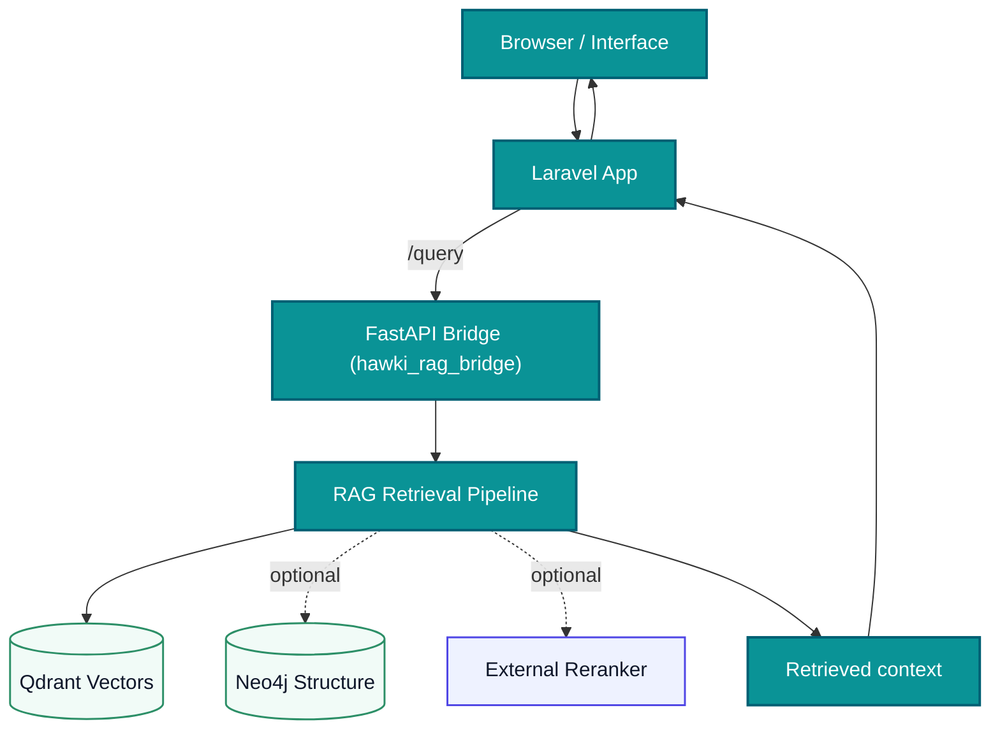

# 3. Introduction & Architecture

## System Overview
- A question-answering machine: you feed it documents; it reads them; it answers questions using only those documents.
- Built with **Laravel (PHP)** plus **Python** services, all inside **Docker** so you avoid complex local installs.

## RAG Definition (Analogy)
- Imagine a librarian with two superpowers:
  - It **finds** the right paragraphs in all books it has read (retrieval).
  - It **writes** a new answer using those paragraphs (generation).
- RAG = Retrieval Augmented Generation. First find; then write.

## The Dual Brain of HAWKI RAG
- **Brain 1: Semantic brain (Qdrant vectors).** It finds text by meaning, even when wording is different.
- **Brain 2: Structural brain (Neo4j graph).** It finds entities and relationships (who/what is connected to what).
- Both brains are used to retrieve evidence, then the reranker orders the best hits, and the generator model writes the final answer.

## How This Project Implements RAG
- **Vector DB (Qdrant):** Stores meanings of text as numbers (“embeddings”).
- **Graph DB (Neo4j):** Stores entities/relationships extracted from text.
- **Models (Ollama):** Runs `bge-m3` for embeddings; `llama3.1:8b` to write answers; `llama3.2:1b` for fast graph tasks.
- **Bridge (Python FastAPI):** Ingests documents, chunks text, makes embeddings/graph, saves to Qdrant/Neo4j.
- **Reranker (Python):** Improves ordering of search results.
- **RAG API (Python):** Runs retrieval orchestration across Qdrant/Neo4j and reranking for query workflows.
- **Laravel App:** Web/API frontend; shows ingest status; proxies queries.

## Core Query Workflow (Diagram)

## Key Concepts Explained
- **Embedding:** A list of numbers representing the meaning of text so similar texts are close together.
- **Vector Database:** A database that can search by “closeness” of embeddings (Qdrant).
- **Graph Database:** Stores nodes (entities) and edges (relationships) for richer queries (Neo4j).
- **Queue:** Background job system (RabbitMQ optional; Laravel DB queue default).
- **Container:** A packaged mini-computer image; Docker runs many containers together.
