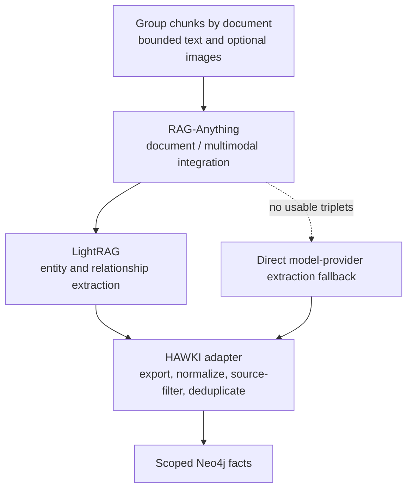

# Graph Enrichment

Graph enrichment extracts relationships from indexed documents and writes
normalized facts to Neo4j. Retrieval reads these stored facts; it does not
rerun extraction.

## When graph processing runs

Source workflows normally use `RAG_INGEST_GRAPH` (template default false).
A converted document marked `converter_fallback=raganything_passthrough` can
require graph processing for its batch even when ordinary graph ingestion was
not requested. Direct-text ingestion forces graph off.

Ordinary unchanged documents skip graph extraction. Internal graph-only mode
bypasses that incremental filter. See
[Identity & Incremental Ingestion](./identity_incremental.md).

## Extraction layers

| Layer | Responsibility |
|---|---|
| RAG-Anything | Coordinates text, supported converter image metadata, and model callbacks |
| LightRAG | Embedded extraction and intermediate graph representation |
| HAWKI RAG adapter | Exports edges, normalizes subject/relation/object tuples, filters against source text, removes duplicates |
| Neo4j writer | Persists canonical facts with document provenance and trusted dataset/namespace |

The extraction window defaults to the first six chunks and 6,000 characters per
document. It does not necessarily cover an entire long document. Chat/vision
models and graph extraction controls are in
[Configuration](../../Operations/5_environment_db_queue.md#graph-extraction).

Intermediate storage, cache, and model fallback

The RAG-Anything adapter configures LightRAG and its model callbacks.
Intermediate extraction can use Neo4j when credentials are available or
fallback storage otherwise. Intermediate nodes/cache files are not the canonical
dataset graph.

The adapter can clear extraction cache per document and run direct model-provider
fallback extraction if the library path yields no usable triplets. An empty
result after filtering is valid; no fact is invented to make a document appear
complete. Cache lifecycle and temporary graph cleanup are internal details.

## Scope and commits

Trusted dataset ID and Neo4j namespace are required by graph-enabled
`IndexRequest`. Existing chunk scope must match; validation occurs before
vector commit. Canonical graph upserts use both fields. Namespace is a logical
scope, not an instruction to create a separate database.

Qdrant commits **before** extraction. For changed documents, extraction happens
before deleting old graph facts. An extraction error records a per-document
failure and preserves old facts. Successful extraction, including an empty fact
set, can trigger replacement cleanup; a later Neo4j delete/write failure can
leave a gap and abort indexing.

Per-document extraction failures are collected while other documents continue.
They do not necessarily make the source fail. A ready source does not prove all
documents yielded facts.

## Graph repair and preview

| Internal mode | Effect | Limitation |
|---|---|---|
| `graph_only=true, graph=true` | Re-extract/upsert facts; no vector embedding, Qdrant writes, or incremental filtering | Does not automatically remove all stale facts |
| `dry_run=true` | Validate/prepare without canonical vector/graph writes | Not exposed as a public bridge route |
| `dry_run=true, graph=true, dry_include_graph=true` | Also runs model extraction and produces preview/failure evidence | Has provider cost and may create intermediate extraction artifacts |

These are indexer application capabilities for controlled maintenance code,
not public REST parameters or an existing graph-repair CLI. Exact replacement
requires scoped cleanup and rebuild; the repository does not expose a turnkey
targeted graph repair command. See [Ingestion Recovery](../../Operations/ingestion_recovery.md).

Sources: [graph commit](https://github.com/hawk-digital-environments/HAWKI-RAG/blob/main/python_rag/services/hawki_indexer_worker/src/hawki_indexer_worker/indexing/graph_commit.py),
[graph preparation](https://github.com/hawk-digital-environments/HAWKI-RAG/blob/main/python_rag/services/hawki_indexer_worker/src/hawki_indexer_worker/indexing/graph_prepare.py),
[RAG-Anything adapters](https://github.com/hawk-digital-environments/HAWKI-RAG/tree/main/python_rag/services/hawki_indexer_worker/src/hawki_indexer_worker/adapters/raganything),
[batch routing](https://github.com/hawk-digital-environments/HAWKI-RAG/blob/main/python_rag/services/hawki_indexer_worker/src/hawki_indexer_worker/indexing/batch_execution.py).
