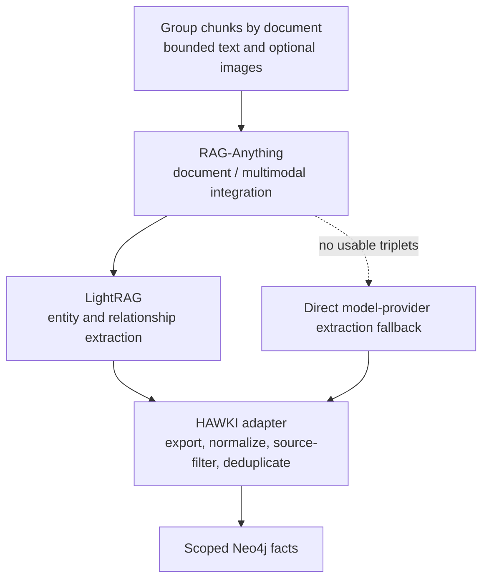

# Ingestion with Graph Processing Enabled

When graph processing is enabled for a website or uploaded file, the indexer
extracts entities and relationships from the document content and stores them
as facts in the dataset's Neo4j graph. This adds a graph representation of the
documents alongside their searchable chunk vectors in Qdrant.

Graph processing runs inside the `ingest_markdown_files` activity of
`IngestSourceWorkflow`. During normal ingestion, the indexer writes the chunk
vectors to Qdrant, then extracts and stores graph facts with references to their
source documents. Graph retrieval reads these stored facts from Neo4j.

## Ingestion with and without graph processing

Both normal ingestion modes create searchable chunk vectors. Enabling graph
processing adds a second step that builds relationships between entities found
in the documents.

| Ingestion mode | What the indexer does | Stored result |
|---|---|---|
| Graph processing disabled (`graph=false`) | Split documents into chunks → generate embeddings → write points to Qdrant | Chunk text, vectors, and source metadata for passage retrieval |
| Graph processing enabled (`graph=true`) | Perform the same vector indexing → extract entities and relationships → write facts to Neo4j | Qdrant chunk points plus a document-linked graph for relationship retrieval |

For example, a document might say, "Course A requires Course B." Both modes store
that passage with its embedding in Qdrant. With graph processing enabled, the
extractor can also store the relationship `Course A → requires → Course B` in
Neo4j, linked to the source document.

Graph processing adds model calls and Neo4j writes to the ingestion work. Vector
indexing finishes first, followed by graph extraction and storage. The
[Scope and commits](#scope-and-commits) section explains how failures in that
second step affect the stored data and ingestion status.

## When graph processing runs

Website and uploaded-file ingestion normally use `RAG_INGEST_GRAPH` to control
graph processing; `true` enables it, and the template default is `false`.
Supported managed-document and upload requests can supply a `graph` option for
that ingestion operation; Laravel carries the selection into the workflow input.
A converted document marked `converter_fallback=raganything_passthrough` also
enables graph processing for its batch. Direct-text ingestion
(`IngestTextWorkflow`) sets `graph=false` and performs vector indexing.

For websites and uploaded files, the incremental planner skips graph extraction
for documents whose content hash is unchanged. Enabling graph processing for
previously indexed content therefore requires a planned graph rebuild so those
documents are processed again. Existing graph facts remain stored when later
ingestion runs with graph processing disabled. See
[Identity & Incremental Ingestion](./identity_incremental.md).

The internal `graph_only=true, graph=true` option is a maintenance mode: it
extracts graph facts from the supplied documents while preserving existing
vectors. It processes documents independently of the unchanged-content check.
Its cleanup behavior and invocation requirements are described under
[Graph repair and preview](#graph-repair-and-preview).

## Sources, documents, chunks, and facts

| Term | Meaning in this workflow |
|---|---|
| Source | The website or uploaded file submitted for ingestion; a website crawl can produce many documents |
| Document | One indexed Markdown artifact, usually representing a web page or converted file, identified by `doc_id` |
| Chunk | A passage split from a document; several chunks can share the same `doc_id` |
| Graph fact | An extracted subject, relationship, and object, linked to the document that supplied it |

For graph extraction, the indexer groups chunks by `doc_id`, applies the configured
chunk and character limits, and submits the selected text in one extraction call
for that document. The extraction libraries can split the text internally; the
indexer records the result or failure for the document as a whole.

## Extraction layers

| Layer | Responsibility |
|---|---|
| RAG-Anything | Coordinates text, supported converter image metadata, and model callbacks |
| LightRAG | Embedded extraction and intermediate graph representation |
| HAWKI RAG adapter | Exports edges, normalizes subject/relation/object tuples, filters against source text, removes duplicates |
| Neo4j writer | Persists canonical facts with document provenance and trusted dataset/namespace |

## System configuration and setup

The request's `graph` option controls a supported ingestion operation while the
system is running. The default `RAG_INGEST_GRAPH` and the extraction limits below
take effect when the services that read them are recreated.

The indexer reads the amount of document text to use for graph extraction from
its worker environment:

| Setting | Value in `.env.example` | Behavior |
|---|---|---|
| `GRAPH_DOC_MAX_CHUNKS` | `6` | Select the first N chunks of each document; `0` selects all available chunks |
| `GRAPH_DOC_MAX_CHARS` | `6000` | Limit the total characters across the selected chunks of each document; `0` keeps all selected text |

The indexer applies the chunk limit first, then the character limit. With the
template values, it passes up to 6,000 characters from the first six chunks of
each document to graph extraction. That character budget applies to the combined
selected text for one document. Operators can adjust both values to change how
much text the extractor receives. An unset setting uses `0` in the code.

New limits and model selections apply to future extraction. Rebuild affected graph
data when existing facts should reflect those changes. See
[Runtime options and system configuration](../../Operations/5_environment_db_queue.md#runtime-options-and-system-configuration)
for when settings take effect, and
[graph model configuration](../../Operations/5_environment_db_queue.md#graph-extraction)
for model selection.

Intermediate storage, cache, and model fallback

The RAG-Anything adapter configures LightRAG and its model callbacks.
Intermediate extraction can use Neo4j when credentials are available or
fallback storage otherwise. Intermediate nodes/cache files are not the canonical
dataset graph.

The adapter can clear extraction cache per document and run direct model-provider
fallback extraction if the library path yields no usable triplets. Filtering can
leave zero facts. Some adapter errors also produce an empty result, as described
under [Empty results and extraction failures](#empty-results-and-extraction-failures).
Cache lifecycle and temporary graph cleanup are internal details.

## Scope and update order

For graph-enabled indexing, the request must include a trusted dataset ID and Neo4j namespace. Existing chunks must belong to the same scope, and this is checked before vectors are written. The dataset ID and namespace are also used when writing graph data to Neo4j. The namespace is only a logical separation of data; it does not create a separate Neo4j database.

Qdrant is updated **before** graph extraction and Neo4j updates. For changed documents, the system first extracts the new graph information while keeping the existing graph data unchanged. If extraction fails or times out, the
document is marked as failed and the old graph data is preserved.

If extraction finishes successfully, the system replaces the old graph data with the new result. This also happens when extraction succeeds but returns no graph facts. If the later Neo4j delete or write step fails, the graph update can be left incomplete and the indexing operation fails.

## When graph extraction returns no facts

Graph extraction can produce zero facts for two different reasons:

- **No facts were found:** extraction completed successfully, so any previous
  graph facts for the changed document are removed.
- **Extraction failed:** the failure is recorded and the previous graph facts
  are normally preserved.

In some cases, an adapter may handle an extraction error internally and return
an empty result. The indexer then treats it as a successful extraction with zero
facts, which can remove the document's previous graph data.

:::warning Check graph results

A source can still reach `ready` even when some documents have no graph facts or
experienced extraction problems. Check `graph_failures`, the logs for the
document's `doc_id`, and the stored Neo4j data when investigating these cases.

:::