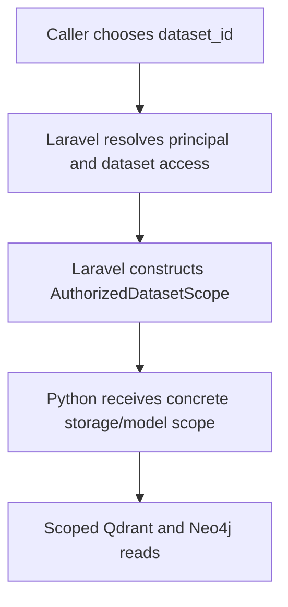

# Authorization & Dataset Scope

A dataset ID is a logical choice. Its storage names and embedding configuration
come from Laravel's dataset record.



## Access boundaries

The current product supports a single-user management deployment. Do not
generalize query authorization to every public API route.

| Surface | Implemented policy |
|---|---|
| REST query and query dataset list | Explicit query-capable bearer user, existing eligible request user, or sole active local user for a credential-free request |
| MCP transport | Sanctum authentication, `query` ability, and query-principal gate |
| Direct-text submit/delete | Real Sanctum personal access token with the literal `rag:text-ingest` ability, plus an explicit dataset `ingest` grant |
| Management APIs (including dataset creation, pipelines, storage cleanup) | Single-user management API; the routes do not require an authenticated admin |

If there is no eligible query identity, credential-free query requests fail
instead of choosing a user arbitrarily. An invalid explicit Authorization
header never falls back to the sole-user path.

The environment template sets
`HAWKI_RAG_QUERY_ALL_DATASETS_BY_DEFAULT=true`: eligible users can query all
active datasets. With that option disabled, explicit query grants are required.
This default never grants direct-text write access.

:::warning Management routes have a separate security boundary

Dataset creation, pipeline management, and storage cleanup do not inherit the
MCP or direct-text authentication policy merely because they use `/api`.
Protect the management surface through the deployment's network/reverse proxy
boundary. `SANCTUM_ROUTES` is not a blanket switch that authenticates every
management route.

:::

## Grant access

```bash
docker exec hawki_rag_app php artisan dataset:grant-query DATASET_ID USER_ID
docker exec hawki_rag_app php artisan dataset:grant-ingest DATASET_ID USER_ID
```

Replace the uppercase placeholders with existing identifiers.
Token creation and direct-text prerequisites are documented in
[Direct Text Ingestion](../Reference/direct_text_ingestion.md).

The self-grant query endpoint is
`POST /api/datasets/{datasetId}/query-grants/self`. For a user without existing
access, it checks an active dataset, storage/model metadata, the last terminal
ingestion job's completed status, and a positive Qdrant point count.
If access already exists (including the all-datasets default), it can create
the grant without repeating those storage checks. It is not a universal
readiness probe.

## Trusted query fields

| Field | Source / meaning |
|---|---|
| `dataset_id` | Active dataset selected by the caller and accepted by Laravel |
| `qdrant_collection` | Dataset's physical vector collection |
| `neo4j_namespace` | Dataset's logical namespace within Neo4j |
| `embedding_provider` | Dataset's persisted embedding provider |
| `embedding_model` | Dataset's persisted embedding model |
| `graph_enabled` | **Currently hard-coded to true by Laravel's scope factory** |

There are no user, tenant, course, document ACL, or external permission-graph
identifiers in this scope contract. Current retrieval uses dataset grants and
mandatory dataset filtering; it does not perform OIDC/SpiceDB/OpenFGA
document checks in Python.

Scope construction requires non-empty collection, namespace, embedding provider,
and embedding model. That check does not query Qdrant or establish that a
particular source is ready. The authorized dataset listing additionally checks
collection existence; the Python query path fails when its collection is missing.

:::warning Current implementation limitation: graph query flag

Laravel's `AuthorizedDatasetScope::fromStorageTargets()` currently sets
`graph_enabled=true` for every constructed query scope. This is a current
factory limitation, not a permanent architectural requirement or a per-dataset
graph setting.

`graph_enabled` is a query capability, not evidence that optional graph
extraction succeeded. It is distinct from source ingestion `graph` and
`RAG_INGEST_GRAPH`; direct text always ingests with graph off.

:::

## Scope cannot be overridden by query/document metadata

Laravel rejects query storage/provider overrides and reserved metadata filter
keys. Python locks the reader to the supplied collection and stamps the
mandatory dataset filter after sanitizing user filters. The query provider must
match the authorized embedding provider.

The indexer builds trusted identity, dataset, and storage payload fields after
reading artifact metadata. Graph-enabled requests require dataset ID and namespace;
conflicting chunk scope is rejected before vector writes. Direct-text top-level
fields are allowlisted, and metadata is stored as integration metadata rather
than interpreted as routing authority.

Dataset **management** is a separate boundary: its create request can supply
storage target names. The no-override guarantee applies to query/direct-text
metadata; it does not make the management API untrusted-client-safe.

