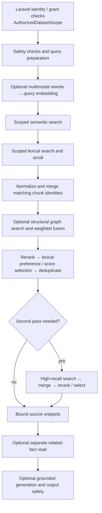

# Query & Retrieval

Retrieval finds evidence inside the dataset authorized by Laravel. The bridge
combines Qdrant content with optional Neo4j structure, ranks candidates, and
optionally asks a model to answer from the evidence.

Use [REST APIs](../Reference/rest_apis.md) or
[MCP query-search](../Reference/mcp_query_search_contract.md) for wire contracts.
This page explains the shared execution behavior.

## Execution order

The implementation entrypoint is
[execute_authorized_query](https://github.com/hawk-digital-environments/HAWKI-RAG/blob/main/python_rag/services/hawki_bridge/src/hawki_bridge/application/query/execution.py).

## 1. Bind trusted scope and prepare the query

Laravel selects one concrete Qdrant collection and embedding provider/model.
The bridge locks the reader to that collection, removes reserved filter keys,
and adds a mandatory `dataset_id` predicate to every vector and lexical path.
It does not fall back to an unscoped collection or another embedding provider.
See [Authorization & Dataset Scope](./authorization_dataset_scope.md).

Prompt checks can block a query; a query empty after sanitization is rejected.
The configured chat/vision selection and authorized embedding model are applied
to the request-local provider.

**Rewrite is conditional**, even in deep mode: the query must mention visual
or structured content such as an image, figure, diagram, table, or equation
(including supported German terms). One chat call asks for a rewritten query,
high/low-level keys, entity terms, and modality hints. Provider errors or
unparseable JSON fall back to the original query. `rewrite.enabled` records
whether rewriting was attempted, not whether it produced useful output.

Lexical terms remove corpus-location phrases such as “in my documents”, retain
German ordinals, and add accent/transliteration variants. This affects text
matching, not authorization. The prepared query is embedded once; an initial
embedding failure stops the request.

## 2. Retrieve semantic candidates

The bridge retrieves a wider candidate set before final evidence selection.

| Condition, in precedence order | Semantic strategy |
|---|---|
| `smart_lookup=true` and not fast | Dense search constrained by query terms across payload fields; empty results retry basic search |
| `is_optimized=true` and not fast | Higher-recall HNSW search with a score threshold and optional preferred tags; empty results remove the threshold |
| Otherwise, including fast mode | Basic dense vector search |

These are bridge-owned policies over the Qdrant adapter. Preferred tags are not
an unconditional filter applied to every retrieval strategy.

Semantic candidate limits and optimized threshold

Candidate count is normally three times requested `top_k`, capped at 50.
The optimized strategy starts with score threshold 0.28.

## 3. Add lexical evidence

Lexical retrieval runs alongside the semantic strategy, including fast mode.
It uses the existing dense vector with text predicates and a separate
payload-text scroll; it is not a sparse-vector/BM25 index.

Text matching supplements dense similarity, including when semantic search
misses a literal phrase.

Lexical fields and scroll budgets

Search fields include content, title, source/page/canonical URLs, tags, and PDF
references. Scroll first requires all terms and relaxes to any term when empty.
The default scroll budget is `min(max(candidate_limit × 4, 20), 200)`.
The advanced exhaustive option selects the paginated scroll path.

A missing authorized collection propagates as `dataset_not_ready`; other
lexical search/scroll failures retain whatever other evidence is available.

## 4. Merge scores and preserve chunk identity

Matching chunks combine evidence from the retrieval sets. Distinct chunks from
one document remain separate candidates. Fusion uses scores, not reciprocal ranks.

Score normalization and identity precedence

When two non-empty retrieval sets are merged, each set is independently
min-max normalized. A tied retrieval set assigns 1.0 to all its hits.
Evidence for a matching identity is summed and divided by the number of active
sets; absence from one set contributes no evidence. Raw scores break ties.

Identity prefers point ID, then document/chunk identity, relative path with
chunk index, document with chunk index, and finally document ID.
Distinct chunks from the same document survive deduplication.

This is score fusion, not reciprocal-rank fusion. A normalization/merge occurs
where multiple sets meet; the pipeline does not globally normalize every
possible signal in one step.

## 5. Add structural graph candidates

Structural search requires graph scope, non-fast mode, and a nonzero traversal
depth (default two hops). Reads carry both dataset ID and Neo4j namespace.
Returned relations receive a score based on inverse hop count.

Graph evidence can boost content from the same document or contribute a
structural relation when no semantic chunk represents that document.

Graph weights and retained candidate types

Graph scores aggregate by document and augment each semantic chunk for that
document. The default weights are 0.6 for semantic/lexical evidence and 0.4 for
structure. A graph-only document retains one structural representative.
Only chunk/relation candidates and candidates with no component type continue.

Neo4j availability errors degrade to no graph evidence; authentication,
configuration, and other non-availability errors can fail the query.
There is no fallback to a different Neo4j database.

## 6. Rerank and select evidence

| Mode | Behavior |
|---|---|
| `external` | Sends the leading candidates to the configured API; the supplied stack uses its local Cohere-compatible reranker |
| `cosine` | Re-embeds bounded candidate text and computes cosine similarity |
| `jina` | Calls Jina when its API key is present |
| `none` | Preserves retrieval order |

Reranking changes candidate order before evidence selection. External failures
generally preserve retrieval ordering.

Reranker limits, normalization, and blending

The leading 20 candidates are reranked by default; the untouched tail is
retained. Reranker signals are normalized and optionally blended with retrieval
scores, using weight 0.5 by default. Tied multi-candidate reranker signals use
0.5, unlike the 1.0 used for tied retrieval stages. External failures generally
retain the original ordering; reranking does not switch embedding providers.

After reranking, lexical matches receive small term/title/URL bonuses. If a
sufficiently matching lexical set exists, that set is selected first. Otherwise,
selection tries the primary score threshold, then the fallback threshold, then
retains the top-k prefix even if no threshold passed. Selected hits are deduplicated.

:::note Thresholds are ranking heuristics

The default thresholds are 0.1 and 0.2. The second is stricter, so it does not
relax an empty first selection at those defaults. Low-score evidence can still
reach context through the final prefix fallback; these scores are not
calibrated confidence or a guaranteed abstention gate.

:::

## 7. Optionally expand once

With iterative retrieval enabled (the default), one additional pass can run
for no hits, too few hits, weak maximum scores, or sequencing/comparison wording.

Terms from first-pass content can be appended to the query. Expansion embedding
errors, wrong dimensions, non-numeric values, or non-finite values reuse the
original vector. A high-recall search uses the same scope; non-empty results
are merged and reranked again. An empty second pass preserves the first ranking.

**Fast mode does not disable this pass.** `iterative_pass=true` indicates an
attempt, even if no new hits were found.

## 8. Build context, fetch facts, and optionally generate

A small `top_k` is not a strict response-count ceiling. Source context is bounded
separately from the complete generation prompt.

Exact hit, snippet, and token limits

The raw hit limit is `max(top_k, RAG_CONTEXT_DOCS)`; with defaults, requesting
five can return six hits. Context uses at most six source snippets, each initially
capped at 1,200 characters, within an approximate 2,800-token source budget.

Token accounting uses a four-characters heuristic with truncation slack.
It is not tokenizer-exact, and it does not cover the whole prompt: system text,
the user query, and graph facts are added separately.

A **separate** related-graph read collects terms from the query and final hits. This produces `kg`, independently of the
ranked structural hits. It requires hits, graph scope, and non-fast mode;
`structural_hops=0` disables structural candidates but does not disable this
separate fact read.

Related-fact limits

The related read uses at most 30 terms by default. Up to 20 facts are appended
to the generation prompt.

Generation requires request `generate=true`, process `RAG_GENERATE_ANSWER=true`,
and non-empty source context. Otherwise `answer` is an empty string.
The prompt treats source excerpts as untrusted evidence, asks for supported
claims and `[Source N]` citations, and instructs the model to acknowledge
insufficient evidence. Output safety runs afterward; citation-only output is
replaced with a message directing the reader to the sources. A generation
failure returns an error rather than a successful evidence-only response.

## Fast versus deep

| Capability | Fast | Deep |
|---|---|---|
| Semantic and lexical retrieval | Yes; basic semantic strategy | Yes; basic, smart, or optimized strategy |
| Multimodal rewrite | No | Conditional on wording |
| Structural candidates / related facts | No | Conditional on trusted graph scope |
| Reranking and second pass | Available | Available |
| Answer generation | Separately controlled | Separately controlled |

Laravel currently hard-codes graph query access on; see the
[current scope-factory limitation](./authorization_dataset_scope.md#trusted-query-fields).
That does not prove graph ingestion ran or facts exist.

## Failures and logging

| Failure | Current boundary behavior |
|---|---|
| Invalid bridge schema or mismatched embedding provider | Validation error |
| Blocked/empty sanitized query | HTTP 400 |
| Missing scoped Qdrant collection | HTTP 503, `dataset_not_ready`; no collection creation |
| Initial embedding failure | HTTP 500 |
| Main Qdrant transport failure | HTTP 503 |
| Rewrite / expansion embedding / reranker failure | Documented fallback above |
| Neo4j availability failure | Empty graph evidence |
| Generation failure | HTTP 502 |

The bridge logs stage counts, timings, provider, dataset and request IDs.
Rewrite/expansion warnings use exception classes and bounded reasons;
HTTP error translation redacts sensitive-looking values and returns stable
messages for known upstream failures. This is not a promise that every log or
public response is confidential: the MCP catch path logs the full query, and
the Laravel REST proxy can return transport exception text or an invalid
upstream body. Those are existing implementation limitations.

Implementation references

Sources: [query application modules](https://github.com/hawk-digital-environments/HAWKI-RAG/tree/main/python_rag/services/hawki_bridge/src/hawki_bridge/application/query),
[Qdrant reader](https://github.com/hawk-digital-environments/HAWKI-RAG/blob/main/python_rag/services/hawki_bridge/src/hawki_bridge/adapters/qdrant_reader.py),
[reranker client](https://github.com/hawk-digital-environments/HAWKI-RAG/blob/main/python_rag/services/hawki_bridge/src/hawki_bridge/adapters/reranker_client.py),
[Neo4j reader](https://github.com/hawk-digital-environments/HAWKI-RAG/blob/main/python_rag/services/hawki_bridge/src/hawki_bridge/adapters/neo4j_reader.py),
[HTTP errors](https://github.com/hawk-digital-environments/HAWKI-RAG/tree/main/python_rag/services/hawki_bridge/src/hawki_bridge/http/errors).

