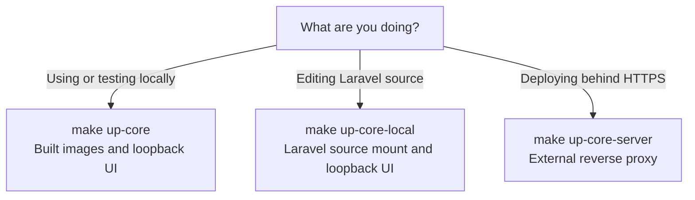

# Run HAWKI RAG

For first-time secrets, database initialization, and user creation, follow
[Installation](./4_installation_zero_to_up.md). Run these commands from the
repository root.

:::tip The usual local start

With your environment configured, run `make up-core` and open
[http://localhost:8080](http://localhost:8080).

:::

## Everyday commands

```bash
make up-core
make health
make logs-core
make restart-core
make down-core
```

Run each when needed: `logs-core` follows logs until interrupted,
`restart-core` force-recreates services, and `down-core` stops/removes containers
while retaining named data volumes. `up-core` can rebuild and briefly stops the
stack for migration; it is not a zero-downtime deployment.

## Choose a startup mode



| Command | Image/source behavior | Laravel access |
|---|---|---|
| `make up-core` | Builds images by default; application runs from built images | Loopback `http://localhost:8080` |
| `make up-core-local` | Reuses images; bind-mounts the repository and development entrypoint into **Laravel**; publishes rebuilt UI assets by default | Same loopback URL |
| `make up-core-server ENV_FILE=.env.production` | Builds images; base Compose plus any GPU override | No host Laravel port; reverse proxy on `hosting_network` |

:::note Local versus local development

All modes read `APP_ENV` and `APP_DEBUG` from the selected environment file.
The local override does **not** mount Python source into the Python services.

:::

To rebuild development images, use the Make command-line assignment:

```bash
make up-core-local BUILD_STACK=1
```

An environment prefix such as `BUILD_STACK=1 make up-core-local` loses to the
Makefile's target-specific assignment. `make publish-ui` builds/copies frontend
assets to the running Laravel container; `UI_AUTO_BUILD=0` as a Make argument
skips that step during local startup.

GPU selection defaults to automatic on Linux when `nvidia-smi` is found and
CPU elsewhere. Override with `make up-core USE_OLLAMA_GPU=0` or
`make up-core USE_OLLAMA_GPU=1`.

<details>
<summary>Keep the same Compose layers for later operations</summary>

Lifecycle targets default to the local UI stack; they do not remember a
previous startup mode. For a server, supply its layers explicitly:

```bash
make restart-core ENV_FILE=.env.production COMPOSE_FILE_LIST=docker-compose.yml
```

Include the GPU override if that server uses it. For development:

```bash
make restart-core COMPOSE_FILE_LIST=docker-compose.yml:docker-compose.ui.yml:docker-compose.local.yml
```

Apply the same `ENV_FILE`, `COMPOSE_FILE_LIST`, and optional profile selection to
logs/shutdown commands. `restart-core` recreates containers but does not build
new images or run the migration sequence; use the appropriate startup target
after an upgrade.

</details>

## Direct-text smoke test

This exercises Laravel → Temporal → indexer → Qdrant → query, without external
ingestion tools. It creates persistent smoke-test content.

1. Use the dataset, grant, and token commands in
   [Direct Text Ingestion](../Reference/direct_text_ingestion.md#prepare-a-dataset-and-token).
   Create the test token with `rag:text-ingest,query` so the same explicit user
   can run the query below.
2. Run that page's [sample submission](../Reference/direct_text_ingestion.md#submit-text).
3. Follow its [readiness and query procedure](../Reference/direct_text_ingestion.md#wait-for-readiness-and-query).
   Expect a ready source and a query hit containing the cobalt lighthouse code.
   A `202` submission response alone is insufficient.
4. Set `generate=true` in a second query to also exercise the chat provider.

Use the direct-text page's source-specific deletion procedure to remove the
test content when finished.

## External tools

Core startup attaches existing crawler/converter containers to `hawki-network`;
it does not install them. The Makefile also offers helpers for sibling checkouts:

```bash
make up-crawler-tool
make up-file-converter-tool
```

They expect `../CustomCrawler` and `../hawki-toolkit-file-converter`.
Override `CRAWLER_DIR` or `FILE_CONVERTER_DIR` if needed. These commands build/start
the external projects and create `rawki_shared_storage` if missing. The converter
helper forwards the configured converter token as `F_API_KEY`.

The external services must agree on the shared volume and paths. Their endpoint
and token settings live in
[Environment & Configuration](../Operations/5_environment_db_queue.md#external-ingestion-tools).

## Full-ingestion smoke test

Use a small website you control, with the external tools running:

```bash
docker exec -it hawki_rag_app php artisan pipeline:start-task \
  --dataset-id=docs-website-smoke \
  --source-url=https://example.com
```

Replace the example URL with your test source. The command prints a task ID.
Follow it in the pipeline UI or through `GET /api/pipeline/tasks/{taskId}/jobs`.

This exercises the source workflow, scraper, conversion stage, indexer, signed
callbacks, and stores. Converter invocation depends on file type: existing
Markdown can pass through. To explicitly test the external converter, upload a
small supported non-Markdown file through `/pipeline-controller`, then verify
conversion artifacts and logs before querying the dataset.

A one-off smoke test should omit `--refresh-cadence`. That option creates a
recurring Temporal schedule; see [Temporal Operations](../Operations/temporal_operations.md).

## Diagnose and maintain

Use [Monitoring](../Operations/monitoring.md) to inspect workers and status,
[Troubleshooting](../Operations/troubleshooting.md) for startup/query symptoms,
and [Ingestion Recovery](../Operations/ingestion_recovery.md) for partial writes.

`make help` lists all targets. `make clean` deletes local virtual environments
and generated logs as well as caches. `make teardown` and `make neo4j-fresh`
delete persistent data; they are not routine restart commands.

Source: [Makefile](https://github.com/hawk-digital-environments/HAWKI-RAG/blob/main/Makefile) and
[pipeline CLI](https://github.com/hawk-digital-environments/HAWKI-RAG/blob/main/app/Console/Commands/StartOrchestratedPipelineTask.php).
