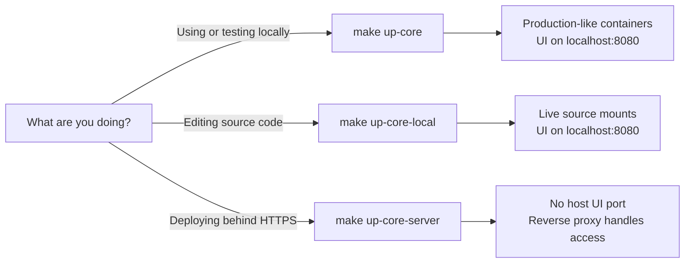
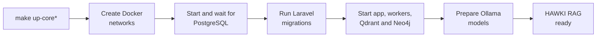
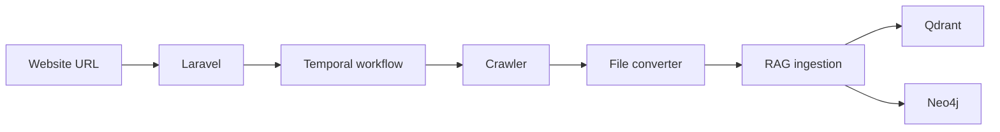

# 2. Run HAWKI RAG

This page helps you choose the right startup command, get the system running,
and solve the most common startup problems.

:::tip The usual local start

If your `.env` is configured and you simply want to use HAWKI RAG locally, run:

```bash
make up-core
```

Then open [http://localhost:8080](http://localhost:8080).

:::

## First run in four steps

### 1. Start Docker

Open Docker Desktop, or make sure the Docker daemon is running:

```bash
docker ps
```

The command should return a container list without a connection error.

### 2. Create your environment file

From the repository root:

```bash
test -f .env || cp .env.example .env
```

Open `.env` and set at least `APP_KEY`, `DB_PASSWORD`, `NEO4J_PASSWORD`, and
`HAWKI_RAG_WORKER_CALLBACK_SECRET`. Generate the callback secret with
`openssl rand -hex 32` and paste the output into `.env`. Configure the external
crawler and converter URLs before running website-ingestion jobs. Activity
workers intentionally refuse to start with an empty callback secret.

### 3. Start the stack

```bash
make up-core
```

The first start takes longer because Docker builds images and Ollama downloads
the required models.

### 4. Verify the result

```bash
make health
```

Open the UI at [http://localhost:8080](http://localhost:8080). If both work,
the stack is ready.

## Which startup command should I use?



| Goal | Command | What you get |
|---|---|---|
| Run the normal local stack | `make up-core` | Built production-mode images and UI at `http://localhost:8080` |
| Develop with local source files | `make up-core-local` | Source-mounted containers, Laravel debug mode, and UI at `http://localhost:8080` |
| Deploy behind a reverse proxy | `make up-core-server ENV_FILE=.env.production` | No published Laravel host port; the proxy reaches `hawki_rag_app:80` |

:::note Local versus local development

Both `make up-core` and `make up-core-local` open the UI on port `8080`.
Use `up-core-local` only when containers need to see your source-code changes
immediately.

:::

After changing a Dockerfile or locked dependency, rebuild the development
images once:

```bash
BUILD_STACK=1 make up-core-local
```

If only frontend assets changed, rebuild and copy them into the running app
container without recreating the stack:

```bash
make publish-ui
```

## What happens during startup?

You do not need to create Docker networks, initialize PostgreSQL, or run Laravel
migrations manually when using a supported `make up-core*` command.



The startup process deliberately migrates the database before starting services
that can write data. This keeps upgrades safer and prevents workers from using
an outdated schema.

## External crawler and converter

Website ingestion depends on a crawler and file converter that run outside the
core HAWKI RAG Compose stack.

```text
HAWKI RAG worker
    ├── crawl request ─────> crawl4ai-service:80
    └── conversion request > hawki-toolkit-file-converter-file-converter-1:80
```

The external containers must already be running. A supported `make up-core*`
command attaches them to `hawki-network` when it finds them.

The relevant `.env` defaults are:

```env
EXTERNAL_SCRAPER_URL=http://crawl4ai-service
EXTERNAL_SCRAPER_START_PATH=/crawl
EXTERNAL_SCRAPER_STATUS_PATH=/status/{job_id}

EXTERNAL_CONVERTER_URL=http://hawki-toolkit-file-converter-file-converter-1
EXTERNAL_CONVERTER_START_PATH=/extract
```

Docker services must use these internal names. Do not use `localhost` for
container-to-container requests.

## Everyday commands

| I want to… | Command |
|---|---|
| Check all service health | `make health` |
| Run direct endpoint checks | `make test-services` |
| Follow core service logs | `make logs-core` |
| Restart the stack | `make restart-core` |
| Stop the core stack | `make down-core` |
| See every available command | `make help` |
| Remove generated caches and test artifacts | `make clean` |

## Run a first ingestion

With the crawler and converter running, submit a website:

```bash
docker exec -it hawki_rag_app php artisan pipeline:start-task \
  --source-url=https://example.edu \
  --refresh-cadence=daily
```

The request flows through the system like this:



Scraped and converted files are exchanged through the `rawki_shared_storage`
Docker volume, mounted as `/shared` in the relevant containers.

## Troubleshooting by symptom

| Symptom | Likely cause | What to do |
|---|---|---|
| `Cannot connect to the Docker daemon` | Docker is stopped | Start Docker Desktop or the Docker service, then run `docker ps` |
| `hosting_network ... could not be found` | Commands were run outside the supported Make targets, or the network was pruned | Run `make network`, then retry |
| UI does not open on port `8080` | Port conflict or Laravel container failed | Check `docker ps`, then run `make logs-core` |
| `crawl4ai-service` cannot be resolved | Crawler is stopped or not attached to `hawki-network` | Start the crawler, then rerun `make up-core` |
| Crawler responds with `404` | Old scraper paths remain in `.env` | Use `/crawl` and `/status/{job_id}` |
| GPU is not detected on Linux | Driver or NVIDIA container toolkit is unavailable | Fix `nvidia-smi`, or run `USE_OLLAMA_GPU=0 make up-core` |
| Ollama model download appears stuck | Large model download, proxy, or registry issue | Check `docker logs hawki_ollama` and pull the model manually |
| Images do not include a recent dependency change | Development mode reused an old image | Run `BUILD_STACK=1 make up-core-local` |

<details>
<summary>Advanced: how the Compose files are selected</summary>

The Makefile always starts with `docker-compose.yml` and layers only the files
needed for the selected mode:

| File | Responsibility |
|---|---|
| `docker-compose.yml` | Core services and CPU-safe defaults |
| `docker-compose.ui.yml` | Publishes Laravel on `127.0.0.1:8080` |
| `docker-compose.local.yml` | Adds development environment values and source mounts |
| `docker-compose-gpu-override.yml` | Adds NVIDIA configuration when GPU mode is enabled |

Useful advanced overrides:

| Variable | Purpose |
|---|---|
| `ENV_FILE` | Select a different environment file; defaults to `.env` |
| `USE_OLLAMA_GPU` | Choose `auto`, `1`, or `0` |
| `CORE_PROFILES_BASE` | Enable optional profiles such as `litellm` |
| `BASE_COMPOSE_FILE` | Replace the base Compose file |
| `GPU_OVERRIDE_COMPOSE` | Replace the GPU override file |

</details>

## Optional services

### LiteLLM gateway

LiteLLM is optional and is not part of a normal startup. Enable it when you need
the OpenAI-compatible gateway:

```bash
CORE_PROFILES_BASE=litellm make up-core
curl -fsS http://127.0.0.1:4000/v1/models
```

OpenAI and Anthropic routes also require their API keys in `.env`.

<details>
<summary>Which Ollama models are prepared?</summary>

The startup command prepares:

| Model | Role | Practical hardware note |
|---|---|---|
| `bge-m3` | Embeddings | Usually below 4 GB VRAM |
| `llama3.2:1b` | Lightweight language tasks | Roughly 2 GB VRAM |
| `llama3.1:8b` | Main language tasks | Prefer 12–16 GB VRAM |
| `qwen2.5vl:7b` | Vision tasks | Prefer 8–12 GB VRAM |

Pull another model manually when needed:

```bash
docker exec hawki_ollama ollama pull llama3.2:3b
```

</details>
