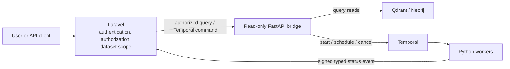
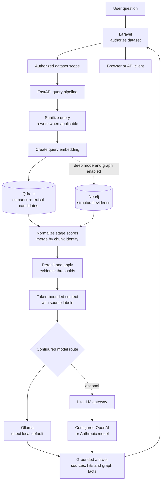

# 3. Introduction & Architecture

## What HAWKI RAG does

HAWKI RAG turns crawled websites and uploaded files into searchable,
dataset-scoped evidence. When a user asks a question, it finds the most relevant
evidence and asks a language model to write a grounded answer with source
references.

```text
Documents → searchable evidence → retrieve the best passages → cited answer
```

The answer prompt instructs the model to use only the supplied dataset evidence
and to say when that evidence is insufficient.

HAWKI RAG combines a **Laravel control plane** with a **Python RAG data plane**.
Docker packages the application and its supporting services so they can
communicate through predictable internal service names.

## Component responsibilities

| Component | Practical responsibility |
|---|---|
| **Laravel application** | Provides the UI and public API, authenticates and authorizes callers, owns all application PostgreSQL metadata, submits trusted Temporal/query requests, and applies typed worker status callbacks. |
| **FastAPI bridge (`hawki_rag_bridge`)** | Provides the read-only internal API for health, authorized query and graph reads, plus Temporal start, schedule, and cancellation commands. It has no ingestion route and no vector or graph write path. |
| **Workflow worker** | Runs the deterministic Temporal workflow and coordinates the scraper, converter, indexer, and final-ready activities. |
| **Scraper worker** | Calls the external crawler (or handles an uploaded artifact), writes raw artifacts, and reports signed stage events to Laravel. |
| **Converter worker** | Inspects or converts raw artifacts into normalized Markdown and reports signed stage events to Laravel. |
| **Indexer worker** | Reads Markdown artifacts and performs chunking, incremental planning, embeddings, Qdrant writes, and optional Neo4j/RAG-Anything work directly in-process. It never calls the bridge to ingest. |
| **CustomCrawler** | Crawls website sources and places the resulting files into shared storage. It runs outside the core Compose project but joins the shared Docker network. |
| **File converter** | Converts supported source files into normalized Markdown for ingestion. |
| **Qdrant** | Stores chunk text, metadata, and embeddings for semantic and lexical retrieval. |
| **Neo4j** | Stores normalized, dataset-scoped entities and relations for optional structural retrieval. |
| **Reranker** | Reorders retrieved candidates so the strongest evidence reaches the answer prompt first. |
| **Model provider** | Creates embeddings and generates answers. Ollama is the direct local default; LiteLLM can optionally route requests to configured local or cloud models. |
| **PostgreSQL** | Stores Laravel application records and Temporal's separate workflow persistence databases. |
| **Shared storage** | Carries raw files, converted Markdown, manifests, and other ingestion artifacts between containers. It is storage, not a database. |

## Control plane and data plane

Laravel is the public security boundary. It identifies the caller, checks
dataset access, and creates an authorized dataset scope before sending a query
to the bridge or submitting ingestion work. That scope contains the concrete
Qdrant collection, Neo4j namespace, embedding provider, embedding model, and
graph setting that Python may use.

Python services apply this scope but do not authenticate users or decide which
datasets they may access. They do not connect to Laravel's PostgreSQL tables.
Scraper, converter, and indexer workers instead send typed, HMAC-signed,
idempotent status events to Laravel; Laravel validates each event and performs
the metadata mutation through its own repository layer. A query cannot silently
switch embedding providers because vectors created by incompatible embedding
models cannot be compared safely.

Laravel also does not connect directly to Temporal. It calls the FastAPI
bridge's internal Temporal endpoints, and the Python Temporal client starts,
cancels, or schedules the workflow.



## How a document enters the system

A source can begin as a website URL or an uploaded file. Temporal coordinates
the external tools and Python workers, while Laravel records their signed
status events in its PostgreSQL metadata throughout the process.

```mermaid
flowchart TB
    subgraph Sources["①  CHOOSE A SOURCE"]
        direction LR
        Website["🌐  Website URL"]
        Upload["📄  File upload"]
    end

    subgraph Control["②  CREATE & ORCHESTRATE"]
        direction LR
        Laravel["Laravel control plane<br/>source · job · permissions"]
        Callback["Laravel internal callback API<br/>typed · signed · idempotent"]
        BridgeControl["FastAPI bridge<br/>Temporal control API"]
        Temporal["Temporal<br/>durable workflow"]
        AppDB[("PostgreSQL<br/>application metadata<br/>& live pipeline status")]
        TemporalDB[("PostgreSQL<br/>Temporal-owned state")]
    end

    Website --> Laravel
    Upload --> Laravel
    Laravel -->|"save metadata"| AppDB
    Laravel -->|"request workflow"| BridgeControl
    BridgeControl --> Temporal
    Temporal -->|"persist workflow"| TemporalDB

    subgraph Prepare["③  PREPARE THE CONTENT"]
        direction TB
        SourceRoute{"Which source<br/>is being processed?"}

        ScrapeWorker["Scraper worker"]
        Crawler["CustomCrawler"]
        UploadStore[("Shared storage<br/>initial upload")]
        UseUpload["Copy stored upload<br/>crawler skipped"]

        RawFiles[("Shared storage<br/>raw source files")]
        ConvertWorker["Converter worker"]
        Converter["File converter"]
        Markdown[("Shared storage<br/>normalized Markdown")]

        SourceRoute -- "website" --> ScrapeWorker
        ScrapeWorker --> Crawler
        Crawler --> RawFiles

        SourceRoute -- "uploaded file" --> UseUpload
        UploadStore --> UseUpload
        UseUpload --> RawFiles

        RawFiles --> ConvertWorker
        ConvertWorker --> Converter
        Converter --> Markdown
    end

    Upload -->|"store file"| UploadStore
    Temporal --> SourceRoute

    subgraph Index["④  BUILD SEARCHABLE KNOWLEDGE"]
        direction TB
        IndexerWorker["Indexer worker<br/>clean + split Markdown batches"]
        Embeddings["Create embeddings"]
        Qdrant[("Qdrant<br/>chunks · metadata · vectors")]
        GraphNeeded{"Graph processing<br/>requested or required?"}
        RAGAnything["RAG-Anything<br/>document + multimodal orchestration"]
        LightRAG["LightRAG<br/>entity + relation extraction"]
        Normalize["HAWKI RAG adapter<br/>export · normalize · deduplicate"]
        Neo4j[("Neo4j<br/>dataset-scoped graph facts")]
        Ready["✓  Dataset ready to search"]

        Markdown --> IndexerWorker
        IndexerWorker -->|"direct in-process indexing"| Embeddings
        Embeddings --> Qdrant
        Qdrant --> GraphNeeded
        GraphNeeded -- "no" --> Ready
        GraphNeeded -- "yes" --> RAGAnything
        RAGAnything --> LightRAG
        LightRAG --> Normalize
        Normalize --> Neo4j
        Neo4j --> Ready
    end

    ScrapeWorker -. "signed stage event" .-> Callback
    ConvertWorker -. "signed stage event" .-> Callback
    IndexerWorker -. "signed stage event" .-> Callback
    Ready -. "signed final event" .-> Callback
    Callback -->|"Laravel repository mutation"| AppDB

    classDef source fill:#7c3aed,color:#ffffff,stroke:#c4b5fd,stroke-width:2px;
    classDef control fill:#0f4c81,color:#ffffff,stroke:#7dd3fc,stroke-width:2px;
    classDef worker fill:#075985,color:#ffffff,stroke:#38bdf8,stroke-width:2px;
    classDef external fill:#4338ca,color:#ffffff,stroke:#a5b4fc,stroke-width:2px;
    classDef storage fill:#ecfdf5,color:#064e3b,stroke:#34d399,stroke-width:2px;
    classDef decision fill:#fff7ed,color:#9a3412,stroke:#fb923c,stroke-width:2px;
    classDef graphStep fill:#86198f,color:#ffffff,stroke:#f0abfc,stroke-width:2px;
    classDef success fill:#047857,color:#ffffff,stroke:#6ee7b7,stroke-width:3px;

    class Website,Upload source;
    class Laravel,Callback,BridgeControl,Temporal control;
    class ScrapeWorker,UseUpload,ConvertWorker,IndexerWorker,Embeddings worker;
    class Crawler,Converter external;
    class AppDB,TemporalDB,UploadStore,RawFiles,Markdown,Qdrant,Neo4j storage;
    class SourceRoute,GraphNeeded decision;
    class RAGAnything,LightRAG,Normalize graphStep;
    class Ready success;

    style Sources fill:#faf5ff,stroke:#8b5cf6,stroke-width:2px
    style Control fill:#f0f9ff,stroke:#0284c7,stroke-width:2px
    style Prepare fill:#fffaf0,stroke:#f59e0b,stroke-width:2px
    style Index fill:#f0fdfa,stroke:#0d9488,stroke-width:2px
```



In practical terms:

1. Laravel creates the source and pipeline metadata. It also saves uploaded
   files directly to shared storage.
2. FastAPI starts a Temporal workflow on Laravel's behalf.
3. For a website, the scraper worker calls CustomCrawler. For an upload, it
   copies the already stored file and skips CustomCrawler.
4. The converter worker sends raw files to the file converter and stores the
   resulting Markdown.
5. The indexer worker reads Markdown in batches and calls its indexing
   application logic directly. It chunks the content, creates embeddings, and
   writes vectors and incremental content state to Qdrant without an HTTP hop
   through the bridge.
6. When graph processing is requested or required, indexer-owned RAG-Anything
   and LightRAG adapters produce normalized facts for Neo4j.
7. Workers send signed, typed stage events and artifact references to Laravel.
   Only Laravel projects those events into its PostgreSQL metadata.

## How a question becomes an answer

Every query is restricted to the scope authorized by Laravel. Qdrant is the
baseline retrieval store. Neo4j contributes structural evidence only when graph
retrieval is enabled and the query is not running in fast mode.



The retrieval pipeline:

1. Sanitizes the question and, when appropriate, creates useful search terms.
2. Retrieves semantic candidates and a lexical fallback from Qdrant.
3. Normalizes scores from separate retrieval stages so they are comparable.
4. Deduplicates by chunk identity without collapsing different chunks from the
   same document.
5. Adds Neo4j structural evidence when deep graph retrieval is available.
6. Reranks the candidates and builds a bounded evidence context.
7. Generates an answer that cites sources as `[Source N]`.

## Fast and deep retrieval

The mode controls retrieval breadth, not whether an answer is generated.
Actual response time still depends on model speed, result count, caches, and
whether an additional retrieval pass is needed.

| Mode | What happens |
|---|---|
| **Fast** | Uses Qdrant semantic and lexical retrieval, score normalization, chunk deduplication, reranking, and answer generation. It skips graph retrieval, graph facts, and model-assisted query rewriting. |
| **Deep** | Uses the same vector and lexical foundation, and can additionally use query rewriting, Neo4j structural retrieval, and graph facts when the authorized dataset has graph data. |

## Why the Python RAG services exist

Laravel remains focused on the public application: HTTP, authentication,
authorization, dataset management, and operational status. Document parsing,
embeddings, model providers, reranking, RAG-Anything, and LightRAG belong to the
Python machine-learning ecosystem.

The Python data plane is split into six independently built roles: bridge,
workflow worker, scraper worker, converter worker, indexer worker, and reranker.
Shared code is supplied by narrow uv workspace packages rather than copied
service implementations. Only the bridge and reranker expose HTTP APIs; the
workflow and activity workers run their package entrypoints.

This keeps the read-only query/control boundary small while allowing the heavy
indexing dependencies to live only in the indexer image. Each role remains
independently testable and replaceable without moving Python-specific concerns
into Laravel or duplicating the same API in multiple containers.

## Why both RAG-Anything and LightRAG exist

RAG-Anything and LightRAG are layers of one optional graph-ingestion path, not
two competing query engines:

1. **RAG-Anything is the outer integration layer.** It coordinates normalized
   text, associated images, and the configured chat, vision, and embedding
   providers.
2. **LightRAG is embedded inside RAG-Anything.** It extracts entities and
   relations and exposes the generated graph edges.
3. **HAWKI RAG owns the final write.** Its adapter exports the edges, converts
   them into `(subject, relation, object)` triplets, removes duplicates, and
   writes dataset-scoped facts to Neo4j.

The helpers named after both libraries adapt these two boundaries. If the
official graph path returns no usable triplets, a small direct model-provider
fallback can attempt extraction before the final write.

RAG-Anything and LightRAG run during **graph-enabled ingestion**. Normal user
queries do not run either library again; they read the already stored evidence
through HAWKI RAG's Qdrant and Neo4j adapters.

<details>
<summary>Advanced: LightRAG extraction storage</summary>

When Neo4j credentials are available, LightRAG can use Neo4j as internal
extraction storage; otherwise its configured fallback storage is used. This
internal extraction state is not the final dataset graph. HAWKI RAG exports the
usable edges and writes normalized dataset-scoped facts through its own Neo4j
adapter. Cleanup of temporary extraction nodes is an internal lifecycle detail
and should not be relied upon as an application data contract.

</details>

This outer/inner relationship follows the
[RAG-Anything framework](https://github.com/HKUDS/RAG-Anything), while the
diagrams above show the components and storage boundaries specific to HAWKI
RAG.

## Storage responsibilities

| Storage | What belongs there | Isolation |
|---|---|---|
| **PostgreSQL** | Datasets, sources, jobs, permissions, schedules, documents, ingested-page records, callback idempotency, and projected pipeline status | Laravel is the sole owner of application metadata. Temporal owns separate persistence schemas, even when hosted by the same PostgreSQL container; Python workers do not query either database directly. |
| **Qdrant** | Chunk text, metadata, embedding vectors, content hashes, and index-internal incremental state | Queries use the authorized collection and mandatory dataset filter. The indexer reads and writes this state; the bridge reads only. |
| **Neo4j** | Normalized entities and relations used for graph retrieval | Facts are written and queried with the authorized dataset namespace. |
| **Shared storage** | Raw source files, converted Markdown, manifests, and pipeline artifacts | Workflow-specific paths and validated shared roots; this is not a query database. |

## Key concepts

- **Chunk:** A bounded section of a document stored and retrieved as one piece
  of evidence.
- **Embedding:** A list of numbers representing meaning, allowing semantically
  similar text to be found.
- **Lexical retrieval:** Matching important words or phrases directly, which
  complements semantic similarity.
- **Reranking:** Reordering retrieved candidates using a stronger relevance
  model.
- **Graph fact:** A normalized relationship such as
  `(student, belongs to, university)`.
- **Temporal workflow:** A durable process that remembers ingestion progress
  and can continue after worker restarts.
