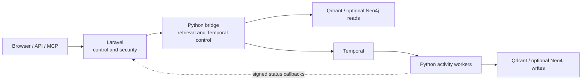
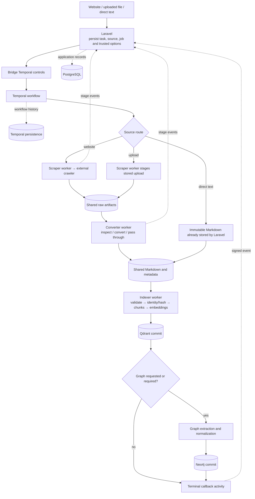
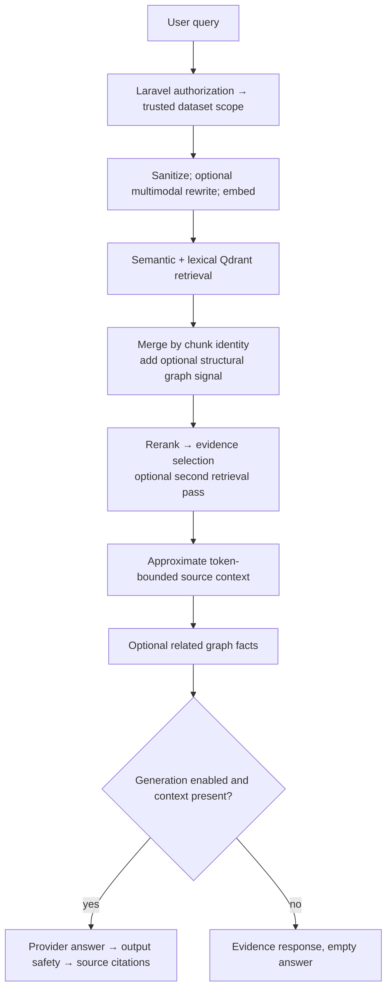

# Introduction & Architecture

HAWKI RAG makes managed content searchable. It turns websites, uploaded files,
and submitted text into evidence that an application can retrieve or use to
generate an answer.

```text
Documents → searchable evidence → relevant passages → optional cited answer
```

## The system at a glance



| Component | Owns |
|---|---|
| **Laravel = control/security plane** | Public routes, query identities and dataset grants, storage/model selection, ingestion submission, application metadata, and operator projections |
| **Python = RAG data plane** | Artifact preparation, indexing, scoped retrieval, reranking, and model-provider calls |
| **Temporal = durable orchestration** | Workflow execution history, activity scheduling, retries, and cancellation |
| **Qdrant = searchable vector/content state** | Chunk text, payload metadata, embeddings, and incremental/completion state |
| **Neo4j = optional structural/graph state** | Dataset-scoped facts used by graph retrieval; Neo4j still starts in the default Compose stack |
| **PostgreSQL = application metadata and separate Temporal persistence** | Laravel tables and Temporal-owned persistence are different responsibilities on the supplied database server |
| **Shared storage = ingestion artifact handoff** | Raw files, normalized Markdown, metadata sidecars, and manifests |

The **read-only data-plane bridge** provides query/graph reads and health. It
also exposes Temporal start, schedule, delete-schedule, and cancellation controls.
“Read-only” describes its Qdrant/Neo4j data routes: it has no ingestion or
canonical store-write route.

Laravel calls those bridge controls rather than a PHP Temporal SDK. The Python
bridge uses the Temporal client; Python activity workers index directly
in-process.

## Trust and ownership

For query requests, Laravel resolves the caller and checks dataset access,
then constructs trusted storage and embedding scope. Python applies this scope;
it does not resolve user grants. Public management routes have a different,
single-user deployment policy: see
[Authorization & Dataset Scope](../Core%20Concepts/authorization_dataset_scope.md).

Only Laravel accesses application PostgreSQL tables. Python workers report
typed HMAC-signed status events to Laravel, which validates them and updates
metadata transactionally. However, the current Compose file supplies the
shared environment file to those workers, including database variables.
**No database access in Python** is an implementation boundary, not a claim
that credentials are absent from container environments.

## How a document enters the system

The detailed source flow has three preparation routes:



The crawler and file converter are external projects. The workers use a shared
Docker volume mounted at `/shared`; Temporal carries artifact references and
configuration, not the document body or vectors.

Conversion can pass through existing Markdown or create artifacts through the
external converter. The indexer prefers the explicit artifact list and verifies
its identities and hashes. Directory discovery is a fallback.

Qdrant commits before optional graph enrichment. A successful vector write and
a successful graph write are **not one atomic transaction**. Optional extraction
may yield no facts, and projection can lag the stores. See
[Ingestion](../Operations/6_ingestion_embeddings.md) and
[Ingestion Recovery](../Operations/ingestion_recovery.md).

Direct text uses `IngestTextWorkflow`, skips scraper/converter activities, and
forces graph ingestion off. Source workflows use `IngestSourceWorkflow`.
Their activity limits and compatibility markers belong in
[Temporal Operations](../Operations/temporal_operations.md).

## How a question becomes an answer



Fast mode skips rewrite and graph reads but retains lexical retrieval,
reranking, and the possible second pass. Deep mode can use those additional
paths. Neither mode implies that generation is enabled: MCP `query-search`
requests evidence with `generate=false`.

[Query & Retrieval](../Core%20Concepts/query_retrieval.md) owns the exact
ordering, score policy, fallbacks, and context limits.

## Service roles and deeper reading

The Python workspace has six production roles: bridge, workflow worker,
scraper worker, converter worker, indexer worker, and reranker.
Only the bridge and reranker expose application HTTP APIs.

RAG-Anything and its embedded LightRAG extraction run within optional ingestion.
Normal queries read stored facts; they do not run those extraction libraries.
[Graph Enrichment](../Core%20Concepts/Ingestion/graph_enrichment.md) explains the
adapter layers and failure boundaries.

Continue with [Storage](../Core%20Concepts/storage.md) for persistence and
isolation, or the [Repository Map](../Reference/8_repo_map.md) for implementation
ownership and declared Python dependencies.

Sources: [Compose](https://github.com/hawk-digital-environments/HAWKI-RAG/blob/main/docker-compose.yml),
[bridge routers](https://github.com/hawk-digital-environments/HAWKI-RAG/tree/main/python_rag/services/hawki_bridge/src/hawki_bridge/http/routers),
[source workflow](https://github.com/hawk-digital-environments/HAWKI-RAG/blob/main/python_rag/services/hawki_workflow_worker/src/hawki_workflow_worker/workflows/ingest_source.py),
[query execution](https://github.com/hawk-digital-environments/HAWKI-RAG/blob/main/python_rag/services/hawki_bridge/src/hawki_bridge/application/query/execution.py),
[worker event service](https://github.com/hawk-digital-environments/HAWKI-RAG/blob/main/app/Services/Pipeline/PipelineWorkerEventService.php).
