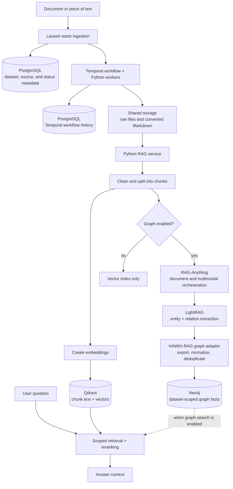
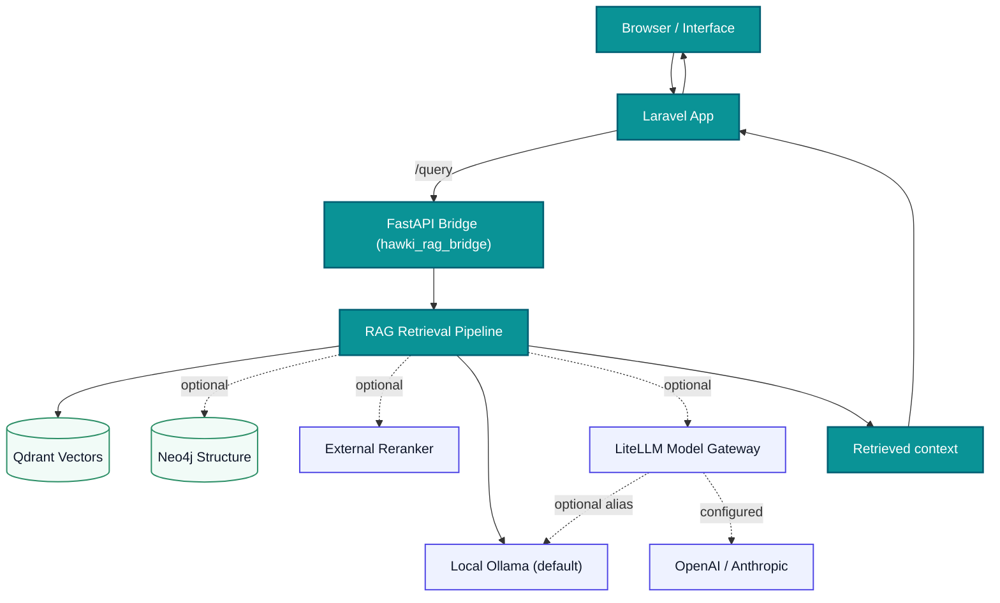

# 3. Introduction & Architecture

## System Overview
- A question-answering machine: you feed it documents; it reads them; it answers questions using only those documents.
- Built with **Laravel (PHP)** plus **Python** services, all inside **Docker** so you avoid complex local installs.

## RAG Definition (Analogy)
- Imagine a librarian with two superpowers:
  - It **finds** the right paragraphs in all books it has read (retrieval).
  - It **writes** a new answer using those paragraphs (generation).
- RAG = Retrieval Augmented Generation. First find; then write.

## The Dual Brain of HAWKI RAG
- **Brain 1: Semantic brain (Qdrant vectors).** It finds text by meaning, even when wording is different.
- **Brain 2: Structural brain (Neo4j graph).** It finds entities and relationships (who/what is connected to what).
- Both brains are used to retrieve evidence, then the reranker orders the best hits, and the generator model writes the final answer.

## How This Project Implements RAG
- **Vector DB (Qdrant):** Stores meanings of text as numbers (“embeddings”).
- **Graph DB (Neo4j):** Stores entities/relationships extracted from text.
- **Local models (Ollama):** The default direct runtime, using `bge-m3` for embeddings, `llama3.1:8b` for answers/graph work, and `qwen2.5vl:7b` for image understanding.
- **Optional model gateway (LiteLLM):** An explicit alternative runtime that routes stable aliases to Ollama, OpenAI, and Anthropic while keeping cloud credentials at the proxy.
- **Bridge (Python FastAPI):** Ingests documents, chunks text, makes embeddings/graph, saves to Qdrant/Neo4j.
- **Temporal:** Durable source-ingestion workflow orchestration for scrape, conversion, ingestion, retries, cancellation, and schedules.
- **Reranker (Python):** Improves ordering of search results.
- **RAG API (Python):** Runs retrieval orchestration across Qdrant/Neo4j and reranking for query workflows.
- **Laravel App:** Web/API frontend; starts/cancels/schedules Temporal workflows; shows ingest status; proxies queries.

## Why the Python RAG Service Exists

Laravel remains the public application and authorization boundary. The separate
Python service was implemented because document parsing, embeddings, model
providers, reranking, RAG-Anything, and LightRAG use the Python machine-learning
ecosystem. Keeping those dependencies behind one internal FastAPI service makes
them easier to run and change without putting ML concerns inside the Laravel
application.

The Python service receives already-authorized dataset scope from Laravel. It
owns document ingestion and retrieval, while Temporal makes long-running
ingestion durable and restartable.

## Why Both RAG-Anything and LightRAG Are Used

They are two layers of the same graph-ingestion path:

1. **RAG-Anything is the outer integration layer.** It accepts normalized text
   and associated images, coordinates multimodal processing, and uses the
   configured chat, vision, and embedding providers.
2. **LightRAG is the graph engine embedded inside RAG-Anything.** It extracts
   entities and relations and exposes the generated graph edges.
3. **HAWKI-RAG owns the final database write.** Its graph adapter exports the edges,
   converts them to simple `(subject, relation, object)` triplets, removes
   duplicates, and writes dataset-scoped facts to Neo4j.

This is why the code contains helpers named for both RAG-Anything and LightRAG.
They adapt different boundaries of one pipeline; they are not two competing
graph extractors. The RAG-Anything helpers manage the ingestion lifecycle, while
the LightRAG helpers configure its internal storage and recover or export its
edges. If that official graph path produces no usable triplets, a small direct
model-provider fallback is used.

RAG-Anything and LightRAG run during **graph-enabled ingestion**. A normal user
query does not call either library again; it reads the stored evidence from
Qdrant and Neo4j through HAWKI-RAG's retrieval adapters.

## Simplified Text Flow

Database responsibilities in one sentence: PostgreSQL stores application and
workflow metadata, Qdrant stores searchable chunks and vectors, and Neo4j stores
entities and relations. Raw files and converted Markdown use shared file
storage, which is not a database.

When Neo4j credentials are configured, LightRAG also uses Neo4j as temporary
graph storage during extraction. HAWKI-RAG exports that temporary result, clears
the extraction state, and writes the normalized dataset-scoped facts back
through its own Neo4j adapter. The diagram combines those internal operations
into one Neo4j destination to keep the flow readable.

This design follows the same outer/inner relationship described by the
[RAG-Anything framework](https://github.com/HKUDS/RAG-Anything), but the diagram
above shows the components and storage responsibilities specific to this
project.

## Core Query Workflow (Diagram)

## Key Concepts Explained
- **Embedding:** A list of numbers representing the meaning of text so similar texts are close together.
- **Vector Database:** A database that can search by “closeness” of embeddings (Qdrant).
- **Graph Database:** Stores nodes (entities) and edges (relationships) for richer queries (Neo4j).
- **Temporal Workflow:** A durable process that remembers ingestion progress and retries work after worker restarts.
- **Container:** A packaged mini-computer image; Docker runs many containers together.
