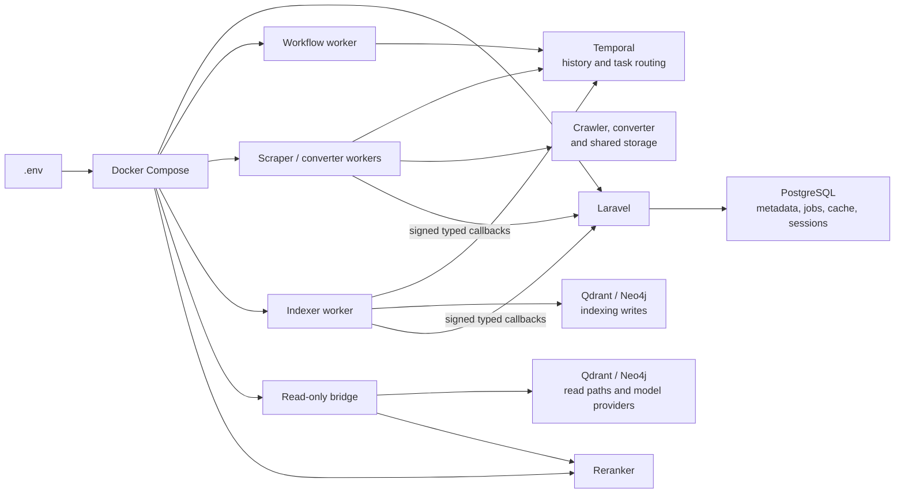
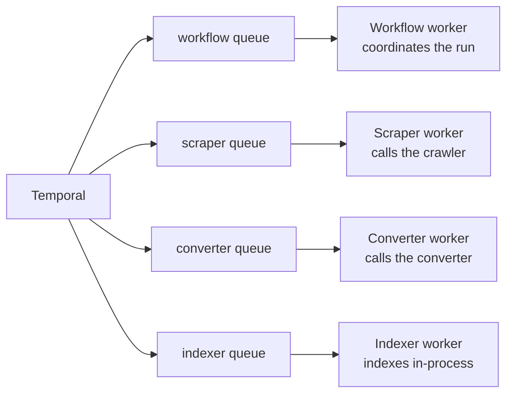
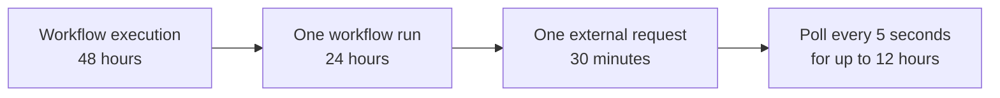
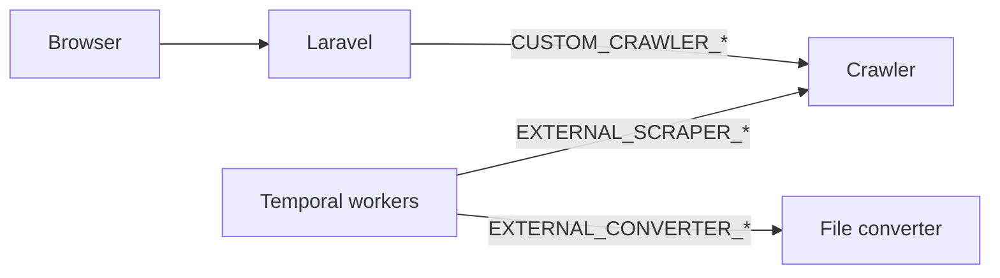
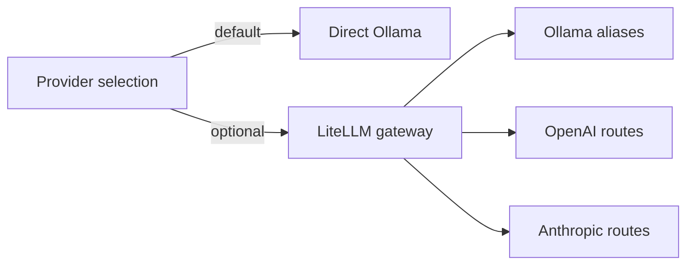

# 5. Environment, Database & Temporal

<div className="hero">

Your .env is the control panel for the running stack—not a checklist where
every blank must be filled. Use this page to see what a setting changes, which
service reads it, and whether existing data is affected.

[Configuring a new installation? Start here](../Getting%20Started/4_installation_zero_to_up.md)

</div>

:::info How to use this reference

`.env.example` is the canonical starting template. Compose and application code
also provide a small number of runtime fallbacks and overrides. This page
focuses on values an operator may realistically change. First-run secrets are explained in
[Installation](../Getting%20Started/4_installation_zero_to_up.md); startup and
recovery commands live in [Run HAWKI RAG](../Getting%20Started/2_setup.md).

:::

## Find the setting you need

<div className="grid-cards">

- <span className="grid-icon">🗄️</span> __Laravel state__
  PostgreSQL, database queues, cache, and sessions.
  [Open section](#laravel-state)

- <span className="grid-icon">⏱️</span> __Temporal__
  Workflow routing, refresh schedules, retries, and time limits.
  [Open section](#temporal-orchestration)

- <span className="grid-icon">🔌</span> __Ingestion tools__
  Crawler, converter, authentication, and polling.
  [Open section](#external-ingestion-services)

- <span className="grid-icon">🧠</span> __Models and retrieval__
  Ollama, LiteLLM, reranking, web search, and embedding safety.
  [Open section](#providers-and-model-contracts)

</div>

## What reads `.env`?

Docker Compose passes the same environment file to several services, but each
service consumes only the settings it owns.



These are six separately built Python roles. The bridge is a read-only
query/config/health and Temporal-control service; indexing runs directly inside
the indexer worker. Python workers receive no Laravel database credentials and
never update application tables themselves.

## Before changing a value

The important question is not only “what value should I enter?” but also “what
must happen after I change it?”

| Type of change | Recreate services? | Re-ingest existing datasets? | Persistent-state concern |
|---|:---:|:---:|---|
| Endpoint, timeout, or retry | Yes | No | None |
| Temporal schedule | Yes | No | Existing schedules may also need to be updated |
| Chat or vision model | Yes | Usually no | An active workflow may retain the settings captured when it started |
| Embedding provider or model | Yes | Yes, to move an existing dataset | Stored vectors must remain in one compatible embedding space |
| PostgreSQL or Neo4j password | Yes | No | The user inside the existing database must be updated as well |
| `APP_KEY` | Yes | No | Existing sessions and encrypted values may become unreadable |

:::warning Secrets are durable configuration

Do not rotate `APP_KEY`, `DB_PASSWORD`, or `NEO4J_PASSWORD` by editing `.env`
alone. Follow a credential-rotation procedure for the persistent service first,
then recreate the consumers.

:::

## Application and deployment

These settings describe how Laravel presents itself. The supported Make targets
already select production or development runtime behavior.

| Variable | `.env.example` value | Change when | Impact |
|---|---|---|---|
| `APP_NAME` | `HAWKI RAG` | A deployment needs different branding | Recreate Laravel |
| `APP_URL` | `http://localhost:8080` | The application has a public reverse-proxy URL | Recreate Laravel; generated and MCP URLs follow it |
| `APP_KEY` | Installation secret | Only during deliberate key rotation | Recreate Laravel; encrypted state may be invalidated |
| `APP_TIMEZONE` | `UTC` | Laravel timestamps should use another application timezone | Recreate Laravel; Temporal schedules remain UTC |
| `SESSION_SECURE_COOKIE` | `false` | The public application is served over HTTPS | Set `true`, then recreate Laravel |

`APP_ENV` and `APP_DEBUG` are loaded directly from the selected dotenv file.
Set them to `production` and `false` for a production deployment.

## Laravel state

### PostgreSQL connection

Laravel metadata and Temporal persistence use the same PostgreSQL server. They
remain separate data owners: Laravel uses its application tables, while
Temporal owns its workflow-history schemas.

| Variable | Default | Operator guidance |
|---|---|---|
| `DB_CONNECTION` | `pgsql` | Keep for the provided stack |
| `DB_HOST` | `postgres` | Keep unless PostgreSQL is deployed under a different service name |
| `DB_PORT` | `5432` | Change only when the PostgreSQL service listens on another internal port |
| `DB_DATABASE` | `hawki_rag` | Laravel application database |
| `DB_USERNAME` | `rag_user` | Credential used by Laravel and the local Temporal server |
| `DB_PASSWORD` | Installation secret | Set before first start and keep synchronized with PostgreSQL |

:::note Core database topology comes from Compose

The provided Compose stack fixes the core containers to `postgres:5432`.
Pointing the standard stack at another PostgreSQL host therefore requires a
Compose override as well as matching `.env` values.

:::

### Queues, cache, and sessions

The standard stack keeps Laravel's operational state in PostgreSQL. This avoids
introducing Redis or another queue service for the default deployment.

| Purpose | Variable | Default | Operator guidance |
|---|---|---|---|
| Laravel jobs | `QUEUE_CONNECTION` | `database` | Keep unless another Laravel queue backend and its workers are deliberately deployed |
| Queue database | `DB_QUEUE_CONNECTION` | `pgsql` | Uses the PostgreSQL connection |
| Failed jobs | `QUEUE_FAILED_DRIVER` | `database-uuids` | Keeps failed-job records available for inspection |
| Cache | `CACHE_STORE` | `database` | Stores application cache and locks in PostgreSQL |
| Cache database | `DB_CACHE_CONNECTION` | `pgsql` | Uses the PostgreSQL connection |
| Sessions | `SESSION_DRIVER` | `database` | Stores browser sessions in PostgreSQL |
| Session database | `SESSION_CONNECTION` | `pgsql` | Uses the PostgreSQL connection |
| Idle session lifetime | `SESSION_LIFETIME` | `120` | Minutes before an inactive session expires |
| RAG monitor retention | `HAWKI_RAG_MONITOR_RETENTION_DAYS` | `30` | Days to retain ingestion summaries, graph previews, and graph-failure rows; values below `1` disable automatic pruning |

:::note Laravel queues and Temporal task queues are different

Laravel's database queue stores application jobs in PostgreSQL. Temporal task
queues route durable workflow and activity tasks to Python workers; they do not
use Laravel's `jobs` table.

:::

:::tip Database initialization is automatic

Supported `make up-core*` commands start PostgreSQL and the Laravel app, then
run migrations inside the app container before writable services start. The
same app startup also initializes shared-storage permissions, so no dedicated
migration container is created. Use `make migrate-core` only when you
intentionally need to rerun migrations on an existing stack.

Before deploying a database upgrade, `make migration-test` runs the migration
scenarios against an isolated temporary schema in the active PostgreSQL stack.

:::

## Temporal orchestration

Temporal makes long-running ingestion recoverable. The settings in this section
control where tasks go, when recurring refreshes run, and how long external
work may take.

### Connection and workflow identity

| Variable | Default | Change when |
|---|---|---|
| `HAWKI_RAG_TEMPORAL_ENABLED` | `true` | Temporal orchestration is intentionally disabled |
| `TEMPORAL_ADDRESS` | `temporal:7233` | Temporal is hosted under another internal address |
| `TEMPORAL_NAMESPACE` | `default` | The deployment uses a dedicated Temporal namespace |
| `TEMPORAL_INGEST_WORKFLOW_TYPE` | `IngestSourceWorkflow` | Only when application and workers are upgraded together to another workflow contract |

The standard Compose stack fixes its internal Temporal address to
`temporal:7233`. An external Temporal deployment also requires a matching
Compose override.

The browser-based Temporal UI is disabled by default. Enable its dedicated
profile only while workflow diagnostics are needed:

```bash
docker compose --env-file .env --profile temporal-ui up -d temporal-ui
```

By default it binds only to `http://127.0.0.1:8081`. Stop it again with
`docker compose --env-file .env --profile temporal-ui stop temporal-ui`.

### How task queues divide the work



:::caution Queue names are coordination contracts

The client and the matching worker must use exactly the same task-queue name.
Do not rename one value in isolation. If queue names change, recreate Laravel,
the bridge, and all Temporal workers together.

:::

<details>
<summary>Advanced: exact Temporal task-queue names</summary>

| Variable | Default | Consumer |
|---|---|---|
| `TEMPORAL_RAG_WORKFLOW_TASK_QUEUE` | `rag-workflow-task-queue` | Workflow worker |
| `TEMPORAL_RAG_SCRAPER_TASK_QUEUE` | `rag-scraper-task-queue` | Scraper activity worker |
| `TEMPORAL_RAG_CONVERTER_TASK_QUEUE` | `rag-converter-task-queue` | Converter activity worker |
| `TEMPORAL_RAG_INDEXER_TASK_QUEUE` | Falls back to `TEMPORAL_RAG_INGESTION_TASK_QUEUE`, then `rag-ingestion-task-queue` | Indexer activity worker |
| `TEMPORAL_RAG_INGESTION_TASK_QUEUE` | `rag-ingestion-task-queue` | Legacy compatibility while pre-refactor executions drain |

</details>

The workflow records the versioned
`hawki-rag-indexer-task-queue-v1` Temporal patch before using the new
`task_queues.indexer` payload field. Pre-patch histories keep their original
`task_queues.ingestion` command. During the transition, the indexer worker polls
both its configured indexer queue and the legacy ingestion queue; do not retire
the legacy queue until production histories have drained and replay has been
verified.

Inspect the workers, task queues, workflows, and activities registered by the
running application with:

```bash
docker exec -it hawki_rag_app php artisan pipeline:workers
```

### Refresh schedule defaults

These expressions are used when daily, weekly, or monthly source refreshes are
created. Temporal schedules use UTC.

| Variable | Default | Practical meaning |
|---|---|---|
| `TEMPORAL_RAG_DAILY_CRON` | `0 2 * * *` | Every day at 02:00 UTC |
| `TEMPORAL_RAG_WEEKLY_CRON` | `0 2 * * 0` | Every Sunday at 02:00 UTC |
| `TEMPORAL_RAG_MONTHLY_CRON` | `0 2 1 * *` | First day of every month at 02:00 UTC |

### Time budget for one ingestion run



| Variable | Default | Increase when |
|---|---|---|
| `TEMPORAL_WORKFLOW_EXECUTION_TIMEOUT` | `172800` | A workflow may need more than 48 hours across retries; value is seconds |
| `TEMPORAL_WORKFLOW_RUN_TIMEOUT` | `86400` | One run may legitimately exceed 24 hours; value is seconds |
| `TEMPORAL_WORKFLOW_TASK_TIMEOUT` | `30` | Workflow task processing itself is consistently timing out; value is seconds |
| `TEMPORAL_RAG_HTTP_TIMEOUT_SECONDS` | `1800` | A crawler or converter request takes longer than 30 minutes |
| `TEMPORAL_RAG_HTTP_RETRY_ATTEMPTS` | `3` | The external service has transient request failures |
| `TEMPORAL_RAG_EXTERNAL_POLL_INTERVAL_SECONDS` | `5` | Status checks should be less frequent |
| `TEMPORAL_RAG_EXTERNAL_POLL_TIMEOUT_SECONDS` | `43200` | An external job may run longer than 12 hours |

Indexing does not have a bridge request timeout: the indexer executes the
indexing application directly inside its Temporal activity. Its activity
timeouts and retries are part of the workflow contract rather than an HTTP
`/ingest` call.

### Signed worker status callbacks

Scraper, converter, and indexer workers report typed stage status, counters,
artifact references, manifests, and errors to Laravel's internal callback API.
The terminal indexer event also carries its ingestion summary, optional graph
preview, and document-level graph failures. Laravel stores the summary and
preview as PostgreSQL JSONB and stores every graph failure as an individual
row. Python receives no database credentials and performs no application-table
writes.
Laravel verifies the HMAC over the exact request body and timestamp, rejects
expired events, and records stable event IDs idempotently. A valid duplicate is
acknowledged without applying its metadata transition twice. Laravel applies
accepted transitions and monitor artifacts through its repository layer in one
database transaction. This is the only path by which Python changes
Laravel-owned pipeline data.

| Variable | Default | Operator guidance |
|---|---|---|
| `HAWKI_RAG_WORKER_CALLBACK_SECRET` | Empty | Required in production. Configure the same non-empty secret for Laravel and every activity worker. |
| `HAWKI_RAG_WORKER_CALLBACK_MAX_AGE_SECONDS` | `300` | Maximum callback timestamp age accepted by Laravel; change only with the workers and clock-skew policy considered together. |

The provided Compose stack supplies the internal callback endpoint
`http://hawki_rag_app/api/internal/pipeline/worker-events`. Callback delivery
has its own bounded timeout and retries; it is not a database connection and no
PostgreSQL credential is passed to a Python service.

Generate this installation secret once with `openssl rand -hex 32`, store it in
the selected private environment file, and recreate Laravel plus the three
activity-worker containers together when rotating it.

<details>
<summary>Advanced: workflow identity and storage handoff</summary>

| Variable | Default | Purpose |
|---|---|---|
| `TEMPORAL_CLIENT_IDENTITY` | `hawki-rag-laravel` | Identifies the HAWKI-RAG Temporal client |
| `HAWKI_RAG_TEMPORAL_SHARED_ROOT` | `/shared` | Existing canonical absolute directory seen by Laravel and all pipeline workers; never set it to `/` |
| `RAG_INGEST_GRAPH` | `false` | Enables graph extraction for source workflows by default |

</details>

The ingestion pipeline supports only the mounted shared-volume handoff. Laravel
allocates every raw, Markdown, and manifest path below the configured shared
root; workers independently enforce that root before accessing the filesystem.

## External ingestion services

The installation guide explains how the crawler and converter join the stack.
This section only maps operational overrides to the consumer that uses them.



### Crawler

| Variable | Default | Used by | Change when |
|---|---|---|---|
| `CUSTOM_CRAWLER_URL` | `http://crawl4ai-service` | Laravel crawler integration | Laravel must reach a differently named crawler |
| `CUSTOM_CRAWLER_TASK_UI_URL` | `http://crawl4ai-service` | Laravel task-UI proxy | The crawler UI uses another base address |
| `EXTERNAL_SCRAPER_URL` | `http://crawl4ai-service` | Temporal scraper worker | Workflow calls use another crawler address |
| `EXTERNAL_SCRAPER_START_PATH` | `/crawl` | Temporal scraper worker | The crawler exposes another submission route |
| `EXTERNAL_SCRAPER_STATUS_PATH` | `/status/{job_id}` | Temporal scraper worker | The crawler exposes another status route |
| `EXTERNAL_SCRAPER_TOKEN` | Empty | Temporal scraper worker | The crawler requires a bearer token |
| `CUSTOM_CRAWLER_API_KEY` | Empty | Laravel and scraper fallback | Laravel access needs authentication or no explicit scraper token is set |

### File converter

| Variable | Default | Used by | Change when |
|---|---|---|---|
| `FILE_CONVERTER_BASE_URL` | `http://hawki-toolkit-file-converter-file-converter-1` | Laravel converter integration | Laravel must reach another converter address |
| `EXTERNAL_CONVERTER_URL` | `http://hawki-toolkit-file-converter-file-converter-1` | Temporal converter worker | Workflow calls use another converter address |
| `EXTERNAL_CONVERTER_START_PATH` | `/extract` | Temporal converter worker | The converter exposes another submission route |
| `EXTERNAL_CONVERTER_STATUS_PATH` | Empty | Temporal converter worker | A custom asynchronous converter exposes a status route |
| `EXTERNAL_CONVERTER_TOKEN` | `file-converter-key` | Temporal converter worker | The converter uses another bearer token |
| `FILE_CONVERTER_TOKEN` | `file-converter-key` | Laravel and converter fallback | Laravel access uses another token or no explicit workflow token is set |

The retry and polling behavior for both tools is controlled by the
`TEMPORAL_RAG_HTTP_*` and `TEMPORAL_RAG_EXTERNAL_POLL_*` variables in the
[Temporal time-budget table](#time-budget-for-one-ingestion-run).

## Providers and model contracts

Direct Ollama is the normal path. LiteLLM is an optional gateway selected
explicitly for Ollama aliases or cloud providers.



### Direct Ollama defaults

| Variable | Default | Role | Change impact |
|---|---|---|---|
| `RAG_DEFAULT_PROVIDER` | `ollama` | Default provider for ingestion and queries | New work uses the selected provider |
| `GRAPH_PROVIDER` | `ollama` | Default provider for graph/model operations | New graph work uses the selected provider |
| `OLLAMA_API_URL` | `http://hawki_ollama:11434/api` | Direct Ollama endpoint | Recreate Python services |
| `OLLAMA_RAG_MODEL` | `llama3.1:8b` | Chat, answer, and graph language tasks | Recreate Python services |
| `OLLAMA_EMBED_MODEL` | `bge-m3` | Dataset embeddings | Existing datasets must retain or intentionally rebuild their vectors |
| `OLLAMA_VISION_MODEL` | `qwen2.5vl:7b` | Image and multimodal tasks | Recreate Python services |

:::warning Embeddings are a dataset contract

Changing the default embedding provider or model does not convert existing
vectors. Query vectors must use the same model family and dimensions as the
indexed vectors. See
[Ingestion & Embeddings](./6_ingestion_embeddings.md) before moving an existing
dataset to another embedding model.

:::

### Reranking and web search

| Feature | Select with | Endpoint or credential | Default behavior |
|---|---|---|---|
| Local reranker | `RERANKER_MODE=external` | `RERANKER_API_URL=http://hawki_rag_rerank/v1/rerank` | Enabled through the local Cohere-compatible service |
| Jina reranker | `RERANKER_MODE=jina` | `JINA_API_KEY` | Available only when a key is supplied |
| Tavily search | `WEB_SEARCH_PROVIDER=tavily` | `TAVILY_SEARCH_API_KEY` | Provider selected, but unavailable while the key is empty |
| Brave search | `WEB_SEARCH_PROVIDER=brave` | `BRAVE_SEARCH_API_KEY` | Available only when selected and a key is supplied |

`RERANKER_PROVIDER` and `QUERY_MODE` remain in `.env.example` for compatibility,
but current reranker routing is selected by `RERANKER_MODE` and
`RERANKER_API_URL`. Do not treat the compatibility values as active controls.

<details>
<summary>Advanced: LiteLLM routes and aliases</summary>

| Variable | Default | Purpose |
|---|---|---|
| `LITELLM_API_URL` | `http://litellm:4000/v1` | Gateway endpoint used when LiteLLM is selected |
| `LITELLM_API_KEY` | Empty | Optional bearer token for a protected LiteLLM gateway |
| `LITELLM_CHAT_MODEL` | `hawki-ollama-chat` | Default chat and graph alias |
| `LITELLM_EMBED_MODEL` | `hawki-ollama-embedding` | Default embedding alias |
| `LITELLM_VISION_MODEL` | `hawki-ollama-vision` | Default vision alias |
| `LITELLM_CHAT_ALIASES` | Ollama, GPT, and Claude aliases | Chat and graph allowlist accepted by Settings |
| `LITELLM_EMBED_ALIASES` | Ollama and OpenAI aliases | Embedding allowlist accepted by Settings |
| `LITELLM_VISION_ALIASES` | Ollama, GPT, and Claude aliases | Vision allowlist accepted by Settings |
| `GRAPH_EMBEDDING_DIMENSIONS` | Ollama `1024`; OpenAI small `1536` | Trusted alias-to-dimension map for graph-only ingestion |

| Upstream | Configuration family | Required credential |
|---|---|---|
| Local Ollama | `LITELLM_OLLAMA_*` | None |
| OpenAI | `LITELLM_OPENAI_*` | `OPENAI_API_KEY` |
| Anthropic | `LITELLM_ANTHROPIC_*` | `ANTHROPIC_API_KEY` |

OpenAI and Anthropic keys are passed only to the optional LiteLLM container.
They can remain empty for the default direct-Ollama stack.

</details>

### Vector and graph stores

| Variable | Default | Operator guidance |
|---|---|---|
| `QDRANT_HTTP_URL` | `http://qdrant:6333` | Keep for the provided vector-store service |
| `QDRANT_API_KEY` | Empty | Set only when Qdrant authentication is enabled |
| `NEO4J_HTTP_URL` | `http://hawki_rag_neo4j:7474` | Keep for the provided graph-store service |
| `NEO4J_USER` | `neo4j` | Keep synchronized with Neo4j authentication |
| `NEO4J_PASSWORD` | Installation secret | Set before first start; rotate inside Neo4j before changing consumers |
| `GRAPH_ENGINE` | `raganything` | Change only when another supported graph engine is implemented |
