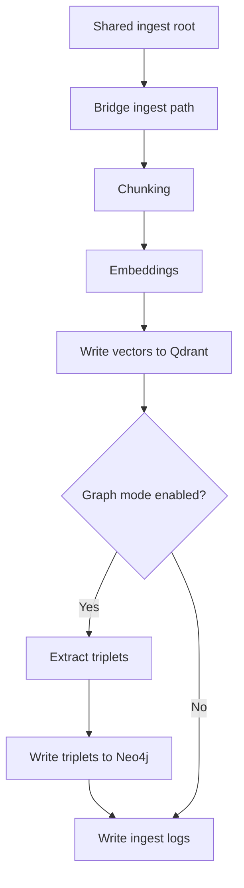

# 6. Ingestion & Embeddings (No Steps Skipped)

## Ingestion flow
<div className="side-by-side">



<div>

### How the pipeline moves
The ingest path starts with raw files and progressively turns them into search-ready knowledge.

1. **Collect**: source files are picked up from the shared ingest location.
2. **Prepare**: content is split into clean chunks so retrieval can target precise passages.
3. **Encode**: chunks are transformed into embeddings for semantic matching via Ollama (default embedding model: `bge-m3`).
4. **Index**: vectors are stored in Qdrant to power fast similarity search.
5. **Enrich (optional)**: when graph mode is on, triplets are extracted with `GRAPH_OLLAMA_RAG_MODEL` and written to Neo4j.
6. **Track**: ingest activity is logged so progress and issues are visible in real time.

</div>
</div>

## Prepare your data
- This step is handled by the crawler service.
- `crawl4ai-service` crawls your website and writes the crawled output into the shared Docker volume, which is available to the bridge at `/app/shared/<foldername>`.

## Run ingestion (inside container for no exposed ports)
- Command:
```
docker exec hawki_rag_bridge sh -lc "python -m application.cli.commands.ingest_crawled \
  --root /app/shared/<foldername> \
  --base-url http://localhost:8000 \
  --provider ollama \
  --graph \
  --batch 16"
```

:::tip "Resume or start fresh"
    The ingestion pipeline supports resume behavior and fresh-start behavior:

    - `--resume` (skip already ingested docs)
    - `--start` (ignore previous state and ingest fresh)
:::

:::tip "Ingestion with `--graph-only`"
    During ingestion, `--graph-only` skips Qdrant vector indexing and runs only graph extraction with writes to Neo4j.
:::

## Monitoring ingest progress
- View cached log: `docker exec hawki_rag_bridge tail -n 40 /var/www/storage/logs/ingest_progress_cache.log`.
- Check status JSON: `docker exec hawki_rag_app cat storage/logs/ingest_status.json`.

## Stopping ingestion
Methods to stop an active ingestion job:

- Use the ingestion stop action exposed by the API/controller flow.
- Kill the running ingest process ID recorded in the status file.
- Restart the `hawki_rag_bridge` container if you need a hard stop.
