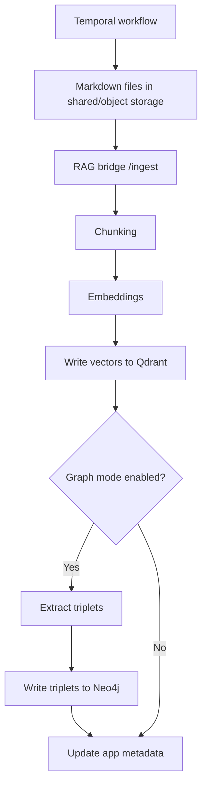

# 6. Ingestion & Embeddings (No Steps Skipped)

## Ingestion flow

### How the pipeline moves
Temporal coordinates ingestion and keeps the large file/content payloads out of workflow history.

1. **Upload**: Laravel stores the source file and starts `IngestSourceWorkflow`.
2. **Convert**: the converter activity writes Markdown to shared/object storage.
3. **Ingest**: the ingestion activity reads Markdown files, chunks text, and calls the RAG bridge `/ingest` endpoint.
4. **Index**: vectors are stored in Qdrant to power semantic search.
5. **Enrich (optional)**: when graph mode is on, triplets are extracted with `GRAPH_OLLAMA_RAG_MODEL` and written to Neo4j.
6. **Track**: Laravel metadata records workflow IDs, heap/source state, and index status.

## Run ingestion
Start ingestion through the application-facing upload API so Laravel can create source/job metadata and start `IngestSourceWorkflow` in Temporal.

## Monitoring ingest progress
- Open Temporal UI at `http://localhost:${TEMPORAL_UI_PORT:-8081}`.
- Inspect Laravel pipeline/source metadata through the operator API.
- Follow worker logs with `docker compose logs -f hawki-rag-temporal-workflow-worker hawki-rag-temporal-converter-worker hawki-rag-temporal-ingestion-worker`.

## Stopping ingestion
Cancel the pipeline task from Laravel or cancel the workflow in Temporal UI. Temporal will preserve workflow history and retry/resume behavior.
