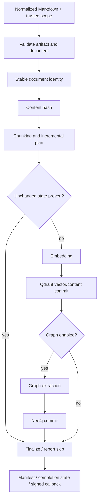

# Ingestion

Ingestion turns normalized Markdown into searchable chunks and, optionally,
graph facts. Follow document identity, incremental work, vector commits, and
optional graph enrichment through the guides below.

[See the complete source flow](../Getting%20Started/3_introduction_architecture.md)
· [Configure models and storage](./5_environment_db_queue.md)

:::info Where this page begins

This page begins when normalized Markdown reaches the indexer worker. The worker
executes the indexing application directly; the FastAPI bridge has no
Qdrant/Neo4j ingestion write route. Upstream preparation is covered in
[Architecture](../Getting%20Started/3_introduction_architecture.md#how-a-document-enters-the-system).

:::

## Choose an input

| Input | Preparation | Guide |
|---|---|---|
| Website | Source workflow → external crawler → conversion stage | [Full-ingestion smoke test](../Getting%20Started/2_setup.md#full-ingestion-smoke-test) |
| Uploaded file | Source workflow → stage upload → conversion or passthrough | [REST APIs](../Reference/rest_apis.md) |
| Plain text / Markdown | Laravel stores an immutable Markdown revision → text workflow → indexer | [Direct Text Ingestion](../Reference/direct_text_ingestion.md) |

The [architecture page](../Getting%20Started/3_introduction_architecture.md#how-a-document-enters-the-system)
shows the upstream Laravel, Temporal, crawler, and converter handoff.

## From Markdown to indexed evidence

:::warning Separate commit boundaries

Qdrant and Neo4j are not one atomic transaction. Vectors may be committed before
graph extraction or graph writing fails. Laravel's projected status is another
separate boundary. Inspect the last completed boundary before retrying.

:::

## Artifact handoff

Temporal input carries source IDs, trusted options, and artifact references,
not Markdown bodies, chunks, or vectors. The indexer uses explicit converter
artifact references when present, validating document/source IDs, hashes, sizes,
and paths. Only when references are absent does it recursively discover sorted
`.md` / `.markdown` files in the shared directory.

Blank artifacts are skipped. No files or an entirely blank artifact set can
produce a **skipped** result rather than an exception. Non-empty documents that
all fail indexer validation raise an error. These outcomes are different.

Shared-volume access is the implemented path; S3 listing/reading is unsupported.
Each Qdrant point stores a chunk's vector, text, and metadata. Chunks are prepared
in memory; there is no separate `chunks.md` handoff file.

## Read the relevant contract

| Topic | Authoritative guide |
|---|---|
| Same logical document versus changed contents | [Identity & Incremental Ingestion](../Core%20Concepts/Ingestion/identity_incremental.md) |
| Chunk boundaries, point IDs, provider compatibility, partial embeddings | [Chunking & Embeddings](../Core%20Concepts/Ingestion/chunking_embeddings.md) |
| RAG-Anything, LightRAG, normalization, graph scope | [Ingestion with Graph Processing Enabled](../Core%20Concepts/Ingestion/graph_enrichment.md) |
| Partial writes, graph repair, retries, source lifecycle | [Ingestion Recovery](./ingestion_recovery.md) |
| Workflow queues, activity budgets, signed callbacks | [Temporal Operations](./temporal_operations.md) |

Operation/job/document identifiers correlate retries, deterministic upserts,
manifests and callbacks. Idempotent identities reduce duplicate writes; they do
not turn the multi-store pipeline into a transaction.

Sources: [index activity](https://github.com/hawk-digital-environments/HAWKI-RAG/blob/main/python_rag/services/hawki_indexer_worker/src/hawki_indexer_worker/application/index_execution.py),
[artifact validation](https://github.com/hawk-digital-environments/HAWKI-RAG/blob/main/python_rag/services/hawki_indexer_worker/src/hawki_indexer_worker/indexing/artifact_documents.py),
[index orchestration](https://github.com/hawk-digital-environments/HAWKI-RAG/blob/main/python_rag/services/hawki_indexer_worker/src/hawki_indexer_worker/indexing/orchestration.py).
