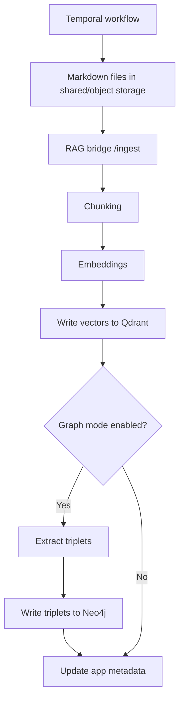

# 6. Ingestion & Embeddings (No Steps Skipped)

## Ingestion flow
<div className="side-by-side">



<div>

### How the pipeline moves
Temporal coordinates ingestion and keeps the large file/content payloads out of workflow history.

1. **Scrape**: the scraper activity calls the external scraper service and writes raw files to shared/object storage.
2. **Convert**: the converter activity calls the external converter service and writes Markdown to shared/object storage.
3. **Ingest**: the ingestion activity reads Markdown files, chunks text, and calls the RAG bridge `/ingest` endpoint with the dataset's stored provider and embedding model plus the selected chat/vision models.
4. **Index**: direct Ollama is used by default; explicitly selected LiteLLM aliases may route to Ollama or OpenAI. Resulting vectors are stored in Qdrant for semantic search.
5. **Enrich (optional)**: when graph mode is on, triplets are extracted through the explicitly selected provider and written to Neo4j.
6. **Track**: Laravel app metadata records workflow IDs, source freshness, and index status.

</div>
</div>

The embedding provider/model is part of the dataset contract because query vectors must
use the same model family and dimensions as the indexed vectors. Changing the
Settings default applies to new datasets; intentionally re-ingest an existing
dataset before changing its embedding model.

## Run ingestion
Start ingestion through Laravel so it can create source/job metadata and start `IngestSourceWorkflow` in Temporal:

```bash
docker exec -it hawki_rag_app php artisan pipeline:start-task \
  --source-url=https://example.edu \
  --refresh-cadence=daily
```

## Monitoring ingest progress
- Open Temporal UI at `http://localhost:${TEMPORAL_UI_PORT:-8081}`.
- Inspect Laravel pipeline/source metadata in the pipeline task UI.
- Follow worker logs with `docker compose logs -f hawki-rag-temporal-workflow-worker hawki-rag-temporal-scraper-worker hawki-rag-temporal-converter-worker hawki-rag-temporal-ingestion-worker`.

## Stopping ingestion
Cancel the pipeline task from Laravel or cancel the workflow in Temporal UI. Temporal will preserve workflow history and retry/resume behavior.
