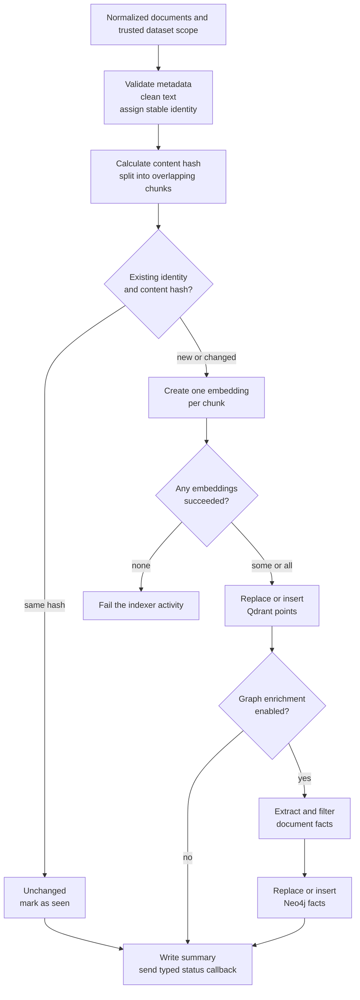

# 6. Ingestion & Embeddings

This page explains the data contracts and failure boundaries inside ingestion:
how a document keeps its identity, when work is skipped, when vectors are
replaced, and how to recover when graph enrichment is incomplete.

[See the complete source flow](../Getting%20Started/3_introduction_architecture.md)
· [Configure models and storage](./5_environment_db_queue.md)

:::info Where this page begins

The architecture guide already follows a website or upload through Laravel,
Temporal, the crawler, the converter, and shared storage. This page begins when
normalized Markdown reaches the indexer worker. There is no FastAPI ingestion
endpoint: the worker invokes its indexing application directly in-process.
Startup, monitoring, and maintenance commands remain in
[Run HAWKI RAG](../Getting%20Started/2_setup.md).

:::

## The handoff into ingestion

Temporal carries source references, storage paths, and configuration—not the
Markdown body, chunks, or vectors—in workflow input. The indexer activity
recursively discovers sorted `.md` and `.markdown` files under the source's
shared-storage path, skips blank files, and passes the remaining documents to
the indexer-owned application service in batches. A source with no usable
Markdown fails before indexing. The bridge is not involved in this handoff.

:::warning Shared storage is the implemented read path

The current Temporal storage adapter reads local/shared Docker paths. It rejects
`s3://` listing and reading, so object-storage ingestion must not be enabled
until an object-storage adapter is implemented.

:::

## The ingestion commit pipeline

An indexing activity is not one indivisible database transaction. Preparation,
vector indexing, graph enrichment, and Laravel status projection have distinct
commit points.

The indexer input carries four contracts:

| Contract | Required information | Why it matters |
|---|---|---|
| **Document** | Stable ID, text, and metadata payload | Connects every chunk and later refresh to the same source document. |
| **Vector** | Qdrant collection, embedding provider/model, distance metric, and chunk settings | Keeps indexed vectors compatible with future query vectors. |
| **Graph** | Dataset ID and Neo4j namespace when graph writes are enabled | Prevents extracted facts from crossing dataset boundaries. |
| **Operation** | Workflow, run, activity, request/job identity, and a stable operation key | Correlates Temporal retries, deterministic writes, callbacks, logs, and artifacts without relying on an ingestion HTTP request. |

The operation key is propagated to storage adapters. Retry safety depends on
stable document and point identities plus deterministic upserts. Worker status
events use their own stable event IDs; Laravel stores callback receipts so a
duplicate event is accepted without applying the metadata transition twice.

## Stable identity and incremental ingestion

Two values answer different questions:

- **Source identity** answers “is this the same page or uploaded document?”
- **Content hash** answers “does its normalized text still have the same
  contents?”

For web content, URL identity is normalized without discarding the query string;
fragments are removed and scheme/host casing is normalized. When a crawler URL
represents several files, the relative path participates in the identity. An
upload keeps the source-scoped stable document ID created by the Temporal
activity. The content hash is SHA-256 over the cleaned document text.

The indexer checks the stable source identity and content hash stored in Qdrant
payloads. This makes the indexed content and its incremental state one
data-plane contract; Python does not read or write Laravel's PostgreSQL
`ingested_pages` table.

| Detected state | Vector action | Graph action | Incremental state and metadata action |
|---|---|---|---|
| **New identity** | Embed and insert its chunks. | Extract and insert facts when enabled. | The new Qdrant payload stores identity and hash; Laravel receives the resulting counters/artifact metadata by callback. |
| **Same identity, same hash** | Skip embedding and Qdrant writes. | Skip graph extraction during ordinary indexing. | Existing Qdrant payload remains authoritative; the callback reports the skip. |
| **Same identity, different hash** | Delete prior document points, then insert the new chunks. | Extract first, then replace facts for that document. | The replacement Qdrant payload carries the new hash; the callback reports the changed document. |
| **No longer submitted by the source** | No automatic action. | No automatic action. | Existing Qdrant points remain until explicit reconciliation or deletion. |
| **Graph-only internal operation** | Skip vector indexing and incremental filtering. | Re-extract and upsert facts for submitted documents. | Do not alter Qdrant incremental state. |

:::note Why an unchanged retry may not repair the graph

Ordinary incremental ingestion returns early when the content hash is unchanged.
If Qdrant is correct but Neo4j is incomplete, use the explicit graph repair or
graph-only path with graph enrichment enabled; resubmitting the same ordinary
source workflow is expected to skip it.

:::

## Chunk and vector contracts

HAWKI RAG currently uses **character-based chunks**, not token-based chunks.
With the defaults, a chunk targets 1,200 characters and overlaps the next chunk
by 250 characters. The splitter prefers a paragraph boundary when a suitable
one occurs after 60% of the target window.

Every Qdrant point contains:

- the chunk text and zero-based chunk index;
- the stable document ID and source metadata;
- the content hash, component type, and derived tags; and
- a deterministic UUID generated from document ID plus chunk index.

This gives retries the same point identities as long as document identity and
chunk boundaries remain unchanged.

:::warning Embedding compatibility is a dataset invariant

Query vectors must use the same embedding space as indexed vectors. Changing
the embedding provider, model, or vector dimension requires intentional
re-ingestion into a compatible collection. A model with the same marketing
name is not automatically compatible if its output dimension or behavior
differs.

:::

### What “batch size” actually controls

`INGEST_BATCH_SIZE` defaults to 64. The Temporal activity uses it to group
Markdown artifacts passed to the in-process indexer, and the indexer uses it
for Qdrant upsert batches. The current embedding loop still calls the provider
once per chunk; raising this value does not turn embedding into a provider-side
batch request.

Embedding failures are isolated per chunk:

- if some chunks fail, successful chunks are still written and the summary
  reports a partial embedding result;
- a document for which every chunk fails is counted as skipped; and
- if every prepared chunk in the activity fails, the activity fails without
  performing the Qdrant upsert.

## Vector and graph commit boundaries

Qdrant is committed before optional graph processing. The two stores can
therefore diverge; Neo4j enrichment is not part of the same atomic transaction
as the vector write.

| Boundary | Current behavior | Operational consequence |
|---|---|---|
| **Changed Qdrant document** | Old points are deleted before new points are upserted. | A failed upsert can temporarily leave that document absent. Retry or re-ingest it. |
| **Graph scope validation** | Conflicting document scope is rejected before vector writing. | Treat dataset ID and Neo4j namespace as trusted workflow fields, not document-controlled metadata. |
| **Changed Neo4j document** | New facts are extracted first; old facts are then deleted before the new upsert. | Extraction failure preserves the old version, but a later write failure can leave a graph gap. |
| **Per-document graph failure** | The failure is recorded and other documents continue. | Vectors can be current while graph facts are incomplete; repair the graph explicitly. |
| **Incremental state** | Stable identity and content hash are stored with the Qdrant content payload. | There is no Python-owned PostgreSQL page registry to reconcile. Inspect the Qdrant payload that actually participates in retrieval. |
| **Status projection** | Workers send signed typed events; only Laravel writes its PostgreSQL metadata. | A failed or delayed callback can leave the UI behind successfully written data; correlate using the operation/job ID before replaying work. |

Graph extraction groups chunks back into documents before calling the graph
engine. By default, it considers at most the first 6 chunks and 6,000
characters per document. Images referenced by supported converter metadata can
also be supplied to the multimodal extractor.

The graph adapter filters extracted triplets against the source text, normalizes
them, and writes them under the trusted dataset scope. Both dataset ID and
Neo4j namespace are required for canonical writes. A conflicting payload scope
causes an indexing validation error before vectors are committed; a missing
trusted scope disables the canonical graph write.

:::warning A ready result can still be partial

Successful completion means the indexing activity reached its finalization path. It does
not prove that every chunk embedded or that every document produced graph
facts. Check the partial-failure counts and graph-failure evidence before
treating the two stores as synchronized.

:::

The architectural roles of RAG-Anything, LightRAG, and the HAWKI RAG adapter are
explained once in
[Introduction & Architecture](../Getting%20Started/3_introduction_architecture.md#why-both-rag-anything-and-lightrag-exist).

## Failure diagnosis and recovery

Start with the last completed boundary rather than restarting the whole stack.

| Symptom | Likely completed boundary | Recommended action |
|---|---|---|
| No valid Markdown or every document fails validation | Nothing indexed | Correct the converted content or required document fields, then rerun ingestion. |
| Every embedding call fails | Preparation completed; Qdrant was not written | Check provider reachability, model availability, and the embedding contract. Retry after correction. |
| Only some embedding chunks fail | Partial Qdrant write may exist | Inspect failed document/chunk identifiers and re-ingest the affected source. |
| Qdrant fails while replacing a changed document | Old document points may already be deleted | Retry the same source with the same dataset scope. |
| Graph failure is reported after vectors succeed | Qdrant is current; Neo4j may be partial | Repair with graph enrichment enabled; use graph-only mode when vectors must remain untouched. |
| UI status appears stale but storage contains the new data | Data commit may be complete; the signed callback failed or Laravel's projection lagged | Correlate the operation ID across the ingestion summary, worker logs, Laravel callback receipt/status tables, Qdrant, and Neo4j before replaying. |

Temporal retries protect every pipeline stage. In particular, the scraper
activity heartbeats the external crawler job ID so an activity retry can resume
polling that job instead of submitting a duplicate crawl.

How the retry layers differ

Temporal currently retries each workflow activity up to five times with
exponential backoff. Indexing retries execute the in-process indexer again; no
bridge HTTP retry layer exists. Stable Qdrant identities make repeated writes
safe, and callback delivery uses a separate bounded retry policy with an
idempotent event ID. The terminal ready callback runs in the short
`mark_source_ready` activity so retrying its delivery does not repeat expensive
indexing. A manual retry after cancellation is different: Laravel starts a new
workflow execution with a new workflow ID; it does not resume the cancelled
execution.

Because a vector commit can precede a hard graph failure, the new attempt may
see an unchanged content hash and skip ordinary graph ingestion. Use the
targeted graph path when Qdrant is current but Neo4j needs repair.

## Change-impact matrix

Use this table before changing ingestion settings on a populated dataset.

| Change | Affects existing vectors? | Affects existing graph facts? | Required follow-up |
|---|---:|---:|---|
| `CHUNK_SIZE` or `CHUNK_OVERLAP_SIZE` | Yes | Yes, because document evidence boundaries change. | Re-ingest the dataset; rebuild graph facts if graph mode is used. |
| Embedding provider or embedding model | Yes | Not directly. | Re-ingest into a compatible vector collection. |
| `QDRANT_DISTANCE` | Yes | No. | Use a collection configured for the new metric and re-index vectors. |
| `INGEST_BATCH_SIZE` | No | No. | Recreate affected services; no data rebuild is required. |
| `GRAPH_DOC_MAX_CHUNKS` or `GRAPH_DOC_MAX_CHARS` | No | Yes. | Rebuild graph facts to apply the new extraction window. |
| Chat or vision model used for graph extraction | No | Potentially. | Rebuild graph facts only when existing facts must reflect the new model. |
| Tag derivation or metadata normalization logic | Payload and lexical behavior | Potentially. | Re-ingest documents whose stored payload must change. |

### Safe embedding migration

Editing an environment default is not a migration for an existing dataset.
Treat the dataset's provider, embedding model, vector dimension, and collection
as one persisted contract:

1. create a new target dataset or collection with the intended contract;
2. re-ingest the source content into that target;
3. validate document/chunk counts, vector dimension, and representative queries;
4. switch consumers to the validated target; and
5. retire the old target only after the cutover is confirmed.

This avoids mixing incompatible vectors or leaving a populated collection in a
half-reindexed state.

## Advanced indexer modes

Preview ingestion without writing canonical data

The transport-neutral indexer application supports `dry_run` for tests and
controlled maintenance tooling. It validates documents, normalizes metadata,
calculates chunks, and returns planned point/batch statistics without writing
Qdrant or canonical Neo4j data. The read-only bridge does not expose this as an
HTTP ingestion route.

When graph mode and `dry_include_graph` are both enabled, the preview also calls
the configured model to extract graph facts and writes preview/failure
artifacts. It is therefore write-safe for canonical stores, but it is not a
zero-cost or provider-free check.

Use graph-only mode for a targeted graph refresh

The indexer application can run with both `graph_only` and `graph` set to true
from trusted workflow/maintenance code. This bypasses vector embedding, Qdrant
writes, and incremental filtering while running the graph path over the
submitted documents. It is not a bridge API.

Keep the same trusted dataset ID and Neo4j namespace used by the dataset.
This mode upserts newly extracted facts but, because it bypasses the incremental
replacement plan, it does not by itself guarantee removal of stale facts.
Use it to restore missing facts; use an explicit graph cleanup and rebuild when
exact replacement is required. It is not a substitute for initial vector
ingestion.

## Evidence left by an ingestion run

Use the operation ID, job ID, document ID, and chunk index as the correlation
chain. The service emits structured stage events for preparation, incremental
decisions, embedding, vector indexing, graph extraction, and completion.

| Evidence | Default location or owner | What it answers |
|---|---|---|
| **Ingestion summary** | PostgreSQL `rag_ingestion_artifacts.summary` (JSONB) | How many documents, chunks, points, skips, replacements, and partial failures were observed? |
| **Graph preview** | PostgreSQL `rag_ingestion_artifacts.graph_preview` (JSONB) | Which graph records were produced during the latest graph-enabled run? |
| **Graph failures** | PostgreSQL `rag_graph_failures` (one row per document failure) | Which document-level graph extractions failed, and why? |
| **Incremental state** | Dataset Qdrant payloads | Which stable source identity and content hash the indexer compares on the next run? |
| **Vector evidence** | Dataset Qdrant collection | Which deterministic chunk points are currently searchable? |
| **Graph evidence** | Dataset-scoped Neo4j namespace | Which normalized entities and relations are currently available? |

The authoritative system depends on the question:

| Question | Authority |
|---|---|
| Did the workflow run, retry, fail, or get cancelled? | **Temporal workflow history** |
| What status is displayed to the operator? | **Laravel's PostgreSQL projection** |
| What text and incremental content state are actually indexed? | **Qdrant** |
| What graph facts actually exist? | **Neo4j** |

Laravel's `/api/rag/monitor` response remains compatible with the former file
reader: `summary` and `graph_preview` still contain `path`, `updated_at`, and
`data`, while `graph_failures` remains a list. The compatibility `path` now has
a `postgresql://rag_ingestion_artifacts/...` value. Monitor records are pruned
opportunistically after terminal artifact callbacks according to
`HAWKI_RAG_MONITOR_RETENTION_DAYS`; deleting an artifact cascades to its
individual failure rows.
