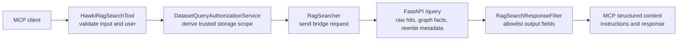

# 7. MCP Query Search Contract

<div className="hero">

This page defines the **query-search** MCP tool boundary: accepted input,
dataset authorization, the server-derived FastAPI request, and the structured
result returned to an MCP client.

[Understand retrieval behavior](../Getting%20Started/3_introduction_architecture.md#how-a-question-becomes-an-answer)
· [Find the implementation](../Reference/8_repo_map.md#follow-one-query)

</div>

:::info Scope

This is not the browser `/api/query` response and not the raw FastAPI `/query`
response. It describes the MCP tool registered by `HawkiRagServer` and the
normalization performed by Laravel's `RagSearch` domain.

:::

## Contract boundaries



The important trust boundary is between `dataset_id` and the internal storage
scope. The caller chooses an authorized dataset ID; Laravel chooses the Qdrant
collection, Neo4j namespace, embedding provider, and embedding model associated
with that dataset.

## MCP input

The tool name is `query-search`.

| Field | Type | Required | Validation and behavior |
|---|---|---:|---|
| `query` | string | Yes | Required by Laravel; FastAPI rejects it if sanitization leaves an empty query. |
| `dataset_id` | string | Yes | Maximum 191 characters; must resolve to a dataset the authenticated user may query. |
| `top_k` | integer | No | Range 1–50; defaults to 5 in the MCP tool. |

The MCP route itself is protected by Sanctum authentication, the `query`
ability, query-principal authorization, and API throttling. The tool also
requires the resolved principal to be an application `User`.

### Dataset authorization

Before the bridge request, `DatasetQueryAuthorizationService` verifies that:

1. the authenticated principal is allowed to query the requested active
   dataset;
2. the dataset has its required storage and embedding targets; and
3. the server can construct an `AuthorizedDatasetScope`.

That scope contains:

```json
{
  "dataset_id": "dataset-id",
  "qdrant_collection": "dataset_collection",
  "neo4j_namespace": "dataset_namespace",
  "embedding_provider": "ollama",
  "embedding_model": "bge-m3",
  "graph_enabled": true
}
```

The client cannot override these fields through the MCP tool.

## Request sent to FastAPI

`RagSearchPayloadFactory` creates the bridge payload. Provider/model values are
selected from the authorized dataset and server settings, not from MCP input.

| Field | Current MCP behavior |
|---|---|
| `query` | Validated caller query |
| `authorized_scope` | Trusted scope derived by Laravel |
| `top_k` | Validated value or MCP default 5 |
| `provider`, `chat_model`, `vision_model` | Server-selected runtime for the dataset's embedding provider |
| `generate` | `false`; the MCP tool retrieves evidence rather than asking FastAPI to generate an answer |
| `reranker` | `external` |
| `rerank_top_n` | `20` |
| `fast_mode` | `false` |
| `smart_lookup` | `true` |
| `structural_hops` | Omitted, allowing Python to use its configured default |

:::note Graph behavior is scope-driven

There is no separate “Qdrant-only response shape” in this MCP contract.
Semantic and lexical retrieval are the baseline. Structural retrieval is added
only when the authorized scope enables graph access, fast mode is off, and the
resolved structural-hop count is greater than zero. The normalized response
always contains `results`, `kg`, and `rewrite_terms` arrays, even when graph
retrieval produces nothing.

:::

## The three response layers

Understanding the layers prevents consumers from coupling to FastAPI internals.

| Layer | Owner | Shape |
|---|---|---|
| **Raw retrieval** | FastAPI | `hits`, `kg`, `retrieval`, `count`, `answer`, and operational metadata |
| **Normalized search response** | `RagSearchResponseFilter` | Only `results`, `kg`, and `rewrite_terms` |
| **MCP structured content** | `HawkiRagSearchTool` | `instructions` plus the normalized object under `response` |

### Actual MCP structured content

The current tool publishes this outer envelope:

```json
{
  "instructions": "<server guidance for the MCP client>",
  "response": {
    "results": [],
    "kg": [],
    "rewrite_terms": []
  }
}
```

The exact instruction text is server-owned and may change. Consumers should
read search data from `response`.

:::warning Known output-schema mismatch

`HawkiRagSearchTool::outputSchema()` currently advertises `results`, `kg`, and
`rewrite_terms` at the top level, while `handle()` publishes them inside
`response` next to `instructions`. This is a code-level MCP contract mismatch.

When correcting it, update the schema and structured content together and add
an MCP contract test. Until then, the envelope above describes actual runtime
behavior; the advertised output schema does not.

:::

## Normalized response

`RagSearchResponseFilter` always returns all three top-level keys in the inner
response:

| Key | Type | Meaning |
|---|---|---|
| `results` | array | Ranked content chunks and any structural relation hits that survive retrieval and reranking |
| `kg` | array | A separately fetched set of complete graph facts |
| `rewrite_terms` | array | Unique, non-empty entity terms produced by backend query rewriting |

Missing or malformed raw arrays become empty normalized arrays.

### `results[]`

Each result is allowlisted to the fields below. Empty fields are omitted.

| Field | Source | Notes |
|---|---|---|
| `metadata.language` | hit payload `lang` | Optional |
| `metadata.title` | hit payload `title` | Optional; structural hits normally use `Graph relation` |
| `metadata.url` | hit payload `page_url` | Optional |
| `metadata.timestamp` | hit payload `updated_at` | Optional |
| `metadata.tags` | hit payload `tags` | Arrays are converted to a comma-separated string |
| `metadata.collection` | hit `collection` | Optional |
| `content` | hit payload `content` | Chunk text or a rendered relation |
| `component_type` | hit payload `component_type` | `relation` identifies a structural hit |
| `subject`, `relation`, `object` | relation payload | Present only when supplied by the structural hit |

Raw scores, point IDs, document IDs, provider details, timings, and arbitrary
payload fields are intentionally not exposed by this filter.

### `kg[]`

Every retained item has all three fields:

```json
{
  "subject": "Entity A",
  "relation": "connected_to",
  "object": "Entity B"
}
```

`kg` is not a duplicate of relation results. Relation results participate in
ranking; `kg` is fetched separately from terms collected after retrieval.
Either array can therefore be empty independently.

### `rewrite_terms[]`

This array comes specifically from
`retrieval.rewrite.entity_terms` in the FastAPI response. Laravel removes
non-string, empty, and duplicate entries while preserving their first-seen
order.

## Complete example

```json
{
  "instructions": "<server guidance for the MCP client>",
  "response": {
    "results": [
      {
        "metadata": {
          "language": "en",
          "title": "Example Page",
          "url": "https://example.org",
          "tags": "policy,fees",
          "collection": "dataset_collection"
        },
        "content": "The third reminder costs 10 euros.",
        "component_type": "chunk"
      },
      {
        "metadata": {
          "title": "Graph relation"
        },
        "content": "Third reminder -costs-> 10 euros",
        "component_type": "relation",
        "subject": "Third reminder",
        "relation": "costs",
        "object": "10 euros"
      }
    ],
    "kg": [
      {
        "subject": "Third reminder",
        "relation": "costs",
        "object": "10 euros"
      }
    ],
    "rewrite_terms": [
      "third reminder"
    ]
  }
}
```

## Failure behavior

| Failure | MCP-visible result |
|---|---|
| No authenticated application user | Authentication error response |
| Missing/invalid input | MCP validation error |
| Dataset missing, unauthorized, inactive, or not ready | Generic search failure; detailed exception is logged server-side |
| FastAPI connection failure or non-success response | Generic search failure; detailed exception is logged server-side |
| Bridge request exceeds 60 seconds | Generic search failure from the same exception path |

The generic error prevents internal collection names, namespaces, or backend
details from leaking to the MCP client.

## Sources of truth

| Concern | Implementation |
|---|---|
| Tool registration and route security | `app/Mcp/Servers/HawkiRagServer.php`, `routes/ai.php` |
| Input validation and MCP envelope | `app/Mcp/Tools/HawkiRagSearchTool.php` |
| Authorized dataset scope | `app/Services/Authorization/DatasetQueryAuthorizationService.php` |
| FastAPI request payload | `app/Services/RagSearch/RagSearchPayloadFactory.php` |
| Bridge call and timeout | `app/Services/RagSearch/RagSearcher.php` |
| Inner response normalization | `app/Services/RagSearch/RagSearchResponseFilter.php` |
| Advertised output schema | `app/Services/RagSearch/RagSearchSchemaFactory.php` |
| FastAPI request validation | `python_rag/services/hawki_bridge/src/hawki_bridge/http/schemas.py` |
| Raw query execution and response | `python_rag/services/hawki_bridge/src/hawki_bridge/application/query/execution.py` |

The existing `RagSearcherDatasetScopeTest` protects server-derived dataset
scope. A dedicated MCP structured-output test is still needed to prevent the
schema/envelope mismatch from recurring.
