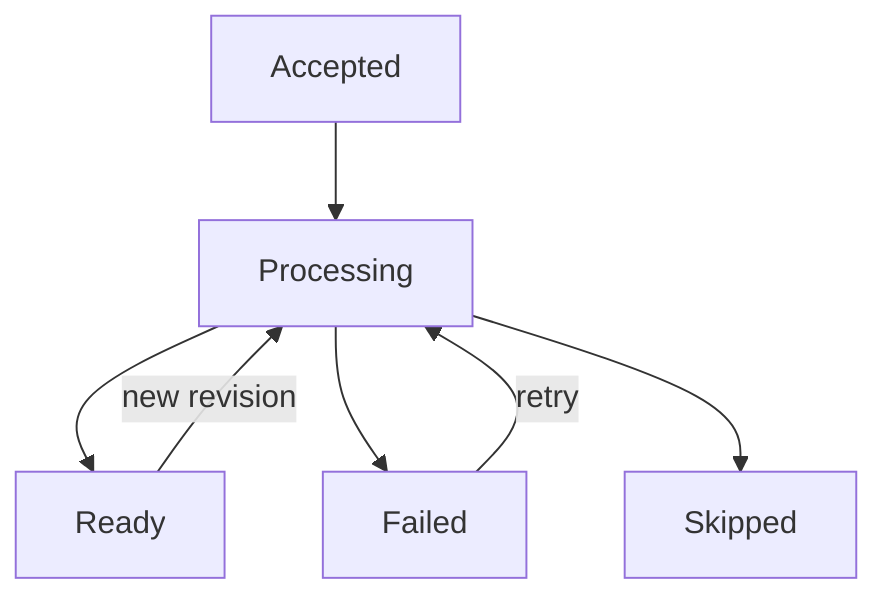

# Ingestion Recovery

Find the last completed boundary before deciding what to retry.

## Choose the authoritative system

| Question | Authority |
|---|---|
| Did execution run, retry, fail, or get cancelled? | **Temporal** workflow history |
| What state does the operator see? | **Laravel/PostgreSQL** projection |
| Which chunks, hashes, completion markers, and vectors exist? | **Qdrant** |
| Which graph facts exist? | **Neo4j** |

A workflow can finish by returning a failed/skipped result. Temporal's
execution status alone is therefore not a source-readiness check; inspect its
result and Laravel projection too.

## Lifecycle

These are conceptual stages. Direct-text HTTP acceptance reports
`status=running`; source state has its own values, and a completed pipeline job
is normally projected as a ready source. Deletion additionally uses
`deleting` and `deleted`.

“Ready” does not prove every optional graph extraction produced facts.
Ordinary ingestion may also contain partial embedding failures.
[Chunking & Embeddings](../Core%20Concepts/Ingestion/chunking_embeddings.md)
explains why direct text has stronger completeness requirements.

## Diagnose by completed boundary

| Symptom | Likely completed boundary | Action |
|---|---|---|
| No Markdown / only blank artifacts | No indexing; may be skipped | Inspect conversion output and artifact paths; supply usable content |
| Non-empty documents all fail validation | No vector write | Correct required content/metadata or artifact mismatch |
| All embeddings fail | Preparation only | Check provider, model, reachability and dimensions; retry after correction |
| Some ordinary embeddings fail | Partial Qdrant content may exist | Inspect chunk coverage; an unchanged retry can skip partial state, so use controlled affected-source/target rebuild |
| Direct-text embedding fails | No Qdrant replacement in that batch | Retry the same request/key after fixing the provider |
| Qdrant replacement/upsert fails | Old points may be deleted; earlier batches may exist | Retry stable source scope; verify complete chunk coverage |
| Extraction fails after vectors commit | Qdrant current; Neo4j old/partial | Inspect graph failures and plan targeted graph recovery |
| Neo4j write fails | Qdrant current; graph may have a gap | Repair scoped graph state; ordinary unchanged re-ingestion can skip it |
| Stores are current but UI is stale | Commit may be complete; callback not applied | Check callback receipts, HMAC/clock, workflow/run IDs, and terminal activity before repeating expensive indexing |
| Direct-text startup returns 502 | Artifacts/metadata or Temporal run may already exist | Retry the identical body and idempotency key |

## Retry the correct layer

Temporal activity retries handle raised failures according to the
[activity policy](./temporal_operations.md#activity-budgets-and-retries).
External HTTP retries and callback delivery retries are separate budgets.

The scraper heartbeats the external crawler job ID so a retry can resume
polling it. The terminal `mark_source_ready` activity separates callback
delivery from expensive indexing.

For operator-initiated recovery, the pipeline UI and
`POST /api/pipeline/recovery/jobs/{jobId}/retry` use Laravel's recovery service.
This route accepts failed jobs. Ordinary source recovery creates a new workflow
ID; it does not resume a cancelled run in place. Direct-text recovery uses its
stable text-workflow ID, as do identical submission retries, with failed-only
reuse and active-execution reconciliation. Deleting/deleted text sources are
excluded from operator recovery; submit a new revision to re-ingest a deleted
source.

## Recover graph state deliberately

An ordinary retry can see unchanged Qdrant content and return before graph
processing. Repeating it is not a reliable graph-repair procedure.

The indexer has an internal graph-only capability that can restore missing
facts without touching vectors. It does not guarantee deletion of stale facts.
Exact replacement needs dataset/document-scoped cleanup followed by rebuild.
There is no public graph-only endpoint or turnkey repair command; see
[Graph Enrichment](../Core%20Concepts/Ingestion/graph_enrichment.md#graph-repair-and-preview).

Avoid whole-store deletion for a single-source problem.

## Preserve evidence

Correlate task, job, source, workflow/run, operation, document, and chunk IDs.
Capture the relevant worker stage logs, Laravel event receipts, monitor artifact,
Qdrant payload state, and Neo4j scope before cleanup.

[Monitoring & Observability](./monitoring.md) owns evidence locations and
diagnostic commands. Embedding/chunk changes require the planned migration
described in [Chunking & Embeddings](../Core%20Concepts/Ingestion/chunking_embeddings.md#embedding-migration).

Sources: [ready projection](https://github.com/hawk-digital-environments/HAWKI-RAG/blob/main/python_rag/services/hawki_indexer_worker/src/hawki_indexer_worker/application/ready_projection.py),
[activity result](https://github.com/hawk-digital-environments/HAWKI-RAG/blob/main/python_rag/services/hawki_indexer_worker/src/hawki_indexer_worker/indexing/activity_result.py),
[manual recovery](https://github.com/hawk-digital-environments/HAWKI-RAG/blob/main/app/Services/Pipeline/Recovery/PipelineRecoveryAttemptService.php),
[direct-text recovery](https://github.com/hawk-digital-environments/HAWKI-RAG/blob/main/app/Services/TextIngestion/TextIngestionRecoveryService.php).
