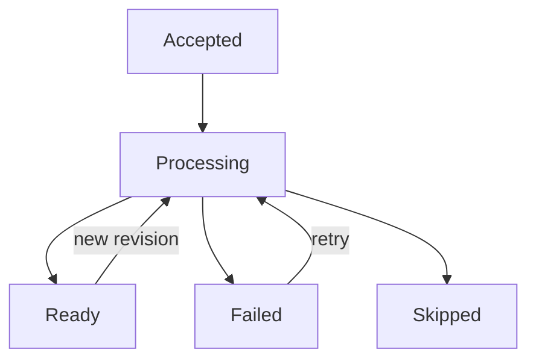
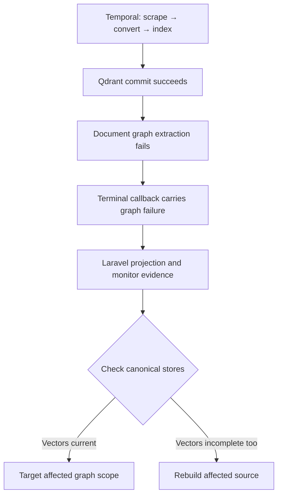

# Ingestion Recovery

Find the last completed boundary before deciding what to retry.

:::warning Recover the smallest affected scope

Avoid whole-store deletion for a single-source problem. Identify the affected
dataset and source/document, preserve evidence, and repair only that scope.
Consider broader cleanup only after establishing broader corruption.

:::

## Choose the authoritative system

| Question | Authority |
|---|---|
| Did execution run, retry, fail, or get cancelled? | **Temporal** workflow history |
| What state does the operator see? | **Laravel/PostgreSQL** projection |
| Which chunks, hashes, completion markers, and vectors exist? | **Qdrant** |
| Which graph facts exist? | **Neo4j** |

A workflow can finish by returning a failed/skipped result. Temporal's
execution status alone is therefore not a source-readiness check; inspect its
result and Laravel projection too.

## Lifecycle



These are conceptual stages. Direct-text HTTP acceptance reports
`status=running`; source state has its own values, and a completed pipeline job
is normally projected as a ready source. Deletion additionally uses
`deleting` and `deleted`.

“Ready” does not prove every optional graph extraction produced facts.
Ordinary ingestion may also contain partial embedding failures.
[Chunking & Embeddings](../Core%20Concepts/Ingestion/chunking_embeddings.md)
explains why direct text has stronger completeness requirements.

## Diagnose by completed boundary

| Symptom | Likely completed boundary | Action |
|---|---|---|
| No Markdown / only blank artifacts | No indexing; may be skipped | Inspect conversion output and artifact paths; supply usable content |
| Non-empty documents all fail validation | No vector write | Correct required content/metadata or artifact mismatch |
| All embeddings fail | Preparation only | Check provider, model, reachability and dimensions; retry after correction |
| Some ordinary embeddings fail | Partial Qdrant content may exist | Inspect chunk coverage; an unchanged retry can skip partial state, so use controlled affected-source/target rebuild |
| Direct-text embedding fails | No Qdrant replacement in that batch | Retry the same request/key after fixing the provider |
| Qdrant replacement/upsert fails | Old points may be deleted; earlier batches may exist | Retry stable source scope; verify complete chunk coverage |
| Extraction fails after vectors commit | Qdrant current; Neo4j old/partial | Inspect graph failures and plan targeted graph recovery |
| Neo4j write fails | Qdrant current; graph may have a gap | Repair scoped graph state; ordinary unchanged re-ingestion can skip it |
| Stores are current but UI is stale | Commit may be complete; callback not applied | Check callback receipts, HMAC/clock, workflow/run IDs, and terminal activity before repeating expensive indexing |
| Direct-text startup returns 502 | Artifacts/metadata or Temporal run may already exist | Retry the identical body and idempotency key |

## Retry the correct layer

Temporal activity retries handle raised failures according to the
[activity policy](./temporal_operations.md#activity-budgets-and-retries).
External HTTP retries and callback delivery retries are separate budgets.

The scraper heartbeats the external crawler job ID so a retry can resume
polling it. The terminal `mark_source_ready` activity separates callback
delivery from expensive indexing.

For operator-initiated recovery, the pipeline UI and
`POST /api/pipeline/recovery/jobs/{jobId}/retry` use Laravel's recovery service.
This route accepts failed jobs. Ordinary source recovery creates a new workflow
ID; it does not resume a cancelled run in place. Direct-text recovery uses its
stable text-workflow ID, as do identical submission retries, with failed-only
reuse and active-execution reconciliation. Deleting/deleted text sources are
excluded from operator recovery; submit a new revision to re-ingest a deleted
source.

## Recover graph state deliberately

An ordinary retry can see unchanged Qdrant content and return before graph
processing. Repeating it is not a reliable graph-repair procedure.

The indexer has an internal graph-only capability that can restore missing
facts without touching vectors. It does not guarantee deletion of stale facts.
Exact replacement needs dataset/document-scoped cleanup followed by rebuild.
There is no public graph-only endpoint or turnkey repair command; see
[Ingestion with Graph Processing Enabled](../Core%20Concepts/Ingestion/graph_enrichment.md#graph-repair-and-preview).

## Worked example: vectors are current but graph enrichment failed

This illustrative case uses an ordinary website source with graph ingestion
enabled. A changed document's vectors were replaced successfully, then its graph
extraction failed. The identifiers below are fictional correlation labels, not
a captured production response:

```text
dataset_id: dataset_example
task_id: task_example
source_id: source_example
job_id: ingest_example
workflow_id: ingest-source-example
```

Laravel accepted the source; Temporal completed scraping and conversion, then
ran `ingest_markdown_files`. The indexer embedded the chunks and committed them
to Qdrant before attempting graph extraction. A document-level extraction error
became `graph_failures` evidence, carried to Laravel by the terminal callback.
The source can still be projected as ready in this case.



### 1. Inspect Laravel projection

Through the protected management surface, inspect these existing routes with
the actual task ID substituted:

```text
GET /api/pipeline/tasks/task_example
GET /api/pipeline/tasks/task_example/events
GET /api/rag/monitor
```

Match the task, job, and source; record `index_status`, `ready_at`, the current
stage, `temporal_workflow_id`, and `temporal_run_id` where present. Correlate
callback receipts and the document's graph error with the same execution and
operation identifiers. The monitor exposes recent failures and the latest
summary/preview, not a complete history filtered to this source; verify document
identity and timestamps. [Monitoring](./monitoring.md#follow-one-ingestion) owns
the evidence locations.

### 2. Inspect Temporal history

Use `make up-monitor-workflows-tool` and open the
[Temporal UI](./temporal_operations.md#diagnostics). Locate the workflow and run,
then inspect `ingest_markdown_files`, its attempts, and `mark_source_ready`.
Pair that history with `docker logs --tail=200 hawki_rag_indexer_worker`: an
`ingest:qdrant upserted=...` log before the matching `graph:extract ... failed=...`
establishes the stage order. Correlate the adjacent `index_vector` event's
`job_id` and `idempotency_key` (operation ID), rather than relying on log order
across concurrent jobs. Temporal does not record each internal store write as
a separate activity.

In this extraction-error case, indexing can return success with graph failures,
so no Temporal retry is required. A raised Neo4j write exception instead fails
the index activity: inspect whether retries are pending or exhausted, including
the original failed attempt. A later unchanged-content attempt may skip graph
work. Workflow completion alone proves neither graph recovery nor store rollback.

### 3. Inspect Qdrant

Inspect the collection selected by the dataset record. Match its `dataset_id`,
document identity, chunk indices/point IDs, text, and current `content_hash` to
the converted artifact. In this example, every expected chunk exists with the
new content and hash. One matching point or a successful upsert log alone does
not prove full coverage; ordinary ingestion can commit partial embeddings.

Direct-text completion markers apply to the separate direct-text path, which
disables graph ingestion. Do not require that stronger proof for this website
example. If coverage is incomplete, follow
[partial-vector recovery](../Core%20Concepts/Ingestion/chunking_embeddings.md#batches-and-partial-failures)
instead.

### 4. Inspect graph evidence

Check canonical Neo4j facts under the trusted dataset ID and namespace, using
the affected document's provenance. In this example, extraction failed before
replacement cleanup, so old facts remain. If extraction succeeded but a later
Neo4j delete/write failed, the graph may instead contain a gap or partial writes.
An empty successful extraction is another distinct outcome.

A Neo4j write exception can reach Laravel as a failed activity callback without
a completed graph preview or document-level extraction-failure record. Match
worker logs and activity errors as well as monitor evidence. See
[graph commit behavior](../Core%20Concepts/Ingestion/graph_enrichment.md#scope-and-commits).

### 5. Choose the recovery scope

Qdrant is current, so preserve it. Do not delete the collection, reindex every
dataset, clear Neo4j globally, or restart the entire stack. First correct the
extraction/provider failure, then arrange developer-assisted recovery for this
document's graph scope.

The internal `graph_only=true, graph=true` capability bypasses vector writes and
ordinary incremental skipping. Use it only through maintenance/workflow code
that supplies the trusted scope and handles results. There is currently no
public turnkey graph-only repair API/CLI. Graph-only upserts do not guarantee
stale-fact removal; exact replacement can require scoped cleanup followed by
rebuild. See [graph repair limitations](../Core%20Concepts/Ingestion/graph_enrichment.md#graph-repair-and-preview).

### 6. Verify recovery

Verify that Qdrant's chunk coverage and hashes remained intact, and that Neo4j
now contains the expected current facts for the affected document. Check that
obsolete facts were removed if exact replacement was required.

Record the recovery execution in Temporal when maintenance used a workflow.
Reconcile Laravel's projection and monitor evidence with its callbacks; direct
internal maintenance may not emit those callbacks automatically. Retained failure
records can describe the original attempt rather than a new failure. If projection
lags, diagnose [callback delivery](./temporal_operations.md#signed-worker-callbacks)
instead of repeating indexing. Recovery does not atomically synchronize the stores,
workflow history, and application projection.

## Preserve evidence

Correlate task, job, source, workflow/run, operation, document, and chunk IDs.
Capture the relevant worker stage logs, Laravel event receipts, monitor artifact,
Qdrant payload state, and Neo4j scope before cleanup.

[Monitoring & Observability](./monitoring.md) owns evidence locations and
diagnostic commands. Embedding/chunk changes require the planned migration
described in [Chunking & Embeddings](../Core%20Concepts/Ingestion/chunking_embeddings.md#embedding-migration).

