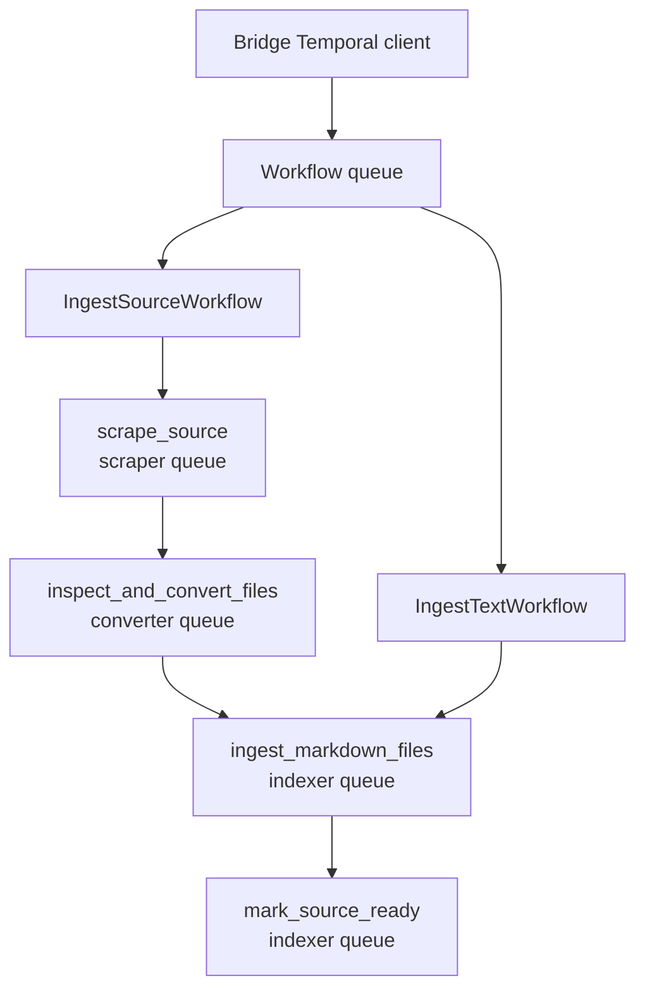

# Temporal Operations

Laravel owns ingestion metadata and calls the bridge's Temporal controls.
The bridge starts/cancels/schedules executions; deterministic workflows dispatch
activities to workers. Temporal owns execution history and task routing.

## Workflows and worker ownership



Uploads use the source workflow but stage the existing upload instead of
crawling. Direct text uses the text workflow and supplies the Markdown artifact.

| Setting | Template default | Owner |
|---|---|---|
| `HAWKI_RAG_TEMPORAL_ENABLED` | `true` | Laravel orchestration switch |
| `TEMPORAL_ADDRESS` | `temporal:7233` | Bridge and workers |
| `TEMPORAL_NAMESPACE` | `default` | Bridge and workers; default namespace image adapter |
| `TEMPORAL_INGEST_WORKFLOW_TYPE` | `IngestSourceWorkflow` | Bridge source-workflow start |
| `TEMPORAL_RAG_WORKFLOW_TASK_QUEUE` | `rag-workflow-task-queue` | Bridge / workflow worker |
| `TEMPORAL_RAG_SCRAPER_TASK_QUEUE` | `rag-scraper-task-queue` | Workflow payload / scraper worker |
| `TEMPORAL_RAG_CONVERTER_TASK_QUEUE` | `rag-converter-task-queue` | Workflow payload / converter worker |
| `TEMPORAL_RAG_INDEXER_TASK_QUEUE` | `rag-ingestion-task-queue` | Workflow payload / indexer worker |
| `TEMPORAL_RAG_INGESTION_TASK_QUEUE` | `rag-ingestion-task-queue` | COMPATIBILITY queue |
| `HAWKI_RAG_BRIDGE_TIMEOUT` | Laravel fallback `30` seconds | Laravel Temporal-control HTTP call |

Client and workers must agree on address, namespace, registered workflow type,
and queue names. A new namespace must exist in the Temporal deployment.
Do not confuse task queues with Laravel's PostgreSQL-backed application queue.

## Activity budgets and retries

| Activity | Start-to-close (one attempt) | Schedule-to-close (total, including queue/retries) | Heartbeat timeout |
|---|---|---|---|
| Scrape | 13 hours | 14 hours | 2 minutes |
| Convert | 2 hours | 3 hours | Not set by workflow |
| Index | 4 hours | 6 hours | Not set by workflow |
| Terminal callback | 5 minutes | 15 minutes | Not set by workflow |

All use at most **five attempts**, initial retry interval 5 seconds, exponential
coefficient 2, and maximum interval 5 minutes. Raised retryable errors consume
that policy. A returned `failed`/`skipped` result is data; it is not itself a
Temporal exception.

Source workflows can return a failure envelope after an unsuccessful stage.
Text workflows pass the index result to the terminal projection, which maps it
to ready, skipped, or failed. Inspect workflow output as well as execution status.

| Workflow setting | Template and bridge fallback | Meaning |
|---|---|---|
| `TEMPORAL_WORKFLOW_EXECUTION_TIMEOUT` | `172800` seconds | 48-hour execution budget |
| `TEMPORAL_WORKFLOW_RUN_TIMEOUT` | `86400` seconds | 24-hour run budget |
| `TEMPORAL_WORKFLOW_TASK_TIMEOUT` | `30` seconds | Workflow task processing |

Use integer seconds: bridge settings parse integers. Laravel config still has
different string fallbacks when dotenv is absent; the bridge supplies these
actual Temporal start budgets.

### External HTTP budgets

| Setting | Default |
|---|---|
| `TEMPORAL_RAG_HTTP_TIMEOUT_SECONDS` | 1800 seconds per request |
| `TEMPORAL_RAG_HTTP_RETRY_ATTEMPTS` | 3 |
| `TEMPORAL_RAG_EXTERNAL_POLL_INTERVAL_SECONDS` | 5 seconds |
| `TEMPORAL_RAG_EXTERNAL_POLL_TIMEOUT_SECONDS` | 43200 seconds (12 hours) |

These do not override activity deadlines. In particular, conversion's two-hour
attempt/three-hour total can expire before the external poll budget.
The scraper heartbeats the external job ID to resume polling on retry.
Indexer execution is in-process and has no ingestion HTTP timeout.

## Schedules

`pipeline:start-task --refresh-cadence=daily|weekly|monthly` creates a schedule.
Omit cadence for one-off work.

| Cadence | Actual bridge cron | Timezone |
|---|---|---|
| Daily | `0 2 * * *` | UTC |
| Weekly | `0 2 * * 0` | UTC |
| Monthly | `0 2 1 * *` | UTC |

The bridge uses skip-overlap policy and a one-hour catch-up window. Schedule
actions retain their workflow input and timeout values.

:::warning Cron variables are not active bridge controls

`TEMPORAL_RAG_DAILY_CRON`, `TEMPORAL_RAG_WEEKLY_CRON`, and
`TEMPORAL_RAG_MONTHLY_CRON` are read by Laravel config, but the current
`BridgeSettings.cron_for_cadence()` hard-codes the expressions above.
Editing those dotenv variables does not change created Temporal schedules.
Changing this behavior requires application code.

:::

Schedule upsert deletes then creates; it is not atomic. The bridge suppresses
schedule-delete errors, so a successful delete response is not proof that a
schedule disappeared. Verify it in Temporal.

## Signed worker callbacks

Workers post to `/api/internal/pipeline/worker-events`.
Laravel validates typed events and applies metadata/monitor artifacts in a
database transaction. This is the Python-to-Laravel application-state write
boundary; workers do not issue application SQL.

| Setting | Default | Owner |
|---|---|---|
| `HAWKI_RAG_WORKER_CALLBACK_URL` | `http://hawki_rag_app/api/internal/pipeline/worker-events` | Activity workers |
| `HAWKI_RAG_WORKER_CALLBACK_SECRET` | Empty; must be set | Laravel and activity workers |
| `HAWKI_RAG_WORKER_CALLBACK_MAX_AGE_SECONDS` | 300 | Laravel |
| `HAWKI_RAG_WORKER_CALLBACK_TIMEOUT_SECONDS` | Code fallback 10 | Activity workers |
| `HAWKI_RAG_WORKER_CALLBACK_RETRY_ATTEMPTS` | Code fallback 3 | Activity workers |

Signature input is timestamp, a literal dot, and the **exact transmitted JSON
bytes**, signed with HMAC-SHA256. Headers are `X-Hawki-Timestamp` and
`X-Hawki-Signature: v1=<hex-digest>`. Laravel rejects timestamps outside the
configured absolute age/skew window.

The event ID is stable for workflow/run/activity/attempt/status. Duplicate
delivery of the same event is acknowledged without repeating the transition;
the same ID with a different payload is a collision, not an idempotent retry.
Stale executions or deleted-source transitions may be acknowledged as ignored.

Callback delivery retries transport errors, 429/5xx, and the allowlisted
temporary target/state-unavailable 409 responses. Other 4xx responses and event
ID collisions are not retried by that HTTP layer.

Rotate the secret in Laravel and all three activity workers together, then
recreate them. Check host clocks when signatures expire. The
`mark_source_ready` activity lets terminal delivery retry without rerunning
indexing.

## Queue migrations and replay

<details>
<summary>Indexer queue and terminal-callback compatibility markers</summary>

The source workflow records `hawki-rag-indexer-task-queue-v1` before selecting
`task_queues.indexer`. Pre-patch histories keep `task_queues.ingestion`.
The indexer polls its configured indexer queue and configured legacy queue,
deduplicating them when equal.

A second marker, `hawki-rag-indexer-terminal-callback-v1`, preserves the old
handling of non-success index results while allowing newer histories to emit
their terminal callback.

Keep old queues/workflow code until affected histories drain and replay has been
verified. Recreating workers together does not rewrite queued commands or
existing histories. The checkout has branch-compatibility tests but no supplied
production-history replay corpus.

`TEMPORAL_CLIENT_IDENTITY` is retained in Laravel config; the current bridge
connect call does not use it as an explicit client identity.

</details>

## Diagnostics

```bash
docker exec hawki_rag_app php artisan pipeline:workers
make up-monitor-workflows-tool
```

The first command prints **configured** workers/queues; it does not inspect
live Temporal pollers and currently lists only the source workflow.
The optional UI defaults to `http://127.0.0.1:8081`.
Inspect task-queue pollers, pending activities, attempts, results, and history there.

`make down-monitor-workflows-tool` removes the UI container without stopping
core services. See [Monitoring](./monitoring.md) for logs and
[Recovery](./ingestion_recovery.md) for choosing the next action.

Sources: [workflow definitions](https://github.com/hawk-digital-environments/HAWKI-RAG/tree/main/python_rag/services/hawki_workflow_worker/src/hawki_workflow_worker/workflows),
[Temporal contracts](https://github.com/hawk-digital-environments/HAWKI-RAG/blob/main/python_rag/packages/contracts/src/hawki_rag_contracts/pipeline/temporal.py),
[bridge client](https://github.com/hawk-digital-environments/HAWKI-RAG/blob/main/python_rag/services/hawki_bridge/src/hawki_bridge/adapters/temporal_client.py),
[bridge settings](https://github.com/hawk-digital-environments/HAWKI-RAG/blob/main/python_rag/services/hawki_bridge/src/hawki_bridge/settings.py),
[callback client](https://github.com/hawk-digital-environments/HAWKI-RAG/blob/main/python_rag/packages/pipeline_callbacks/src/hawki_pipeline_callbacks/client.py),
[signature verifier](https://github.com/hawk-digital-environments/HAWKI-RAG/blob/main/app/Services/Pipeline/PipelineWorkerEventSignatureVerifier.php).
