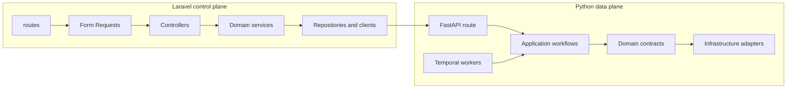

# 8. Developer Repository Map

<div className="hero">

Use this page when you know what behavior must change but not where its code
lives. It maps HTTP boundaries, domain logic, Python workflows, adapters,
build files, and the tests that protect each area.

[Understand the runtime architecture](../Getting%20Started/3_introduction_architecture.md)
· [Run the stack](../Getting%20Started/2_setup.md)

</div>

:::info What this reference does not repeat

Runtime responsibilities belong in
[Introduction & Architecture](../Getting%20Started/3_introduction_architecture.md),
environment variables in
[Environment, Database & Temporal](../Operations/5_environment_db_queue.md),
and operational commands in
[Run HAWKI RAG](../Getting%20Started/2_setup.md). This page answers one
question: **where should a developer begin a code change?**

:::

## Find the change you need

| I need to change… | Start here | Follow the behavior into… | Primary tests |
|---|---|---|---|
| Query authorization or dataset scope | `routes/api.php`, `app/Http/Requests/Rag/`, `HawkiRagProxyController.php` | `app/Services/Authorization/` and `app/Services/Rag/` | `tests/Feature/Authorization/`, `tests/Feature/Query/` |
| Retrieval, score merging, or reranking | `python_rag/api/http/routers/query.py` | `application/workflows/query_*.py`, then `infrastructure/vectorstore/`, `graph/`, or `rerank/` | `python_rag/tests/query/`, `python_rag/tests/reliability/` |
| Pipeline creation, retry, or cancellation | `PipelineTaskController.php` and `PipelineControlController.php` | `app/Services/Pipeline/`, then `python_rag/temporal_rag/` | `tests/Feature/Pipeline/`, `python_rag/tests/temporal/` |
| Chunking, incremental ingestion, or Qdrant commits | `python_rag/api/http/routers/ingest.py` | `application/workflows/ingest_logic.py` and `application/workflows/ingest/` | `python_rag/tests/ingest/`, `python_rag/tests/api/` |
| Graph extraction or Neo4j behavior | `app/Http/Controllers/Graph/` or the Python ingest graph phase | `app/Services/Graph/`, `infrastructure/raganything/`, and `infrastructure/graph/` | `tests/Feature/Graph/`, `python_rag/tests/graph/` |
| Model providers or model allowlists | `config/model_providers.php` and `python_rag/api/settings.py` | `app/Services/Settings/` and `python_rag/infrastructure/providers/` | `tests/Feature/Settings/`, `python_rag/tests/providers/` |
| Browser UI or frontend assets | `routes/web.php` and `resources/js/svelte/` | `resources/views/`, `vite.config.js`, and `svelte.config.js` | `tests/Feature/Ui/` |
| Containers, startup, or health wiring | `Makefile` and `docker-compose*.yml` | `Dockerfile`, `docker/laravel.Dockerfile`, and `docker/` | `tests/System/` plus `make health` and `make test-services` |

## The dependency direction

The typical request path moves inward from framework boundaries to application
logic, then outward through an adapter. Keeping this direction makes business
behavior testable without an HTTP server or live database.



This is a navigation model, not a claim that every call crosses every box. For
example, a Laravel service may call the bridge directly, while a pure Python
helper may need no infrastructure adapter.

## Repository at a glance

```text
RAWKI/
├── app/                    Laravel HTTP and domain code
├── routes/                 Browser, API, health, and MCP entrypoints
├── resources/              Svelte, JavaScript, CSS, and Blade source
├── config/                 Laravel runtime configuration mapping
├── database/               Laravel database migrations
├── python_rag/
│   ├── api/                FastAPI boundary and runtime assembly
│   ├── application/        Query and ingestion use cases
│   ├── domain/             Stable contracts and domain settings
│   ├── infrastructure/     Qdrant, Neo4j, providers, graph, and reranking
│   ├── temporal_rag/       Workflows, activities, clients, and workers
│   └── tests/              Python behavior and integration tests
├── tests/                  Laravel feature, unit, and system tests
├── docker/                 Laravel and service-specific container assets
├── docker-compose*.yml     Base and mode-specific Compose layers
├── Dockerfile              Python bridge and reranker images
└── Makefile                Supported build, startup, test, and lifecycle entrypoints
```

## Laravel control plane

Laravel owns the public HTTP boundary, authorization, dataset configuration,
pipeline control, and operator-facing state.

### Framework boundaries

| Path | Responsibility |
|---|---|
| `routes/web.php` | Browser page shells, Swagger redirect, and crawler UI proxy |
| `routes/api.php` | JSON endpoints for datasets, documents, queries, pipelines, graph operations, settings, and detailed health |
| `routes/health.php` | Lightweight liveness and pipeline-health browser routes |
| `routes/ai.php` | MCP protocol transport |
| `app/Http/Requests/` | Request validation and authorization at the HTTP boundary |
| `app/Http/Controllers/` | Small HTTP adapters that delegate work to services |
| `app/Http/Middleware/` | Browser-query principal enforcement and shared security headers |

### Domain code

Business behavior is grouped by domain under `app/Services/`. Database access
belongs in the domain's repository classes; Eloquent models in `app/Models/`
describe persisted records and relationships.

| Domain | Main concern |
|---|---|
| `Authorization/` | Query principals, dataset grants, and authorized dataset scope |
| `Dataset/` | Dataset lifecycle, collection identity, graph/vector statistics, and cleanup |
| `Document/` | Uploads, browsing, synchronization, previews, and document state |
| `Pipeline/` | Tasks, uploads, Temporal bridge calls, recovery, logs, and projected status |
| `Rag/` and `RagSearch/` | Bridge requests, response filtering, health, monitoring, and MCP search schema |
| `Graph/` | Neo4j administration, exploration, snapshots, search, and result normalization |
| `Settings/` | Persisted operator settings and model runtime selection |
| `Scrape/` and `Storage/` | Crawler integration and shared-file handling |
| `WebSearch/` | Replaceable external search-provider implementations |

Configuration is intentionally split by concern: application values in
`config/app.php`, database settings in `config/database.php`, Temporal in
`config/temporal.php`, providers in `config/model_providers.php`, and
HAWKI-RAG-specific paths and limits in `config/config.php`.

## Python data plane

Python owns ingestion preparation, vector/graph persistence, retrieval,
reranking, model-provider adapters, and Temporal execution.

| Layer | Path | Put code here when… |
|---|---|---|
| **HTTP boundary** | `python_rag/api/http/` | Validating an API payload, handling request context, or exposing a route |
| **Runtime assembly** | `python_rag/api/factory.py`, `runtime.py`, `settings.py` | Wiring providers, settings, startup checks, or application dependencies |
| **Application** | `python_rag/application/` | Coordinating a query or ingestion use case without owning vendor transport details |
| **Domain contracts** | `python_rag/domain/` | Defining a stable provider/store protocol used by application logic |
| **Vector adapter** | `python_rag/infrastructure/vectorstore/` | Building Qdrant requests, interpreting responses, or implementing search strategies |
| **Graph adapter** | `python_rag/infrastructure/graph/` | Scoping, transporting, normalizing, or visualizing Neo4j data |
| **Graph extraction** | `python_rag/infrastructure/raganything/` | Integrating RAG-Anything/LightRAG extraction, caches, parsing, or fallbacks |
| **Model providers** | `python_rag/infrastructure/providers/` | Implementing Ollama or LiteLLM chat/embedding behavior |
| **Reranker** | `python_rag/infrastructure/rerank/` | Running or adapting the local reranker service |
| **Durable execution** | `python_rag/temporal_rag/` | Changing workflow order, activity behavior, retries, storage handoff, or workers |
| **Shared primitives** | `python_rag/common/` | Reusing a small framework-independent rule across several workflows |

### Follow one query

```text
routes/api.php
→ HawkiRagProxyController
→ DatasetQueryAuthorizationService + RagProxyService
→ POST /query
→ api/http/routers/query.py
→ application/workflows/query_logic.py
→ query stages, ranking, and context assembly
→ vector, graph, reranker, and provider adapters
```

### Follow one ingestion

```text
Laravel Pipeline controllers
→ app/Services/Pipeline/
→ FastAPI Temporal control route
→ temporal_rag workflow and activity workers
→ POST /ingest
→ application/workflows/ingest_logic.py
→ chunking + incremental plan + vector commit + optional graph commit
→ Qdrant and Neo4j adapters
```

The exact ingestion commit semantics are documented in
[Ingestion & Embeddings](../Operations/6_ingestion_embeddings.md).

## Build and dependency ownership

| File | Owns |
|---|---|
| `docker/laravel.Dockerfile` | Node/Vite asset build and the PHP/Nginx Laravel runtime image |
| `Dockerfile` | Separate Python bridge and local reranker image stages |
| `docker-compose.yml` | Base services, volumes, internal environment, and optional profiles |
| `docker-compose.ui.yml` | Published local Laravel UI port |
| `docker-compose.local.yml` | Source-mounted development overrides |
| `docker-compose-gpu-override.yml` | NVIDIA-specific Ollama and reranker configuration |
| `composer.json` / `composer.lock` | Laravel/PHP dependencies |
| `package.json` / `package-lock.json` | Frontend and root JavaScript build dependencies |
| `python_rag/requirements.txt` | Direct production bridge dependencies shared by CPU and GPU resolution |
| `python_rag/requirements.cpu.lock.txt` / `requirements.gpu.lock.txt` | Locked production bridge dependencies for CPU and CUDA images |
| `python_rag/requirements-rerank.in` | Direct local reranker dependencies shared by CPU and GPU resolution |
| `python_rag/requirements-rerank.cpu.lock.txt` / `requirements-rerank.gpu.lock.txt` | Locked local reranker dependencies for CPU and CUDA images |
| `python_rag/requirements-test.txt` | Python test-only dependencies |

## Test map

| Test area | Use it for |
|---|---|
| `tests/Feature/` | Laravel HTTP contracts and database-backed behavior |
| `tests/Unit/` | Laravel services and value behavior without full HTTP flows |
| `tests/System/` | Container and cross-service expectations |
| `python_rag/tests/api/` | FastAPI request/response contracts |
| `python_rag/tests/query/` | Retrieval, ranking, scope, context, and generation behavior |
| `python_rag/tests/ingest/` | Chunking, identity, incremental decisions, and commit behavior |
| `python_rag/tests/graph/` | Graph extraction and dataset-scoped Neo4j writes |
| `python_rag/tests/temporal/` | Workflow, activity, retry, and external-client behavior |
| `python_rag/tests/providers/` | Provider and RAG-Anything runtime contracts |
| `python_rag/tests/reliability/` | Idempotency, fallback, and partial-failure guarantees |
| `python_rag/tests/integration/` | Tests that deliberately cross adapter boundaries |

:::warning Generated and runtime files are not implementation sources

Do not hand-edit `public/build/`, Laravel files under `storage/`, Python cache
directories, or local `rag_storage` data. Change their source or generating
configuration, then rebuild or rerun the owning process.

:::
