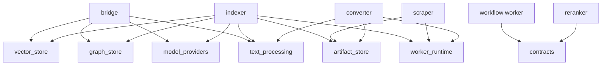

# Developer Repository Map

Use this map when you know what behavior must change but need its code owner.

[Understand the runtime architecture](../Getting%20Started/3_introduction_architecture.md)
· [Run the stack](../Getting%20Started/2_setup.md)

:::info Where to find the explanation

Runtime responsibilities belong in [Architecture](../Getting%20Started/3_introduction_architecture.md);
dependency rules belong in [Architecture Rules](../Developer/architecture_rules.md).
This page maps a requested change to its implementation and tests.

:::

## Find the change you need

Linked implementation paths were verified against this checkout. Recheck them
when updating the map; external repository links are not validated by the site
build.

| I need to change… | Start here | Follow into… | Primary tests |
|---|---|---|---|
| Query authorization or dataset scope | [Query request](https://github.com/hawk-digital-environments/HAWKI-RAG/blob/main/app/Http/Requests/Rag/QueryDatasetRequest.php) | [Authorization](https://github.com/hawk-digital-environments/HAWKI-RAG/tree/main/app/Services/Authorization), [Rag](https://github.com/hawk-digital-environments/HAWKI-RAG/tree/main/app/Services/Rag) | [Authorization](https://github.com/hawk-digital-environments/HAWKI-RAG/tree/main/tests/Feature/Authorization), [Query](https://github.com/hawk-digital-environments/HAWKI-RAG/tree/main/tests/Feature/Query), [Authentication](https://github.com/hawk-digital-environments/HAWKI-RAG/tree/main/tests/Feature/Authentication) |
| Retrieval, fusion, or reranking | [Query router](https://github.com/hawk-digital-environments/HAWKI-RAG/blob/main/python_rag/services/hawki_bridge/src/hawki_bridge/http/routers/query.py) | [Query application](https://github.com/hawk-digital-environments/HAWKI-RAG/tree/main/python_rag/services/hawki_bridge/src/hawki_bridge/application/query) | [Bridge tests](https://github.com/hawk-digital-environments/HAWKI-RAG/tree/main/python_rag/services/hawki_bridge/tests) |
| Direct-text ingestion / deletion | [Integration controllers](https://github.com/hawk-digital-environments/HAWKI-RAG/tree/main/app/Http/Controllers/Integration) | [TextIngestion](https://github.com/hawk-digital-environments/HAWKI-RAG/tree/main/app/Services/TextIngestion) | [Integration feature tests](https://github.com/hawk-digital-environments/HAWKI-RAG/tree/main/tests/Feature/Integration) |
| Pipeline creation, retry, cancellation | [Task controller](https://github.com/hawk-digital-environments/HAWKI-RAG/blob/main/app/Http/Controllers/PipelineTaskController.php) | [Pipeline services](https://github.com/hawk-digital-environments/HAWKI-RAG/tree/main/app/Services/Pipeline), [workflows](https://github.com/hawk-digital-environments/HAWKI-RAG/tree/main/python_rag/services/hawki_workflow_worker/src/hawki_workflow_worker/workflows) | [Pipeline](https://github.com/hawk-digital-environments/HAWKI-RAG/tree/main/tests/Feature/Pipeline), [workflow tests](https://github.com/hawk-digital-environments/HAWKI-RAG/tree/main/python_rag/services/hawki_workflow_worker/tests) |
| Chunking, incremental decisions, vector commits | [Indexer activities](https://github.com/hawk-digital-environments/HAWKI-RAG/tree/main/python_rag/services/hawki_indexer_worker/src/hawki_indexer_worker/activities) | [Indexing application](https://github.com/hawk-digital-environments/HAWKI-RAG/tree/main/python_rag/services/hawki_indexer_worker/src/hawki_indexer_worker/indexing) | [Indexer tests](https://github.com/hawk-digital-environments/HAWKI-RAG/tree/main/python_rag/services/hawki_indexer_worker/tests), [text tests](https://github.com/hawk-digital-environments/HAWKI-RAG/tree/main/python_rag/packages/text_processing/tests) |
| Graph extraction or Neo4j behavior | [Graph services](https://github.com/hawk-digital-environments/HAWKI-RAG/tree/main/app/Services/Graph), [RAG-Anything adapter](https://github.com/hawk-digital-environments/HAWKI-RAG/tree/main/python_rag/services/hawki_indexer_worker/src/hawki_indexer_worker/adapters/raganything) | [Graph store](https://github.com/hawk-digital-environments/HAWKI-RAG/tree/main/python_rag/packages/graph_store) | [Laravel graph tests](https://github.com/hawk-digital-environments/HAWKI-RAG/tree/main/tests/Feature/Graph), [graph-store tests](https://github.com/hawk-digital-environments/HAWKI-RAG/tree/main/python_rag/packages/graph_store/tests) |
| Model providers or allowlists | [Provider configuration](https://github.com/hawk-digital-environments/HAWKI-RAG/blob/main/config/model_providers.php) | [Settings](https://github.com/hawk-digital-environments/HAWKI-RAG/tree/main/app/Services/Settings), [model providers](https://github.com/hawk-digital-environments/HAWKI-RAG/tree/main/python_rag/packages/model_providers) | [Settings](https://github.com/hawk-digital-environments/HAWKI-RAG/tree/main/tests/Feature/Settings), [provider tests](https://github.com/hawk-digital-environments/HAWKI-RAG/tree/main/python_rag/packages/model_providers/tests) |
| MCP normalization/schema | [MCP tool](https://github.com/hawk-digital-environments/HAWKI-RAG/blob/main/app/Mcp/Tools/HawkiRagSearchTool.php) | [RagSearch](https://github.com/hawk-digital-environments/HAWKI-RAG/tree/main/app/Services/RagSearch) | [Unit tests](https://github.com/hawk-digital-environments/HAWKI-RAG/tree/main/tests/Unit) |
| Browser UI | [Web routes](https://github.com/hawk-digital-environments/HAWKI-RAG/blob/main/routes/web.php), [Svelte](https://github.com/hawk-digital-environments/HAWKI-RAG/tree/main/resources/js/svelte) | [Views](https://github.com/hawk-digital-environments/HAWKI-RAG/tree/main/resources/views), [Vite](https://github.com/hawk-digital-environments/HAWKI-RAG/blob/main/vite.config.js) | [UI feature tests](https://github.com/hawk-digital-environments/HAWKI-RAG/tree/main/tests/Feature/Ui) |
| Containers, startup, health | [Makefile](https://github.com/hawk-digital-environments/HAWKI-RAG/blob/main/Makefile), [Compose](https://github.com/hawk-digital-environments/HAWKI-RAG/blob/main/docker-compose.yml) | [Python Dockerfile](https://github.com/hawk-digital-environments/HAWKI-RAG/blob/main/python_rag/Dockerfile), [Laravel Dockerfile](https://github.com/hawk-digital-environments/HAWKI-RAG/blob/main/docker/laravel.Dockerfile) | [System tests](https://github.com/hawk-digital-environments/HAWKI-RAG/tree/main/tests/System), live smoke tests |
| Documentation/navigation | [Site configuration](https://github.com/hawk-digital-environments/HAWKI-RAG/blob/main/_documentation.build/docusaurus.config.js) | [Sidebar](https://github.com/hawk-digital-environments/HAWKI-RAG/blob/main/_documentation.build/sidebars-docs.js) | [Documentation checks](../Developer/testing.md#documentation-checks) |

## Repository at a glance

| Root | Responsibility |
|---|---|
| [app](https://github.com/hawk-digital-environments/HAWKI-RAG/tree/main/app), [routes](https://github.com/hawk-digital-environments/HAWKI-RAG/tree/main/routes), [config](https://github.com/hawk-digital-environments/HAWKI-RAG/tree/main/config) | Laravel HTTP, domain services, and configuration |
| [database](https://github.com/hawk-digital-environments/HAWKI-RAG/tree/main/database) | Application migrations and persistence setup |
| [resources](https://github.com/hawk-digital-environments/HAWKI-RAG/tree/main/resources) | Svelte, JavaScript, CSS, Blade |
| [python_rag/services](https://github.com/hawk-digital-environments/HAWKI-RAG/tree/main/python_rag/services) | Six independently built Python roles |
| [python_rag/packages](https://github.com/hawk-digital-environments/HAWKI-RAG/tree/main/python_rag/packages) | Ten focused reusable libraries |
| [python_rag/pyproject.toml](https://github.com/hawk-digital-environments/HAWKI-RAG/blob/main/python_rag/pyproject.toml), [uv.lock](https://github.com/hawk-digital-environments/HAWKI-RAG/blob/main/python_rag/uv.lock) | Python 3.13.14 workspace and one dependency lock |
| [tests](https://github.com/hawk-digital-environments/HAWKI-RAG/tree/main/tests) | Laravel unit, feature, system, and migration tests |
| [python_rag/tests](https://github.com/hawk-digital-environments/HAWKI-RAG/tree/main/python_rag/tests) | Cross-service end-to-end tests; member tests live beside each member's source |
| [docker](https://github.com/hawk-digital-environments/HAWKI-RAG/tree/main/docker) | Container entrypoints, service configuration, assets |
| [_documentation.build](https://github.com/hawk-digital-environments/HAWKI-RAG/tree/main/_documentation.build) | Docusaurus build and documentation validation |

## Follow one query

[API routes](https://github.com/hawk-digital-environments/HAWKI-RAG/blob/main/routes/api.php)
→ [query validation](https://github.com/hawk-digital-environments/HAWKI-RAG/blob/main/app/Http/Requests/Rag/QueryDatasetRequest.php)
→ [authorization services](https://github.com/hawk-digital-environments/HAWKI-RAG/tree/main/app/Services/Authorization)
→ [Rag proxy](https://github.com/hawk-digital-environments/HAWKI-RAG/tree/main/app/Services/Rag)
→ [bridge query router](https://github.com/hawk-digital-environments/HAWKI-RAG/blob/main/python_rag/services/hawki_bridge/src/hawki_bridge/http/routers/query.py)
→ [execution.py](https://github.com/hawk-digital-environments/HAWKI-RAG/blob/main/python_rag/services/hawki_bridge/src/hawki_bridge/application/query/execution.py)
→ store/provider/reranker adapters.

MCP instead enters through [ai.php](https://github.com/hawk-digital-environments/HAWKI-RAG/blob/main/routes/ai.php) and
[HawkiRagSearchTool](https://github.com/hawk-digital-environments/HAWKI-RAG/blob/main/app/Mcp/Tools/HawkiRagSearchTool.php), then
[RagSearch](https://github.com/hawk-digital-environments/HAWKI-RAG/tree/main/app/Services/RagSearch) before reaching the same bridge.
The [query guide](../Core%20Concepts/query_retrieval.md) explains stage behavior.

## Follow one ingestion

Ordinary work starts in [Pipeline services](https://github.com/hawk-digital-environments/HAWKI-RAG/tree/main/app/Services/Pipeline);
direct text starts in [TextIngestion](https://github.com/hawk-digital-environments/HAWKI-RAG/tree/main/app/Services/TextIngestion).
Laravel sends trusted workflow input through the
[Temporal bridge client](https://github.com/hawk-digital-environments/HAWKI-RAG/tree/main/python_rag/services/hawki_bridge/src/hawki_bridge/adapters)
to [workflows](https://github.com/hawk-digital-environments/HAWKI-RAG/tree/main/python_rag/services/hawki_workflow_worker/src/hawki_workflow_worker/workflows).
Activity workers own external I/O and canonical vector/graph writes.
[Pipeline callbacks](https://github.com/hawk-digital-environments/HAWKI-RAG/tree/main/python_rag/packages/pipeline_callbacks) report results
to [Laravel's event service](https://github.com/hawk-digital-environments/HAWKI-RAG/blob/main/app/Services/Pipeline/PipelineWorkerEventService.php).

## Python service ownership

Each member has a `pyproject.toml`, a `src/<import_package>/` tree, and colocated
tests. The import package root owns composition/settings; it is not a business layer.

| Service | Owns |
|---|---|
| [hawki_bridge](https://github.com/hawk-digital-environments/HAWKI-RAG/tree/main/python_rag/services/hawki_bridge) | Read-only data-plane bridge: query/graph reads, health, plus Temporal control |
| [hawki_workflow_worker](https://github.com/hawk-digital-environments/HAWKI-RAG/tree/main/python_rag/services/hawki_workflow_worker) | Deterministic source/text workflows, queue selection, retries |
| [hawki_scraper_worker](https://github.com/hawk-digital-environments/HAWKI-RAG/tree/main/python_rag/services/hawki_scraper_worker) | Website crawl or upload staging, raw artifacts |
| [hawki_converter_worker](https://github.com/hawk-digital-environments/HAWKI-RAG/tree/main/python_rag/services/hawki_converter_worker) | Inspection/conversion and normalized Markdown artifacts |
| [hawki_indexer_worker](https://github.com/hawk-digital-environments/HAWKI-RAG/tree/main/python_rag/services/hawki_indexer_worker) | In-process indexing, Qdrant/Neo4j commits, terminal callbacks |
| [hawki_reranker](https://github.com/hawk-digital-environments/HAWKI-RAG/tree/main/python_rag/services/hawki_reranker) | Cohere-compatible HTTP reranking and model lifecycle |

CPU/GPU image variants do not add service roles. Indexer and reranker use
separate dependency environments because their model stacks conflict.

## Actual workspace dependencies

This diagram shows the main direct dependencies; the table below is the complete
workspace-only list from member `pyproject.toml` files. Third-party libraries
are omitted. Arrows mean “declares a dependency on,” not HTTP calls.

| Member | Direct workspace dependencies |
|---|---|
| bridge | contracts, graph_store, model_providers, observability, text_processing, vector_store |
| workflow worker | contracts |
| scraper worker | artifact_store, contracts, external_jobs, observability, pipeline_callbacks, worker_runtime |
| converter worker | artifact_store, contracts, external_jobs, observability, pipeline_callbacks, text_processing, worker_runtime |
| indexer worker | artifact_store, contracts, graph_store, model_providers, observability, pipeline_callbacks, text_processing, vector_store, worker_runtime |
| reranker | contracts |
| graph_store | observability |
| vector_store | observability |
| Other eight packages | None |

| Package | Stable responsibility |
|---|---|
| [contracts](https://github.com/hawk-digital-environments/HAWKI-RAG/tree/main/python_rag/packages/contracts) | Typed wire contracts and stable Temporal names |
| [artifact_store](https://github.com/hawk-digital-environments/HAWKI-RAG/tree/main/python_rag/packages/artifact_store) | Confined shared-volume artifacts, identities, manifests |
| [worker_runtime](https://github.com/hawk-digital-environments/HAWKI-RAG/tree/main/python_rag/packages/worker_runtime) | Activity executor, heartbeat, retry-delay and logging primitives |
| [pipeline_callbacks](https://github.com/hawk-digital-environments/HAWKI-RAG/tree/main/python_rag/packages/pipeline_callbacks) | Exact-body HMAC callback delivery |
| [external_jobs](https://github.com/hawk-digital-environments/HAWKI-RAG/tree/main/python_rag/packages/external_jobs) | External start/status polling |
| [observability](https://github.com/hawk-digital-environments/HAWKI-RAG/tree/main/python_rag/packages/observability) | Correlation, event names, bounded/redacted logging |
| [text_processing](https://github.com/hawk-digital-environments/HAWKI-RAG/tree/main/python_rag/packages/text_processing) | Cleanup, chunking, terms, tags, safety rules |
| [model_providers](https://github.com/hawk-digital-environments/HAWKI-RAG/tree/main/python_rag/packages/model_providers) | Provider ports and Ollama/LiteLLM adapters |
| [vector_store](https://github.com/hawk-digital-environments/HAWKI-RAG/tree/main/python_rag/packages/vector_store) | Typed Qdrant contracts and transport |
| [graph_store](https://github.com/hawk-digital-environments/HAWKI-RAG/tree/main/python_rag/packages/graph_store) | Scoped Neo4j contracts and transport |

There is no separate `resilience` workspace package. Retry classification lives
beside its client; reusable retry-delay primitives live in `worker_runtime`.

Keep behavior inside one service when only that service owns it. Promote it to
a shared package when it represents a stable cross-service contract or reusable
infrastructure primitive. See [Architecture Rules](../Developer/architecture_rules.md)
and [Testing](../Developer/testing.md) before changing a boundary.
