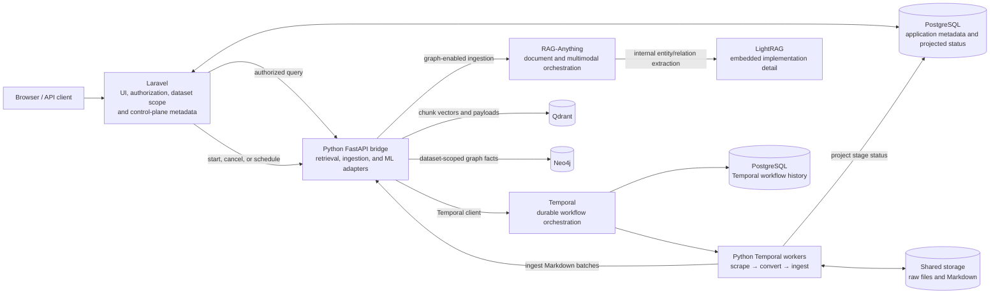

# Python RAG Service

This directory contains the FastAPI bridge, vector and graph ingestion logic,
query pipeline, Temporal ingestion workers, and local reranker code.

## Architecture

The Python service is the internal RAG data plane, not the public authorization
boundary. Browser and API requests enter through Laravel, which resolves the
caller and the permitted dataset scope before forwarding an internal request.



### Component ownership

- **Laravel is the control plane.** It owns the UI, authentication and
  authorization, dataset grants, server-derived query scope, and application
  metadata such as datasets, sources, pipeline jobs, and stage status.
- **Temporal is the durable orchestrator.** Laravel requests workflow starts,
  cancellations, and schedules through the Python bridge. Temporal coordinates
  the scrape, conversion, ingestion, retry, and readiness phases; its activities
  project user-facing status back into Laravel's pipeline tables.
- **Python is the RAG data plane.** FastAPI and the Temporal workers isolate the
  Python parser, ML, vector, and graph dependencies from the Laravel process.
  The bridge applies Laravel's authorized dataset scope when reading Qdrant and
  Neo4j; it does not decide which datasets a caller may access.

### RAG-Anything and LightRAG

RAG-Anything is the outer document and multimodal orchestration library **inside
the graph-extraction path**. During graph-enabled ingestion, the service gives
RAG-Anything normalized text blocks and any associated images. RAG-Anything
owns the extraction lifecycle and uses the configured chat, vision, and
embedding providers.

LightRAG is used internally by RAG-Anything to extract entities and relations
and expose the resulting graph edges. The application then normalizes and
deduplicates those edges before writing dataset-scoped facts to Neo4j. LightRAG
is therefore not a second selectable RAG engine running beside RAG-Anything,
and it is not the normal query endpoint: retrieval queries Qdrant and Neo4j
through the application's own adapters.

The helpers named after both projects are adapters around those two layers, not
duplicate graph engines. The RAG-Anything adapter controls insertion and
extraction lifecycle. The LightRAG-facing helpers configure the embedded
engine's graph and document-status storage, export its edges, and recover usable
relations from its response cache when required. If the official path returns
no triplets, the service can use a direct model-provider fallback before the
final Neo4j write.

For a shorter explanation and an end-to-end text-flow diagram, see
[`3. Introduction & Architecture`](../_documentation/Getting%20Started/3_introduction_architecture.md).

### Data flow and storage

1. **Query:** Laravel authorizes the caller and dataset, sends the resulting
   scope to FastAPI, and FastAPI retrieves scoped vector and graph context from
   Qdrant and Neo4j.
2. **Ingestion:** Laravel creates the application metadata and asks the bridge
   to start a Temporal workflow. Python workers scrape, convert to Markdown, and
   submit batches to FastAPI. FastAPI writes chunk vectors to Qdrant and, when
   graph ingestion is enabled, writes normalized RAG-Anything/LightRAG facts to
   Neo4j.
3. **Status:** Temporal activities write phase projections to the Laravel-owned
   PostgreSQL tables. Temporal keeps its own workflow history in a separate
   Temporal-owned PostgreSQL database; Laravel does not read or write Temporal's
   internal tables.

Storage responsibilities are intentionally separate:

- **PostgreSQL:** application metadata, authorization-related records, dataset
  configuration, ingestion sources, and projected pipeline status. The same
  PostgreSQL service may also host Temporal's separate internal databases.
- **Qdrant:** chunk embeddings and their retrieval payloads.
- **Neo4j:** normalized, dataset-scoped entity and relation facts used for graph
  retrieval.
- **Shared storage:** raw source files, converted Markdown, manifests, and other
  artifacts passed between Temporal activities.

## Test Command

Run the deterministic Python contract and API suite from the repository root:

```bash
make python-test
```

Install runtime and test dependencies with `make python-deps` from a Python
3.11 environment, matching the bridge image. `USE_OLLAMA_GPU=0` selects the
CPU lock and `USE_OLLAMA_GPU=1` selects the CUDA 13.0 lock. The test target uses
pytest so both `unittest.TestCase` scenarios and module-level pytest functions
are collected:

```bash
PYTHONPATH=python_rag python -m pytest -c python_rag/pytest.ini -m "not integration"
```

The dependency target builds `mineru==3.4.4+rawki.1` locally from the official
MinerU 3.4.4 wheel after verifying its SHA-256 digest. The local version carries
the small pipeline compatibility patch needed for Transformers 5.14.1 and
narrows MinerU's `core` extra to that pipeline backend. MinerU's local VLM and
Gradio extras are intentionally unsupported by this image. The generated
third-party wheel is kept outside the repository, and the same guarded build
runs inside the bridge image. `make python-lock` regenerates the main and
reranker locks for both CPU and CUDA. The CPU lock check fails if a CUDA,
NVIDIA, or Triton package is introduced accidentally.

The generated deployment locks are:

- `requirements.cpu.lock.txt`
- `requirements.gpu.lock.txt`
- `requirements-rerank.cpu.lock.txt`
- `requirements-rerank.gpu.lock.txt`

On Linux ARM64, `pip check` on a GPU image reports
`nvidia-cusparselt-cu13 0.8.1 is not supported on this platform`. PyTorch pins
that package, whose ARM binary works but whose internal wheel tag says `sbsa`
instead of `aarch64`. Importing the CUDA 13.0 PyTorch build succeeds; do not
override PyTorch's exact CUDA dependency pin to suppress this metadata warning.

When the corresponding services are reachable, run the opt-in live suites:

```bash
make python-integration
make provider-test
```

See [`tests/README.md`](tests/README.md) for the API flows, feature categories,
endpoint coverage, and the Laravel/Python authorization boundary.

## Runtime Output

The service writes runtime/cache data under directories such as
`python_rag/rag_storage`, `python_rag/public`, and Python `__pycache__` folders.
These are generated artifacts and should not be committed.
