# Python RAG test suite

This directory contains the Python tests for the internal FastAPI RAG bridge,
query and ingestion workflows, provider adapters, scoped vector and graph
access, Temporal activities, and reliability boundaries. Pytest is the test
runner; it also collects the existing `unittest.TestCase` scenarios.

## System architecture and trust boundary

RAWKI has two application boundaries with different security jobs:

| Boundary | Owns | Must not own |
| --- | --- | --- |
| Laravel gateway | Browser session and Sanctum authentication, active-user checks, query-token abilities, development-principal policy, dataset grants, active-dataset lookup, and database-derived storage/model scope | It must not accept collection, namespace, model, graph, or authorization scope from a public query caller. |
| Python RAG bridge | Pydantic validation of the trusted `authorized_scope`, mandatory dataset filtering, selection of exactly one Qdrant collection, scoped Neo4j reads, retrieval, reranking, generation, ingestion, and storage adapters | It does not authenticate a HAWKI user and does not decide whether a principal has a dataset grant. |

Laravel's
[`DatasetQueryAuthorizationService`](../../app/Services/Authorization/DatasetQueryAuthorizationService.php)
resolves an active principal, requires an explicit `query` grant for an active
dataset, and derives `dataset_id`, `qdrant_collection`, `neo4j_namespace`,
`embedding_provider`, and `embedding_model` from the database. Unknown,
unauthorized, and inactive datasets deliberately share the same 404 response.
A database row with incomplete storage targets fails before Python is called.

The public Laravel request
[`QueryDatasetRequest`](../../app/Http/Requests/Rag/QueryDatasetRequest.php)
prohibits caller-supplied storage, model, graph, and authorization fields.
[`RagProxyService`](../../app/Services/Rag/RagProxyService.php) serializes the
server-derived scope and sends it to the internal `POST /query` route.

Python's [`AuthorizedQueryScope`](../api/http/schemas.py) is therefore an
enforcement contract, not proof of end-user authentication. The bridge:

- rejects a missing scope, unexpected scope fields, and provider/vector-space
  mismatches;
- locks the request-local Qdrant client to `qdrant_collection`, bypassing
  `QDRANT_SEARCH_ALL` and `QDRANT_FALLBACK_ALL` behavior;
- combines sanitized metadata filters with a mandatory
  `dataset_id == authorized_scope.dataset_id` predicate;
- permits graph retrieval only when `graph_enabled` is true and a namespace is
  present, then constrains Neo4j nodes and relationships by both `dataset_id`
  and `neo4j_namespace`; and
- returns the stable Python `dataset_not_ready` error when the authorized
  Qdrant collection is absent instead of searching another collection.

The Python bridge has no authentication dependency on its routes. It must stay
on a trusted internal network and be called only by Laravel or trusted workers.
Sending an invented `authorized_scope` directly to an exposed bridge would
bypass Laravel's principal and grant checks.

## Query flow

```mermaid
flowchart LR
    A[Browser session or Sanctum query token] --> B[Laravel query middleware]
    B --> C[Validate public dataset_id, query, and safe filters]
    C --> D[Resolve active HAWKI user]
    D --> E[Join active dataset to explicit query grant]
    E -->|unknown, unauthorized, or inactive| F[Uniform 404]
    E --> G[Derive storage and embedding scope from database]
    G -->|targets incomplete| H[Laravel dataset_not_ready]
    G --> I[POST internal FastAPI /query with authorized_scope]
    I --> J[Pydantic scope and provider validation]
    J --> K[Select only the derived Qdrant collection]
    K --> L[Mandatory dataset filter AND sanitized user filter]
    L --> M[Vector, lexical, and optional rerank stages]
    J --> N{graph_enabled?}
    N -->|yes| O[Dataset and namespace scoped Neo4j retrieval]
    N -->|no| P[No graph read]
    M --> Q[Grounded context and optional answer generation]
    O --> Q
    P --> Q
    Q --> R[Laravel forwards the bridge response]
```



The Laravel incomplete-target error is currently HTTP 409. A collection that
is named in a valid scope but missing in Qdrant is detected by Python and
returned as HTTP 503. Tests document both boundaries.

## Ingestion flow

```mermaid
flowchart LR
    A[Laravel upload or pipeline request] --> B[Create or resolve dataset, task, job, and source]
    B --> C[Build workflow input with dataset storage and model settings]
    C --> D[FastAPI Temporal bridge routes]
    D --> E[Temporal IngestSourceWorkflow]
    E --> F[Scrape or stage uploaded source]
    F --> G[Inspect and convert files to Markdown]
    G --> H[Build stable document IDs, hashes, and scoped payloads]
    H --> I[POST FastAPI /ingest with idempotency key]
    I --> J[Validate and chunk documents]
    J --> K[Embed and upsert dataset-stamped Qdrant points]
    J --> L[Optional triplet extraction and scoped Neo4j writes]
    K --> M[Persist manifest and document metadata]
    L --> M
    M --> N[Mark source and pipeline job ready in PostgreSQL]
```



Ingestion authorization is controlled before the internal worker call. The
Python ingestion path validates conflicting graph scope and stamps trusted
`dataset_id` and `neo4j_namespace` values on canonical graph records. Its
write and management endpoints are internal service endpoints, not public
authorization gates.

## Test categories

| Directory | Primary coverage |
| --- | --- |
| [`api/`](api/) | FastAPI schemas, settings, app construction, middleware/error envelopes, route delegation, and vertical query/ingest HTTP flows using `TestClient`. |
| [`query/`](query/) | Authorized query scope, strict Qdrant selection, mandatory filters, lexical and high-recall fallbacks, rewrite/ranking/context orchestration, generation, and external reranker consumer contracts. |
| [`ingest/`](ingest/) | Validation, Markdown cleanup, deterministic chunk/point construction, dry runs, incremental replacement, vector and graph commits, deletion, summaries, and ingestion CLI helpers. |
| [`graph/`](graph/) | Triplet cleanup/extraction, cache behavior, Neo4j request construction, dataset-scoped reads and writes, namespace-scoped deletion, and graph runtime helpers. |
| [`providers/`](providers/) | Ollama, LiteLLM, RAGAnything, embedding dimensions, multimodal payloads, provider selection, and safe upstream error normalization. |
| [`temporal/`](temporal/) | Scraper/converter/activity contracts, shared path mapping, passthrough conversion, metadata persistence, and workflow-stage behavior. |
| [`reliability/`](reliability/) | Retry/idempotency policy, startup checks, log redaction, transport telemetry, optional-import boundaries, shared-storage permissions, and refactor characterization. |
| [`integration/`](integration/) | Opt-in compatibility tests against live Qdrant, Neo4j, Temporal, Ollama, and LiteLLM services. Resources are uniquely named and cleaned up; unavailable services skip unless strict mode is enabled. |
| [`characterization_support.py`](characterization_support.py) | Shared optional-dependency stubs and FastAPI test helpers. It is support code, not a test module. |

## FastAPI endpoint coverage

The matrix lists every application-defined route in the main bridge and local
reranker apps. "Direct" means a test sends an HTTP request through FastAPI's
`TestClient`; deeper workflow tests may still replace network, model, and
database boundaries with fakes.

| Service | Method and route | Responsibility | Current test coverage |
| --- | --- | --- | --- |
| Main bridge | `GET /health` | Health plus optional graph runtime summary | Direct in `api/test_api_characterization.py`, including `runtime=false`. |
| Main bridge | `GET /config` | Effective provider and Qdrant runtime information | Direct in `api/test_api_characterization.py` with fake provider/Qdrant boundaries. |
| Main bridge | `POST /ingest` | Validate and delegate document ingestion; propagate idempotency | Direct vertical success, validation, and error-envelope coverage in `api/test_ingest_api_flow.py`; delegation is also characterized in `api/test_api_characterization.py`. |
| Main bridge | `DELETE /documents/{doc_id}` | Delete one document from Qdrant and Neo4j | Direct contract coverage in `api/test_api_characterization.py` with fake stores; deeper scoped deletion tests live under `ingest/` and `graph/`. |
| Main bridge | `PUT /documents/{doc_id}` | Delete and re-ingest a replacement document | Direct contract coverage in `api/test_api_characterization.py` with fake application functions. |
| Main bridge | `POST /query` | Validate trusted scope and run dataset-scoped retrieval | Direct vertical success, 422, strict-scope, and 503-envelope coverage in `api/test_query_api_flow.py`; detailed scope/fallback tests live under `query/`. |
| Main bridge | `POST /graph/from-text` | Extract graph facts from text | Direct success, 422, and normalized 502 coverage in `api/test_graph_api_flow.py`; live scoped Neo4j behavior is covered separately in `integration/test_neo4j_scoping.py`. |
| Main bridge | `POST /graph/cache/clear` | Clear graph/RAGAnything caches | Direct in `api/test_api_characterization.py`; cache file behavior is covered under `graph/`. |
| Main bridge | `POST /temporal/workflows/ingest` | Start an ingest workflow | Direct success, 422, and normalized 502 coverage in `api/test_temporal_api_flow.py`; the production workflow is also executed against live Temporal in `integration/test_temporal_ingestion.py`. |
| Main bridge | `POST /temporal/schedules/ingest` | Create or update an ingest schedule | Direct success, 422, and normalized 502 coverage in `api/test_temporal_api_flow.py`. |
| Main bridge | `POST /temporal/schedules/delete` | Delete an ingest schedule | Direct success, 422, and normalized 502 coverage in `api/test_temporal_api_flow.py`. |
| Main bridge | `POST /temporal/workflows/cancel` | Cancel a workflow/run | Direct success, 422, and normalized 502 coverage in `api/test_temporal_api_flow.py`. |
| Local reranker | `GET /health` | Report that the reranker process is available | Direct in `api/test_reranker_api_flow.py` with the download-heavy model constructor replaced. |
| Local reranker | `POST /v1/rerank` | Cohere-shaped reranking with a local CrossEncoder | Direct ranking, validation, and client-error coverage in `api/test_reranker_api_flow.py`; the query-side consumer contract remains covered in `query/test_reranker_contract.py`. |

Both FastAPI applications also expose the default framework routes
`GET /openapi.json`, `GET /docs`, `GET /docs/oauth2-redirect`, and
`GET /redoc`. They have no project-specific assertions; FastAPI owns their
implementation.

## Test layers and fakes

1. **Schema and pure-function tests** exercise Pydantic validation, filter
   composition, payload construction, text cleanup, chunking, and request
   builders without I/O.
2. **Application workflow tests** call query and ingestion orchestration with
   injected functions, fake providers, recording Qdrant objects, and recording
   Neo4j objects. These tests prove ordering, scope propagation, and failure
   policy without external services.
3. **HTTP vertical tests** build the real FastAPI app and send requests through
   `TestClient`. The HTTP adapter, schema, middleware, exception handler, and
   application delegation are real; model and persistence boundaries remain
   fake.
4. **Adapter contract tests** replace `requests`, provider responses, clocks,
   filesystems, or database connections with small deterministic fakes. They
   verify outbound shape, timeouts, retries, redaction, and response parsing.
5. **Live integration tests** connect to already-running services and exercise
   the production Qdrant, Neo4j, Temporal, Ollama, and LiteLLM adapters. They
   never start containers, download models, reuse application collections, or
   silently fall back between model providers.

Prefer stateful fakes that record calls when the behavior matters. Use
`unittest.mock.patch` for process or external boundaries such as HTTP, model
loading, environment variables, clocks, and constructors. Do not mock the
function under test or assert private implementation steps when an observable
result can express the contract. Temporary files belong in `tmp_path` or
`TemporaryDirectory`; environment changes must use a restoring context such as
`patch.dict`.

## Running tests

From the repository root, install both runtime and test dependencies:

```bash
make python-deps
```

Run the deterministic Python suite through the repository target:

```bash
make python-test
```

The equivalent pytest command is:

```bash
PYTHONPATH=python_rag python -m pytest -c python_rag/pytest.ini -m "not integration"
```

Run the live storage/Temporal tests or live provider tests when their services
are reachable from the current process:

```bash
make python-integration
make provider-test
```

The live tests probe repository environment variables plus explicit
`RAWKI_INTEGRATION_*` overrides. Set `RAWKI_INTEGRATION_REQUIRED=1` in a
release job to turn an unavailable selected dependency into a failure instead
of a skip. The important overrides are:

```text
RAWKI_INTEGRATION_QDRANT_URL
RAWKI_INTEGRATION_NEO4J_URI
RAWKI_INTEGRATION_TEMPORAL_ADDRESS
RAWKI_INTEGRATION_OLLAMA_API_URL
RAWKI_INTEGRATION_LITELLM_API_URL
RAWKI_INTEGRATION_MODEL_TIMEOUT
```

Qdrant, Neo4j, Ollama, and the bridge are not published to the host by the
default Compose topology. Run live tests from the Compose network or expose
test-only loopback endpoints; do not publish internal services on a production
host merely to execute the suite.

With the local stack already running, the complete live suite can be executed
in a disposable bridge container on that internal network:

```bash
docker compose run --rm --no-deps \
  -e RAWKI_INTEGRATION_REQUIRED=1 \
  --entrypoint sh hawki_rag_bridge -lc \
  'python -m pip install -q -r requirements-test.txt &&
   PYTHONPATH=/app python -m pytest -c pytest.ini tests/integration -rs'
```

The optional LiteLLM profile must be running for strict execution of the
LiteLLM scenarios. The disposable container installs only the test runner;
runtime dependencies come from the existing bridge image.

Useful focused commands:

```bash
# One category
PYTHONPATH=python_rag python -m pytest -c python_rag/pytest.ini python_rag/tests/query

# The two HTTP vertical flows
PYTHONPATH=python_rag python -m pytest -c python_rag/pytest.ini \
  python_rag/tests/api/test_query_api_flow.py \
  python_rag/tests/api/test_ingest_api_flow.py

# One regression by node ID
PYTHONPATH=python_rag python -m pytest -c python_rag/pytest.ini \
  python_rag/tests/query/test_dataset_scoped_query.py::AuthorizedScopeSchemaTests::test_query_requires_a_typed_authorized_scope

# Show collected tests without executing them
PYTHONPATH=python_rag python -m pytest -c python_rag/pytest.ini --collect-only -q
```

## Naming and docstrings

- Put a test in the directory for the boundary whose behavior it proves, not
  merely the module it imports.
- Name files `test_<capability>.py` and tests
  `test_<condition>_<observable_result>`. Include security-relevant outcomes in
  the name, for example `test_missing_scoped_collection_fails_without_global_fallback`.
- Use `TestCapability` for pytest classes or `CapabilityTests` for
  `unittest.TestCase`. Both styles are collected by `python_rag/pytest.ini`.
- Give each test module a one-sentence docstring describing its contract. Give
  helper fakes and non-obvious test classes short intent-oriented docstrings.
- A descriptive test name is normally enough; add a test-function docstring
  only when the policy or trust-boundary rationale is not clear from the name.
- Name fakes by role (`RecordingQdrant`, `FakeProvider`) and expose only the
  methods the scenario requires. Assertions should inspect their recorded
  inputs and public outputs.
- Keep Arrange/Act/Assert visible through spacing and names. Avoid comments
  that only restate code.

## Current limitations

- The deterministic suite remains predominantly isolated characterization and
  contract coverage. The opt-in integration suite connects to live services,
  but deliberately does not start containers or download models.
- No Python integration test currently exercises PostgreSQL metadata writes,
  a downloaded local CrossEncoder, or a real RAGAnything parser/model runtime.
- Python tests begin after Laravel's authorization decision. Laravel feature
  tests under `tests/Feature/Authentication` and `tests/Feature/Query` are the
  source of truth for authentication and grants. Vertical scenarios under
  `tests/System` combine real Sanctum/session middleware, dataset grants,
  trusted scope construction, and PDF upload persistence while faking only the
  external Python HTTP boundary.
- The internal FastAPI routes do not authenticate callers. Network isolation is
  part of the production security model and is not proven by this suite.
- Default OpenAPI/documentation routes are framework-owned and unasserted.
- The ten-page PDF system scenario proves upload validation, byte-for-byte
  shared-storage persistence, pipeline records, and Temporal payload creation;
  it does not wait for conversion, embedding, graph ingestion, or a completed
  retrieval response.
- `make test-services` and the Bruno collections are smoke checks, not proof of
  full ingestion, model, and retrieval compatibility. A production release
  should run deterministic, live integration, provider, Laravel Feature, and
  Laravel System suites and review every skip.
