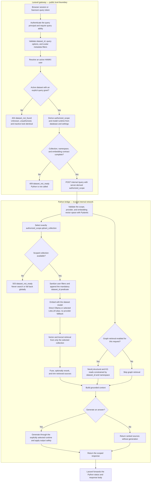
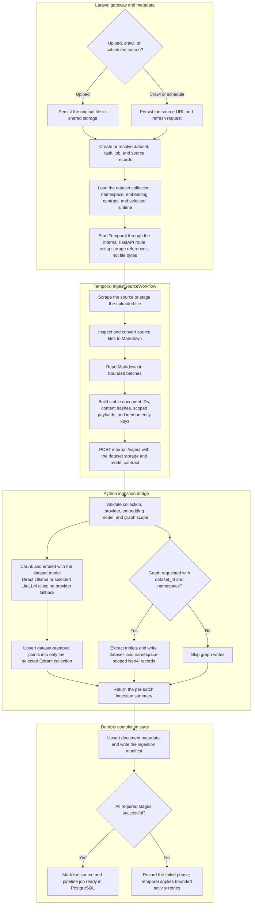

# Python RAG test suite

This directory contains the Python tests for the internal FastAPI RAG bridge,
query and ingestion workflows, provider adapters, scoped vector and graph
access, Temporal activities, and reliability boundaries. Pytest is the test
runner; it also collects the existing `unittest.TestCase` scenarios.

## System architecture and trust boundary

RAWKI has two application boundaries with different security jobs:

- **Laravel gateway**

  - Owns browser-session and Sanctum authentication, active-user checks,
    query-token abilities, development-principal policy, dataset grants,
    active-dataset lookup, and database-derived storage and model scope.
  - Must not accept collection, namespace, model, graph, or authorization scope
    from a public query caller.

- **Python RAG bridge**

  - Owns Pydantic validation of the trusted `authorized_scope`, mandatory
    dataset filtering, selection of exactly one Qdrant collection, scoped
    Neo4j reads, retrieval, reranking, generation, ingestion, and storage
    adapters.
  - Does not authenticate a HAWKI user or decide whether a principal has a
    dataset grant.

Laravel's
[`DatasetQueryAuthorizationService`](../../app/Services/Authorization/DatasetQueryAuthorizationService.php)
resolves an active principal, requires an explicit `query` grant for an active
dataset, and derives `dataset_id`, `qdrant_collection`, `neo4j_namespace`,
`embedding_provider`, and `embedding_model` from the database. Unknown,
unauthorized, and inactive datasets deliberately share the same 404 response.
A database row with incomplete storage targets fails before Python is called.

The public Laravel request
[`QueryDatasetRequest`](../../app/Http/Requests/Rag/QueryDatasetRequest.php)
prohibits caller-supplied storage, model, graph, and authorization fields.
[`RagProxyService`](../../app/Services/Rag/RagProxyService.php) serializes the
server-derived scope and sends it to the internal `POST /query` route.

Python's [`AuthorizedQueryScope`](../api/http/schemas.py) is therefore an
enforcement contract, not proof of end-user authentication. The bridge:

- rejects a missing scope, unexpected scope fields, and provider/vector-space
  mismatches;
- locks the request-local Qdrant client to `qdrant_collection`, bypassing
  `QDRANT_SEARCH_ALL` and `QDRANT_FALLBACK_ALL` behavior;
- combines sanitized metadata filters with a mandatory
  `dataset_id == authorized_scope.dataset_id` predicate;
- permits graph retrieval only when `graph_enabled` is true and a namespace is
  present, then constrains Neo4j nodes and relationships by both `dataset_id`
  and `neo4j_namespace`; and
- returns the stable Python `dataset_not_ready` error when the authorized
  Qdrant collection is absent instead of searching another collection.

The Python bridge has no authentication dependency on its routes. It must stay
on a trusted internal network and be called only by Laravel or trusted workers.
Sending an invented `authorized_scope` directly to an exposed bridge would
bypass Laravel's principal and grant checks.

## Query flow



Readiness failures intentionally identify which boundary rejected the request:

- Laravel returns HTTP 409 `dataset_not_ready` when the authorized database row
  lacks a collection, namespace, embedding provider, or embedding model. The
  bridge is not called.
- Python returns HTTP 503 `dataset_not_ready` when a complete authorized scope
  names a collection that is absent from Qdrant. It never uses
  `QDRANT_SEARCH_ALL`, `QDRANT_FALLBACK_ALL`, or another collection.
- Unknown, unauthorized, and inactive datasets all return the same HTTP 404
  response so callers cannot enumerate dataset identities.

## Ingestion flow



Ingestion authorization is controlled before the internal worker call.
Workflow history contains identifiers and storage references rather than PDF
or Markdown bodies. The same dataset collection, namespace, embedding
provider, and embedding model travel through every stage; stable document
hashes and idempotency keys make retries safe. Python stamps `dataset_id` on
Qdrant payloads and both `dataset_id` and `neo4j_namespace` on canonical graph
records. Ingestion and management routes remain internal service endpoints,
not public authorization gates.

## Test categories

- [`api/`](api/): FastAPI schemas, settings, app construction,
  middleware/error envelopes, route delegation, and vertical query and ingest
  HTTP flows using `TestClient`.
- [`query/`](query/): Authorized query scope, strict Qdrant selection,
  mandatory filters, lexical and high-recall fallbacks,
  rewrite/ranking/context orchestration, generation, and external reranker
  consumer contracts.
- [`ingest/`](ingest/): Validation, Markdown cleanup, deterministic chunk and
  point construction, dry runs, incremental replacement, vector and graph
  commits, deletion, summaries, and ingestion CLI helpers.
- [`graph/`](graph/): Triplet cleanup and extraction, cache behavior, Neo4j
  request construction, dataset-scoped reads and writes, namespace-scoped
  deletion, and graph runtime helpers.
- [`providers/`](providers/): Ollama, LiteLLM, RAGAnything, embedding
  dimensions, multimodal payloads, provider selection, and safe upstream error
  normalization.
- [`temporal/`](temporal/): Scraper, converter, and activity contracts; shared
  path mapping; passthrough conversion; metadata persistence; and workflow
  stage behavior.
- [`reliability/`](reliability/): Retry and idempotency policy, startup checks,
  log redaction, transport telemetry, optional-import boundaries,
  shared-storage permissions, and refactor characterization.
- [`integration/`](integration/): Opt-in compatibility tests against live
  Qdrant, Neo4j, Temporal, Ollama, and LiteLLM services. Resources are uniquely
  named and cleaned up; unavailable services skip unless strict mode is
  enabled.
- [`characterization_support.py`](characterization_support.py): Shared
  optional-dependency stubs and FastAPI test helpers. It is support code, not a
  test module.

## FastAPI endpoint coverage

The following list covers every application-defined route in the main bridge
and local reranker apps. "Direct" means a test sends an HTTP request through
FastAPI's `TestClient`; deeper workflow tests may still replace network, model,
and database boundaries with fakes.

### Main bridge

- **`GET /health`**

  - Responsibility: Return health information and the optional graph runtime
    summary.
  - Coverage: Direct in `api/test_api_characterization.py`, including
    `runtime=false`.

- **`GET /config`**

  - Responsibility: Return effective provider and Qdrant runtime information.
  - Coverage: Direct in `api/test_api_characterization.py` with fake provider
    and Qdrant boundaries.

- **`POST /ingest`**

  - Responsibility: Validate and delegate document ingestion while propagating
    the idempotency key.
  - Coverage: Direct vertical success, validation, and error-envelope coverage
    in `api/test_ingest_api_flow.py`; delegation is also characterized in
    `api/test_api_characterization.py`.

- **`DELETE /documents/{doc_id}`**

  - Responsibility: Delete one document from Qdrant and Neo4j.
  - Coverage: Direct contract coverage in `api/test_api_characterization.py`
    with fake stores; deeper scoped deletion tests live under `ingest/` and
    `graph/`.

- **`PUT /documents/{doc_id}`**

  - Responsibility: Delete and re-ingest a replacement document.
  - Coverage: Direct contract coverage in `api/test_api_characterization.py`
    with fake application functions.

- **`POST /query`**

  - Responsibility: Validate the trusted scope and run dataset-scoped
    retrieval.
  - Coverage: Direct vertical success, 422, strict-scope, and 503-envelope
    coverage in `api/test_query_api_flow.py`; detailed scope and fallback tests
    live under `query/`.

- **`POST /graph/from-text`**

  - Responsibility: Extract graph facts from text.
  - Coverage: Direct success, 422, and normalized 502 coverage in
    `api/test_graph_api_flow.py`; live scoped Neo4j behavior is covered in
    `integration/test_neo4j_scoping.py`.

- **`POST /graph/cache/clear`**

  - Responsibility: Clear graph and RAGAnything caches.
  - Coverage: Direct in `api/test_api_characterization.py`; cache-file behavior
    is covered under `graph/`.

- **`POST /temporal/workflows/ingest`**

  - Responsibility: Start an ingestion workflow.
  - Coverage: Direct success, 422, and normalized 502 coverage in
    `api/test_temporal_api_flow.py`; the production workflow is also executed
    against live Temporal in `integration/test_temporal_ingestion.py`.

- **`POST /temporal/schedules/ingest`**

  - Responsibility: Create or update an ingestion schedule.
  - Coverage: Direct success, 422, and normalized 502 coverage in
    `api/test_temporal_api_flow.py`.

- **`POST /temporal/schedules/delete`**

  - Responsibility: Delete an ingestion schedule.
  - Coverage: Direct success, 422, and normalized 502 coverage in
    `api/test_temporal_api_flow.py`.

- **`POST /temporal/workflows/cancel`**

  - Responsibility: Cancel a workflow or workflow run.
  - Coverage: Direct success, 422, and normalized 502 coverage in
    `api/test_temporal_api_flow.py`.

### Local reranker

- **`GET /health`**

  - Responsibility: Report that the reranker process is available.
  - Coverage: Direct in `api/test_reranker_api_flow.py`, with the
    download-heavy model constructor replaced.

- **`POST /v1/rerank`**

  - Responsibility: Provide Cohere-shaped reranking with a local CrossEncoder.
  - Coverage: Direct ranking, validation, and client-error coverage in
    `api/test_reranker_api_flow.py`; the query-side consumer contract remains
    covered in `query/test_reranker_contract.py`.

Both FastAPI applications also expose the default framework routes
`GET /openapi.json`, `GET /docs`, `GET /docs/oauth2-redirect`, and
`GET /redoc`. They have no project-specific assertions; FastAPI owns their
implementation.

## Test layers and fakes

1. **Schema and pure-function tests** exercise Pydantic validation, filter
   composition, payload construction, text cleanup, chunking, and request
   builders without I/O.
2. **Application workflow tests** call query and ingestion orchestration with
   injected functions, fake providers, recording Qdrant objects, and recording
   Neo4j objects. These tests prove ordering, scope propagation, and failure
   policy without external services.
3. **HTTP vertical tests** build the real FastAPI app and send requests through
   `TestClient`. The HTTP adapter, schema, middleware, exception handler, and
   application delegation are real; model and persistence boundaries remain
   fake.
4. **Adapter contract tests** replace `requests`, provider responses, clocks,
   filesystems, or database connections with small deterministic fakes. They
   verify outbound shape, timeouts, retries, redaction, and response parsing.
5. **Live integration tests** connect to already-running services and exercise
   the production Qdrant, Neo4j, Temporal, Ollama, and LiteLLM adapters. They
   never start containers, download models, reuse application collections, or
   silently fall back between model providers.

Prefer stateful fakes that record calls when the behavior matters. Use
`unittest.mock.patch` for process or external boundaries such as HTTP, model
loading, environment variables, clocks, and constructors. Do not mock the
function under test or assert private implementation steps when an observable
result can express the contract. Temporary files belong in `tmp_path` or
`TemporaryDirectory`; environment changes must use a restoring context such as
`patch.dict`.

## Running tests

From the repository root, install both runtime and test dependencies:

```bash
make python-deps
```

Run the deterministic Python suite through the repository target:

```bash
make python-test
```

The equivalent pytest command is:

```bash
PYTHONPATH=python_rag python -m pytest -c python_rag/pytest.ini -m "not integration"
```

Run the live storage/Temporal tests or live provider tests when their services
are reachable from the current process:

```bash
make python-integration
make provider-test
```

The live tests probe repository environment variables plus explicit
`RAWKI_INTEGRATION_*` overrides. Set `RAWKI_INTEGRATION_REQUIRED=1` in a
release job to turn an unavailable selected dependency into a failure instead
of a skip. The important overrides are:

```text
RAWKI_INTEGRATION_QDRANT_URL
RAWKI_INTEGRATION_NEO4J_URI
RAWKI_INTEGRATION_TEMPORAL_ADDRESS
RAWKI_INTEGRATION_OLLAMA_API_URL
RAWKI_INTEGRATION_LITELLM_API_URL
RAWKI_INTEGRATION_MODEL_TIMEOUT
```

Qdrant, Neo4j, Ollama, and the bridge are not published to the host by the
default Compose topology. Run live tests from the Compose network or expose
test-only loopback endpoints; do not publish internal services on a production
host merely to execute the suite.

With the local stack already running, the complete live suite can be executed
in a disposable bridge container on that internal network:

```bash
docker compose run --rm --no-deps \
  -e RAWKI_INTEGRATION_REQUIRED=1 \
  --entrypoint sh hawki_rag_bridge -lc \
  'python -m pip install -q -r requirements-test.txt &&
   PYTHONPATH=/app python -m pytest -c pytest.ini tests/integration -rs'
```

The optional LiteLLM profile must be running for strict execution of the
LiteLLM scenarios. The disposable container installs only the test runner;
runtime dependencies come from the existing bridge image.

Useful focused commands:

```bash
# One category
PYTHONPATH=python_rag python -m pytest -c python_rag/pytest.ini python_rag/tests/query

# The two HTTP vertical flows
PYTHONPATH=python_rag python -m pytest -c python_rag/pytest.ini \
  python_rag/tests/api/test_query_api_flow.py \
  python_rag/tests/api/test_ingest_api_flow.py

# One regression by node ID
PYTHONPATH=python_rag python -m pytest -c python_rag/pytest.ini \
  python_rag/tests/query/test_dataset_scoped_query.py::AuthorizedScopeSchemaTests::test_query_requires_a_typed_authorized_scope

# Show collected tests without executing them
PYTHONPATH=python_rag python -m pytest -c python_rag/pytest.ini --collect-only -q
```
